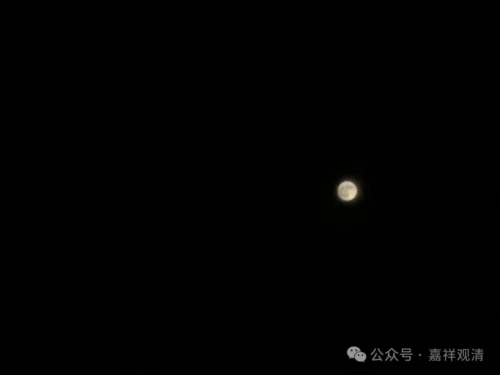
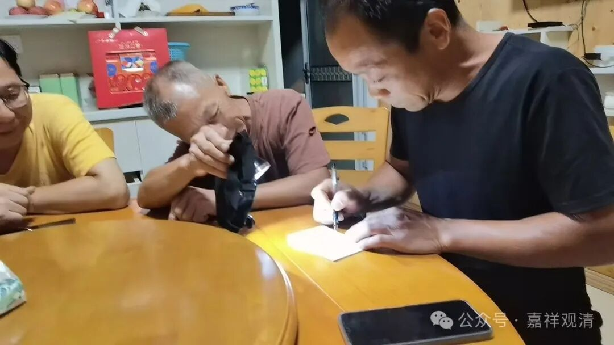
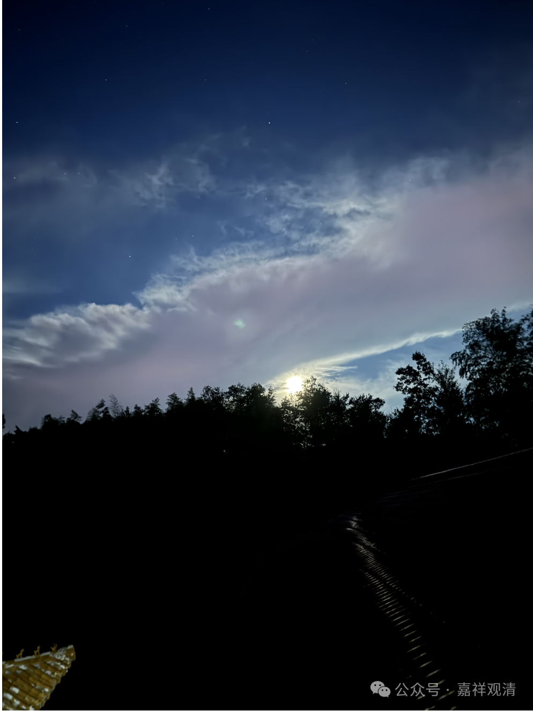
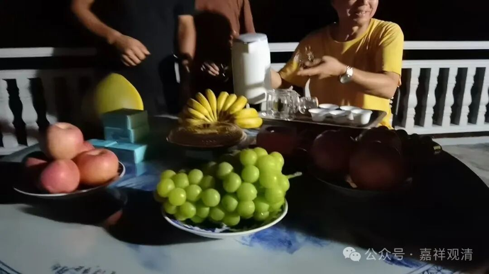
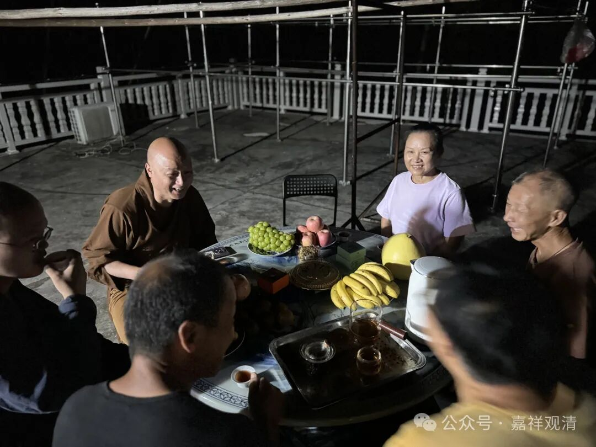
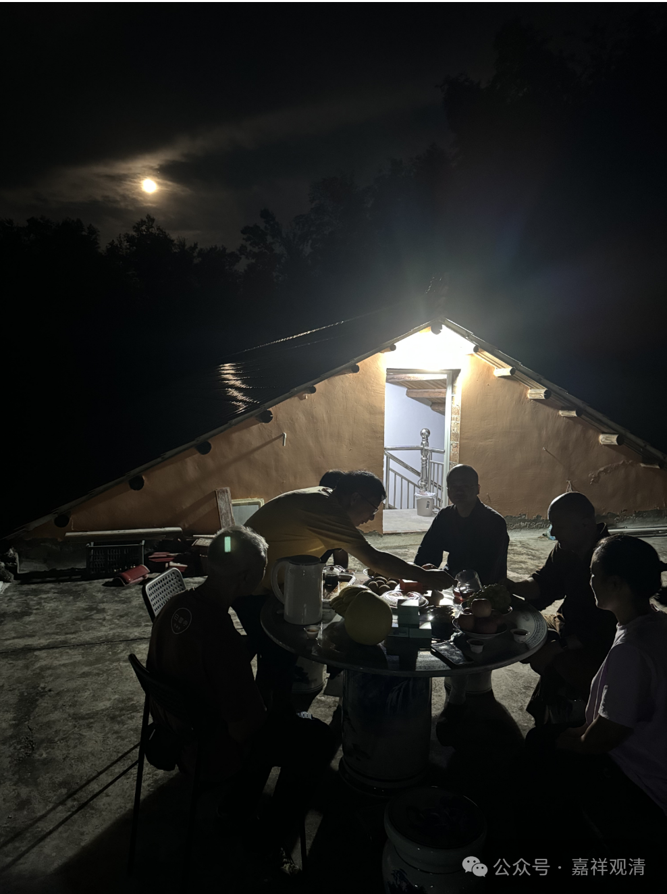
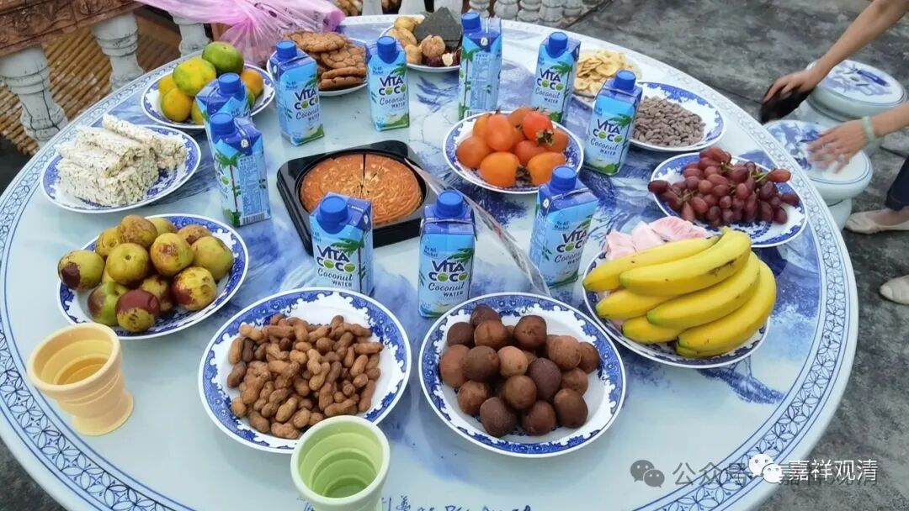
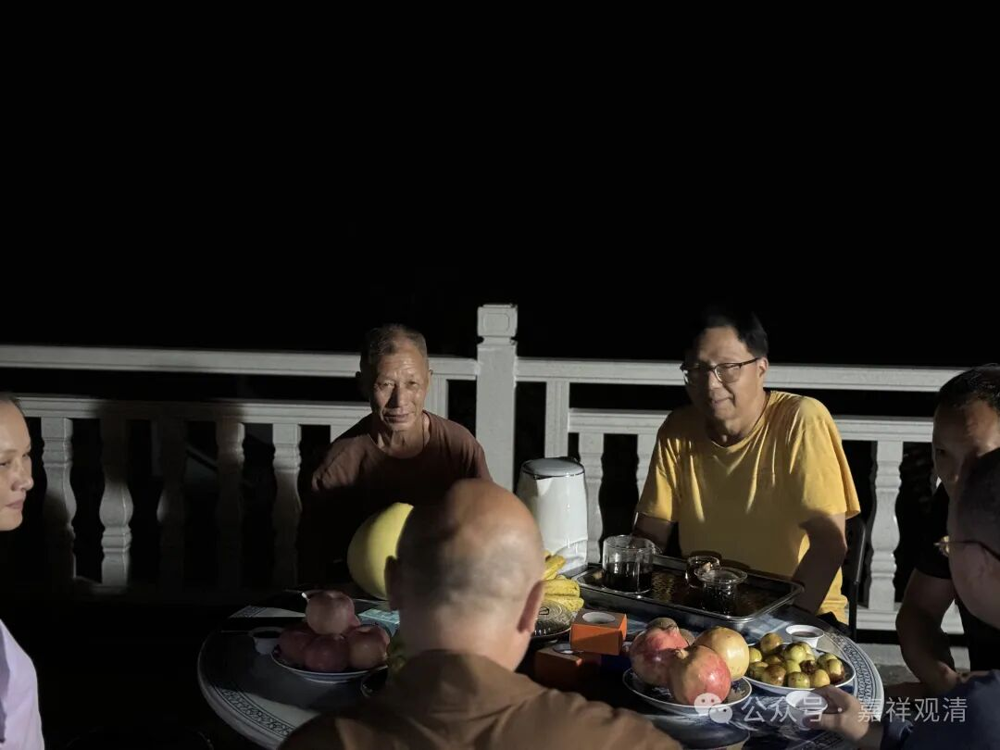

**今夜一轮满，清光何处无**

认认真真地等台风，结果没来。

本来以为今天台风边缘会擦到我们莲花山，所以是准备在风雨中过节的，不过今天是个大晴天，高温持续，但晚上却能赏月……（不过据气象预报，另一个台风四天后大概率会到赣北……我们还是得继续防台！）

传统上，过节之前要结点工钱的，因为工人家里要安排“过节”……你看，工头来找我结银子了……这咱必须安排啊！

送了四箱水果给老周（们），老周也专门去镇上买了坚果、榴莲送我们（榴莲就我一个人吃，他们都嫌弃），哈哈，我们合并一起过中秋节。

带着大家上楼顶“茶话会”，把月饼、水果、茶盘都摆上……过节嘛，仪式感、氛围还是要有的。

为了今晚的茶话会，老胡今天专门在晒台边装了俩电灯——

去年中秋我们都在月光下“瞎吹”“瞎吃”……

去年中秋，好像吃的东西比今年丰富哦。

今年算是又有进步了。

让老胡吹个萨克斯助助兴……说很久没练了。好，这两天练练，十一表演一个《我的祖国》！

