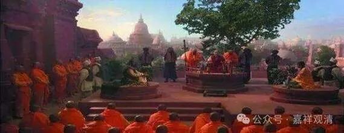

**《入论》和《理门论》：**

** “宗九过”和“宗五过”**

商羯罗主《因明入正理论》里说宗有九过：

“谓：1、现量相违；2、比量相违；3、自教相违；4、世间相违；5、自语相违；6、能别不极成；7、所别不极成；8、俱不极成；9、相符极成。”

这里“宗九过”的后四种，陈那《因明正理门论》未列，可以理解为是商羯罗主在辩论实践上添加的四种“宗过”。

陈那的《理门论》说五种：

“若非违义言声所遣，如立‘一切言皆是妄’；

或先所立宗义相违，如獯狐子立‘声为常’；

又若于中由不共故，无有比量，为极成言相违义遣，如说‘怀兔，非月有故’；

又于有法，即彼所立为此极成现量、比量相违义遣，如有成立‘声非所闻’、‘瓶是常’等。”

对照《理门论》来看《入论》，则可以这么看：

1、（极成）现量相违；立“声非所闻”。

2、（极成）比量相违；立“瓶是常”。

3、自教相违（先所立宗义相违）；獯狐子立‘声为常’。（“獯狐子”就是指的胜论派。注释书说“獯狐子”就是“鸺鹠仙”，即胜论派祖师。）

4、世间相违（极成言相违）；立“怀兔，非月有故”。

5、自语相违（非违义言声）；立“一切言皆是妄”。

《入论》和《理门论》次序恰好颠倒（《理论论》把“现量相违”和“比量相违”放在一起。）

