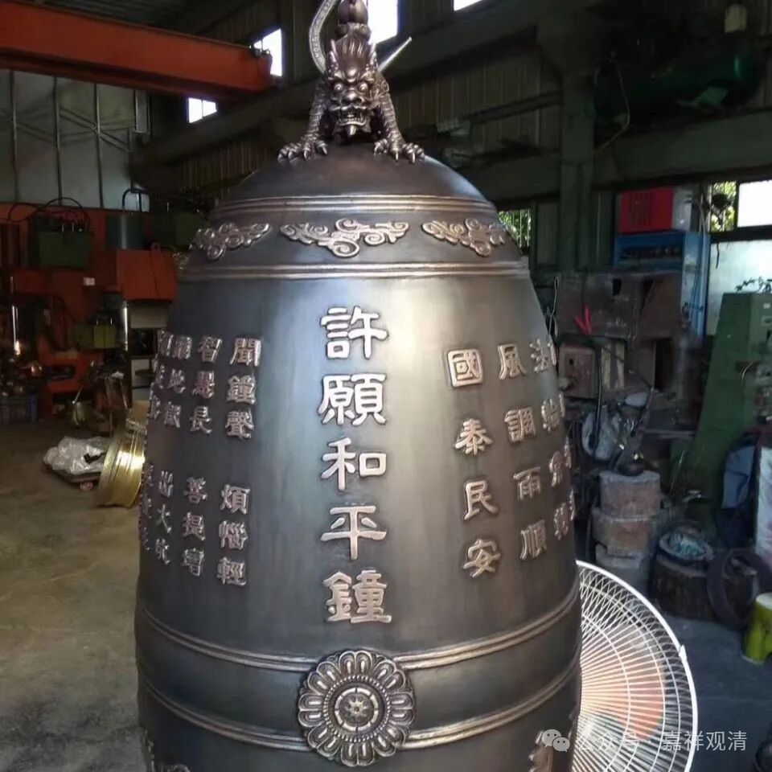

**祈祷世界和平**

刚才晚上来了两个佛具厂推销的。这是最近一个月来的第三波了。

最近咱庙里在搞建设，我发在朋友圈，估计圈里大家都看到了，于是厂家都过来走走看看，联络一下。

来的两位约我去今年的厦门佛展会的秋季展，我说本来我是要去的，可是今年这次时间正好撞车了——我要普陀山拜山，正遇上佛展会的日子。于是约我上门——他们的厂址也在江西，三个小时路程，嗯呐，可以有空去看看。

他们做木雕、铜铸的佛像，也做铜钟……咦，铜钟！我们倒是有个计划下面要做钟楼的。准备在鸡冠石上面做个三层的钟楼。铜钟要做的话，得在封顶前吊装到位……于是把包工头小周叫来……

铜钟的运输和吊装确实是个问题——直径一米五的铜钟大约3吨重，现在的土路坡度太陡，还要从停车场大白塔那里重开一条坡度稍缓的路才方便运输，另外，三吨的铜钟要吊到十五米高也是个问题，这么大的吊车可能也开不上去……

还有一个问题，就是最近铜价在最高位！看来，为了把“价格打下来”，我们和尚得努力念经，祈祷世界和平，那样，铜价就下来了……压力好大！（我说的是努力于世界和平——我们已经建了一个“世界和平吉祥塔”了。）

厂家赶着下山走了，再次约我们上门“考察”。嗯呐，有空去看看呗，反正当天可以来回。

就跟世间人买房一样，买个别墅花个大几百万，结果装修还得再砸几百万下去；这造庙也是一样，房子建完了，相关的各种配套也得砸银子啊……

