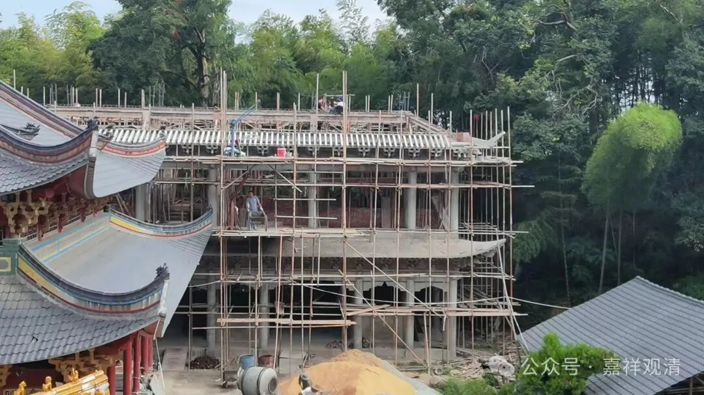

**“菩萨同意我住庙里……”**

七斤也来庙里“上班”了。

早上，七斤突然上山，去找观音菩萨“问事”，打了个“告子”（筊子、茭贝）……就跑我这里来了，说“菩萨同意了”，要在白云寺“常住”。

抛开“菩萨同意”不谈，一问，原来，和老太婆吵架了。（哇哈哈哈……）

七斤说门口每天早上都有只狗（老太婆表妹家的狗）过来拉屎，他要赶走，老婆不让，还打电话给儿子告状，儿子又打电话批评他……忍无可忍之下，想跑来庙里“干活，不要钱，给个睡的地方就可以了”！

我看看老胡，瞅瞅木生，“懂了！是男人都懂！！哈哈……你住二楼楼梯口边上那个房间吧……”

老李（七斤）转身就下山，取了行李就回了。这速度……下午就看见他在庙里除草了。

老李以前也帮赞白云寺看过庙，是个居士头，脾气也有点倔犟。前几年耳朵不太好了以后，就渐渐不太管事了（做功课的时候，耳朵不好，声音大，还找不着调……），但对庙里的事情一直有热情。

老李手很巧的，我们的“大雄宝殿”的牌匾就是他自己找铁皮敲出来的。最近又买了铁皮帮庙里做了两个蜡烛架子、一个简易香炉。以前夏令营的时候，他负责教孩子们做竹器——弓箭、哨子、笔筒、玩具枪……早四十年，老李能自己做火铳上山打猎，还把他姐姐给“教训”了。

她姐姐跟舅舅学“罗汉神打”（民间武术），他练得没他姐姐好，于是偷偷做了只火铳，声称要和姐姐“比武”。拉开架势以后，他“不讲武德”地拿出了火器……

老李很能干，他过来，庙里我可以轻松一点了。就是费嗓子……哈哈

