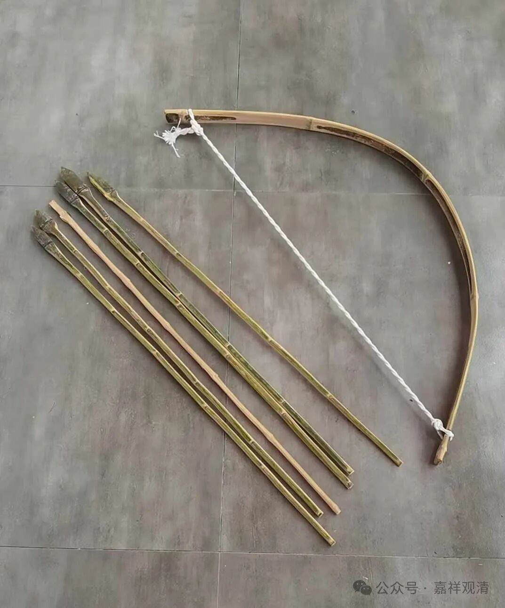
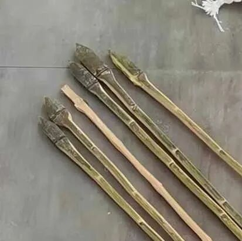
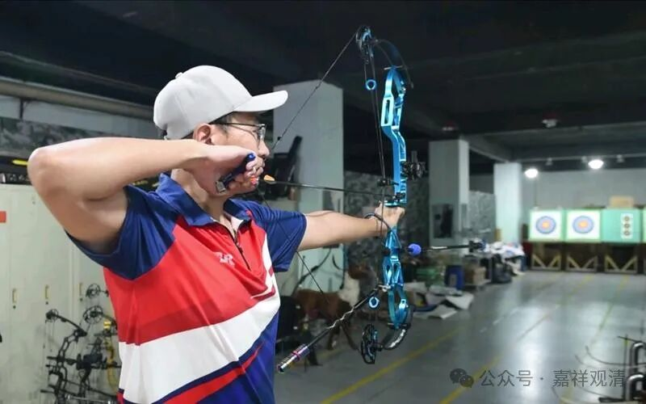
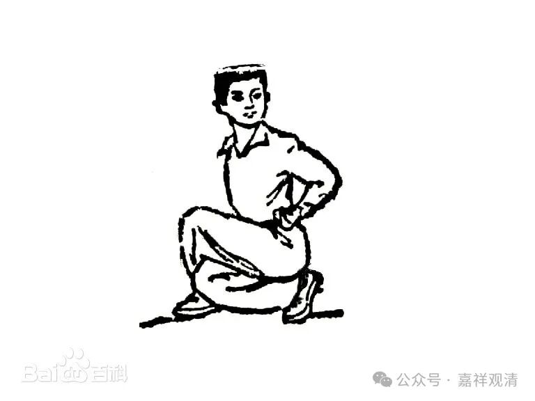

**“弓箭”做好了**

中午睡一觉起来一看，门口地上摆着一套“弓箭”。哦哟，这就已经做好了啊！

哈哈，李七斤动作真快啊。

吃早饭时闲聊，说山上的竹林要清理一下，可以做点竹制品，比如杯子、火罐、弓箭……七斤说“没问题”……这不，很快就有成品出来了。

七斤还跟我介绍了里面的“技术含量”——

由于没有铁的箭头，所以这个箭头必须做成这个样子，因为箭头必须要重一点，不然，射出去的“箭”在空中就会“横”过来“漂”。（还说了“弓”应该怎么做，我没听懂……）

我一箭“射”出去“六间门面”，老胡跑出来看，“哦哟，这就做好了啊！咦，‘尾巴’这里应该有个槽啊！……”哈哈

于是来纠正我的“射箭”动作——不应该用三根手指“捏”着“弓”，应该握拳“把”着……第二箭射出去，差点打碎走廊里的玻璃门。

复合弓

现实的开弓是很看臂力的。我认识的武林高手里，老潘说过，他开不了他师公的铁胎弓，但是他的师姐取下铁胎弓，一个歇步，弓开满月！他说，帅呆了！

我现在的臂力大概开不了弓了，还得专门练。要不以后地里立几个靶子，练练射箭？！（现在的这个只能算玩具。）

