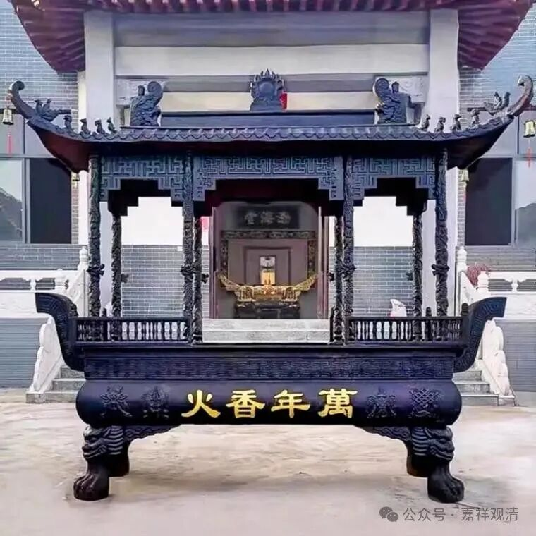

又有推销员上门了。

下午又来一个佛具厂的厂长。说是刚在隔壁浮梁县某寺院安装完佛像，准备去安徽，地图上看到我们寺院觉得还蛮大，就过来看看……

最近上门推销的还挺多的啊，这都至少三波了。我问老胡，老胡说以前没那么多，他都没见过有上门推销的。难道我们现在真的算大庙了？还是他们内部有消息散播渠道？

照例带着王厂长在咱们庙里走一圈，“走一走、看一看”，聊聊寺院的规划，征求一下意见——造像用铜的、木头的还是泥塑的，基座用80厘米还是一米二，像高二米二、二米八还是三米五……坐下来再问问铜钟的价格……

问厂长要了本图册，看到有做香炉的——铁的香炉，小的七千就可以了……我和老胡对视一眼～这可以啊！我们李七斤自己买材料自己撮了一个铁皮香炉也得三千呢，这厂家工业化的铸件比我们铁片、螺丝搓起来的肯定要正规、气派多了。

把七斤叫来，他以为还要做一个香炉，满口答应下来。我们说，不是让你做，我们准备直接买了！后来问下来，我们需要的那么大的规格，用铁的，大概两三万吧。到时候去他们厂里看看，也不远，厂家也在江西东乡，和上一个来的厂家可能在一个园区里面，正好一起走走看看。两百多公里，三个小时可以到了，当天来回都可以。

这一连几个厂家的推销员上门，让我略微有点膨胀啊！

