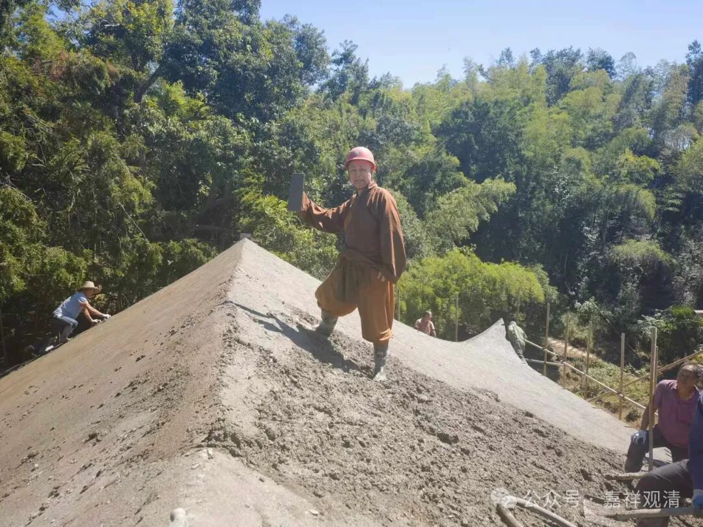
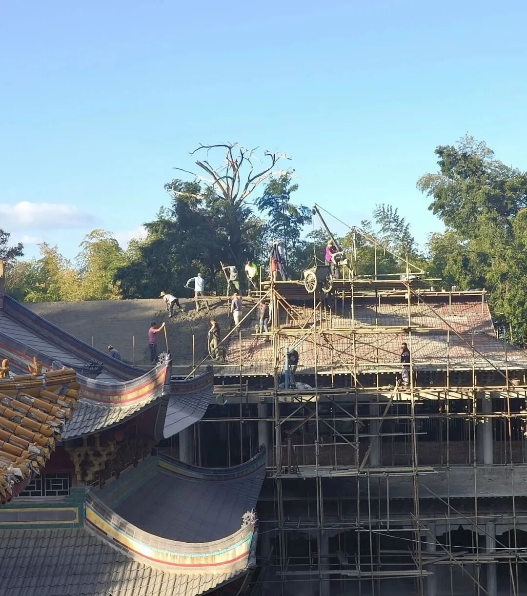
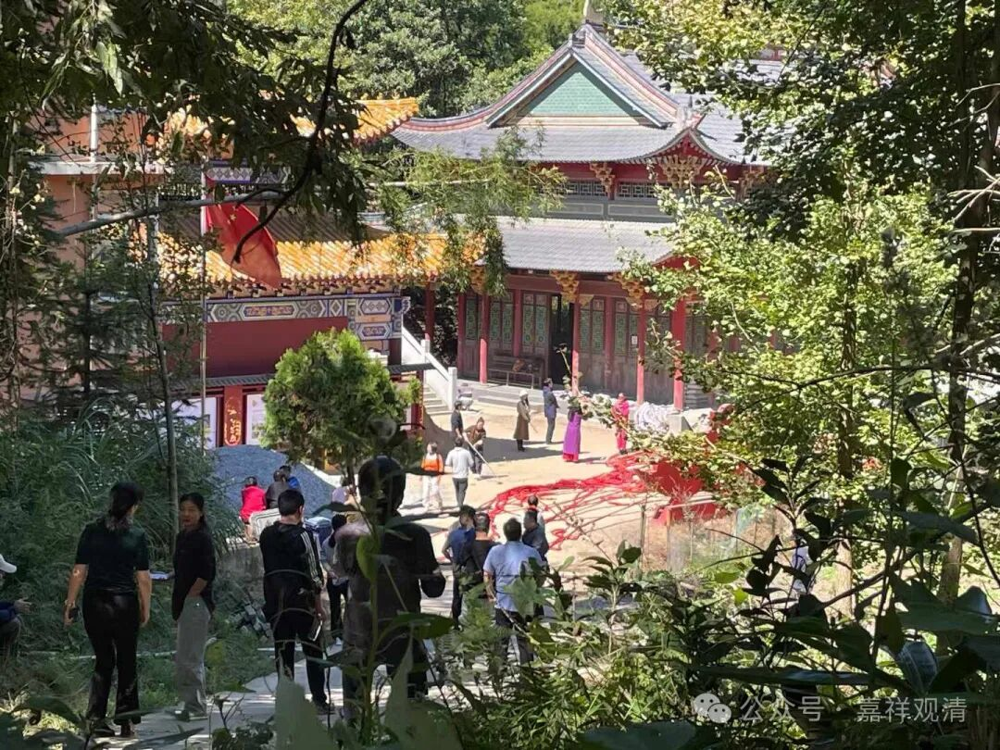
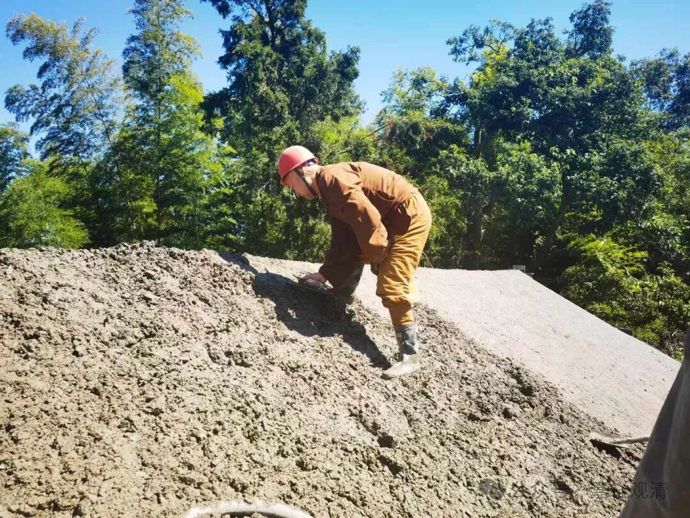
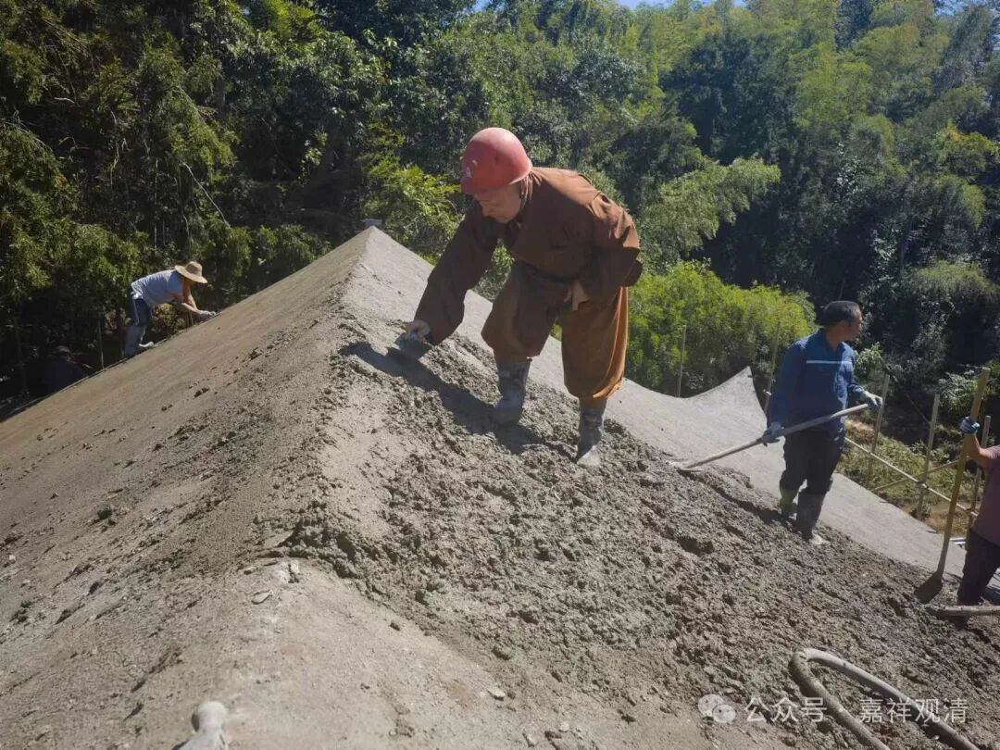
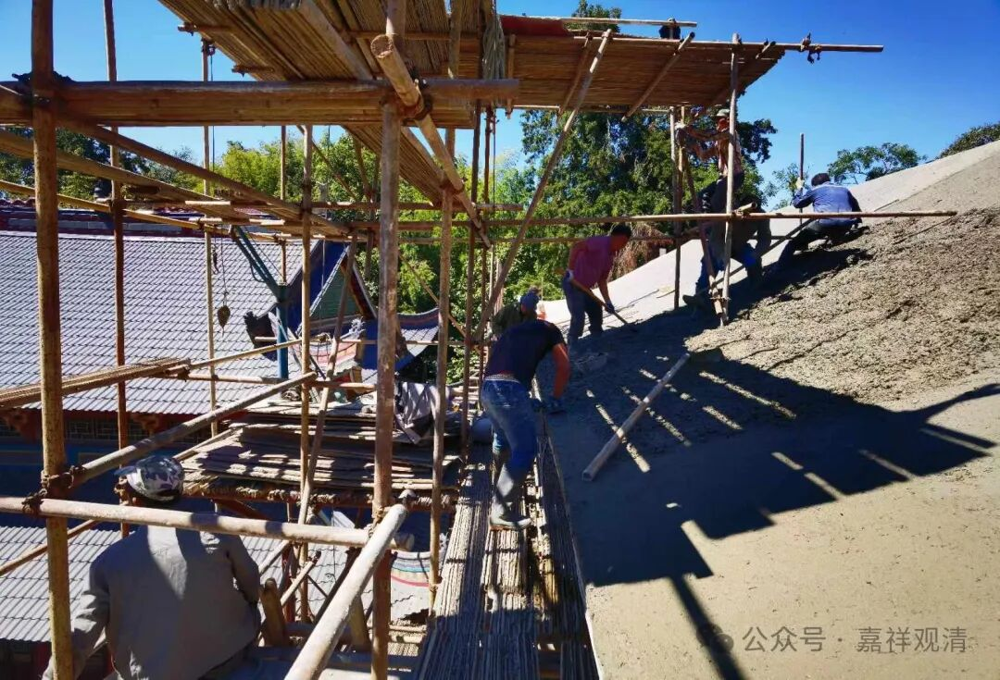
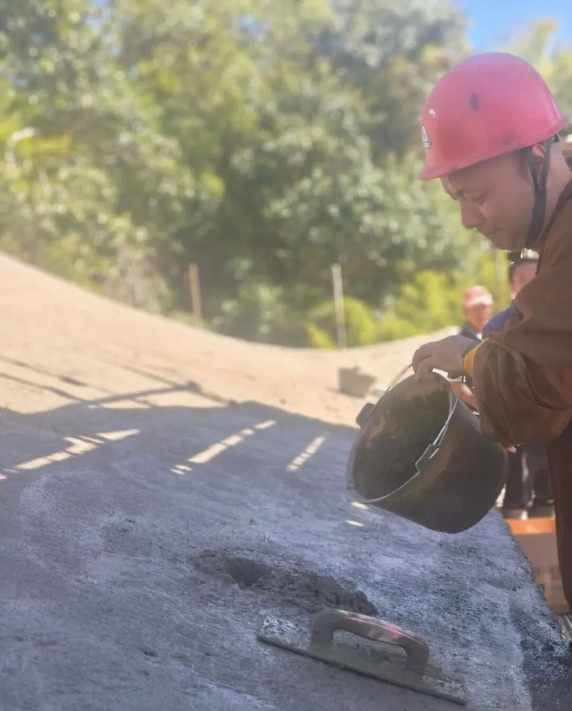
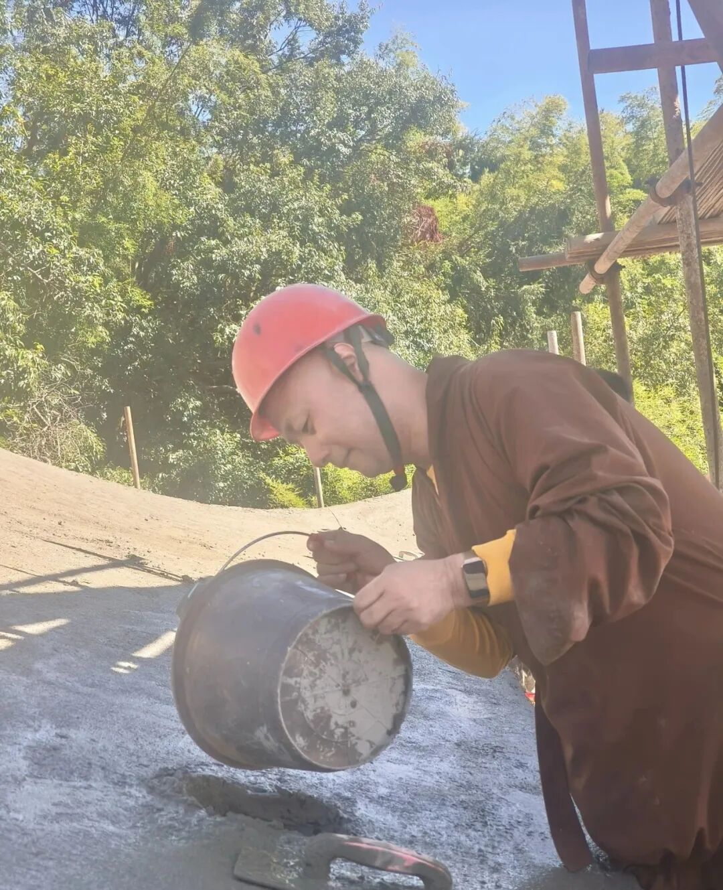
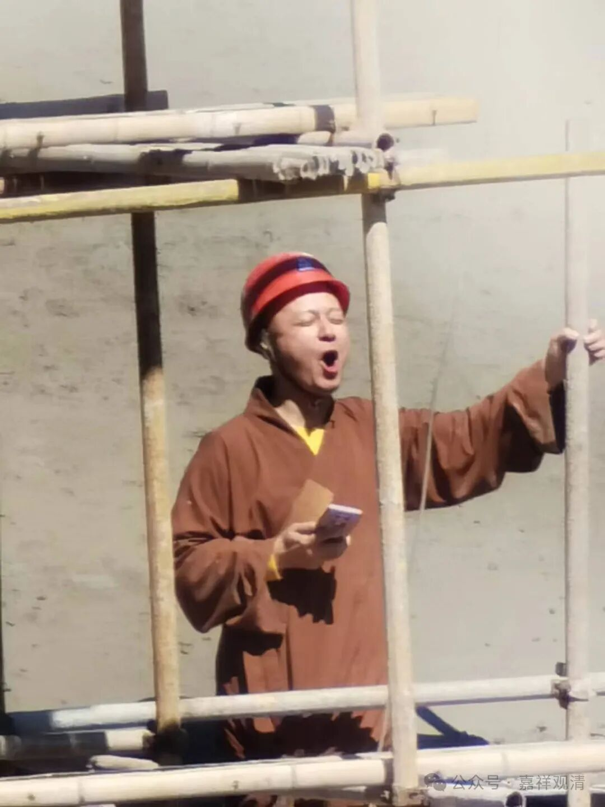
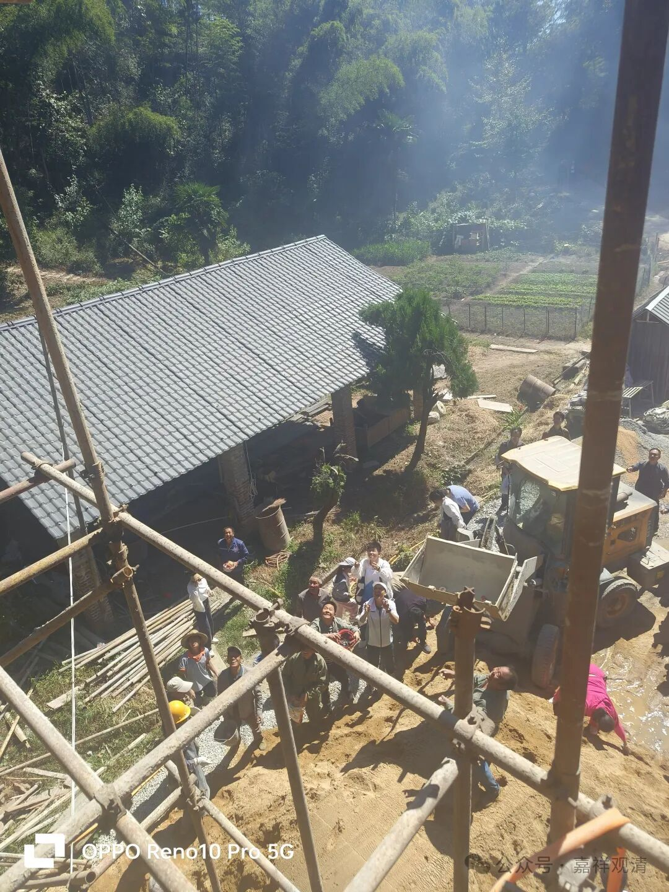

**封顶大吉，一切吉祥！**

前两天累了，没来得及介绍庙里新殿封顶的事，现在补上！

好事多磨，差不多拖了一年，咱们的新殿终于封顶了。

作为一个佛教界智识分子，“不务正业”地居然把个“小庙”造起来了，呵呵，这是连我自己也未曾想到过的，却是老一辈们劝我应该要做的。现在在种种因缘下、施主的助力下、工人的辛劳下，有了个大概的样子了。（我是不是应该要谦虚一下……）

老周给我留了最顶上的一块，

又留了最后一块让我抹水泥（你看我把安全帽都戴上了，安全意识满满的）

我想象中的举着水泥铲子唱“佛情”的形式，实际变成了我举着手机吼着上梁、封顶的吉祥话——那是由ai写了一小半，我再临时补足的。算是一个记录，就别给我打分啦——

“封顶大吉，稳固脊梁！

法轮常转，佛道永昌！

佛光普照，众生安康！

福慧双增，法音绕梁！

四海清宁，慧日清朗！

教幢高企，圣智增长！

障碍消除，功德增上！

僧团和睦，施主运昌！

世界和平，国家富强！

幸甚至哉，一切吉祥！！！”

保留节目——封顶结束，撒喜糖！（最后，那个挖机斗里接的糖果、巧克力最多。）

