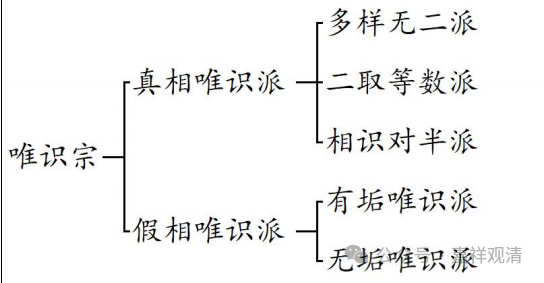

**《宗义略讲》006·034**

** “辰二，差别：此中分实相唯识师与假相唯识师二派。”**

宗义书系统对唯识的分类，就是总的分二，既真相唯识和假相唯识，真相唯识又分三，1、能取所取平等派；2、半开卵派；3、种种无二派；假相唯识分二，有垢假相派和无垢假相派。

 　      ┌二取等数派

 ┌有相唯识 ├种种无二派

唯识宗 │      └半对开卵派

 　│　　 　 　┌有垢无相派
 　 └无相唯识—└无垢无相派

各部宗义书里对唯识派的分类这一段，具体的内容，文字上都有，大家都说的（几乎一模）一样，但也都不知道这里面各派说的具体的人物、经典是谁、出自什么地方、也不知道具体意思是什么，反正大家解释起来都是文字上基本一样，同时又都语焉不详。我也问过我的师父们，他们也都不甚了了。其实如果不知道具体任务和具体主张的话，这种分类就很单薄。

当我们作为旁观者来观察“宗派论”这个题材的成立、演变史，发现它（此处所说的唯识宗的分派）的最初提出实际是出自臧地大师的抉择（这也难怪外部学唯识的人看起来有点莫名其妙了）——

最初，法师子（公元十二世纪噶当派学者）的《佛教与外道辨别论》是在藏传在著作中最早引进了出自《中观庄严论》的“有相唯识”和“无相唯识”说，同时在此上更作分派，已经有了后世宗义书中对唯识分类的雏形。

法师子在其《佛教与外道辨别论》中的唯识宗章节，其分派的树形图是这样的——

我们再取稍后炯旦热智所著之《宗义·庄严花》的唯识分类作对比，《宗义庄严花》的唯识宗分类的思维导图是这样的——

明显可见后者（《庄严花》）对前者（《内外道辨别论》）的继承。

另外，这里出现的“半对开卵派”和“二取等数派”都是后期臧文文献当中出现的分类科目，原先并无对应的梵文经典的词组，而法师子的著作中“释迦觉等论师”那一条目，则大致约等于后期说的“二取等数派”。

如果我们追朔上去的话，臧传整个宗义书文献系统里的“有部+经部+唯识+中观”的框架即是出自是法师子（公元十二世纪），此前智军的宗派论师则是把经部放在有部背景下谈的。也就是说，在智军的系统里，有部就包含了整个小乘部派佛教，包括经部，是法师子把经部独立出来和有部并列的……我们现在按宗义书的历史演变这样讲一讲，大家应该更能够理解宗义书里面的一些之前很难理解的地方了。

