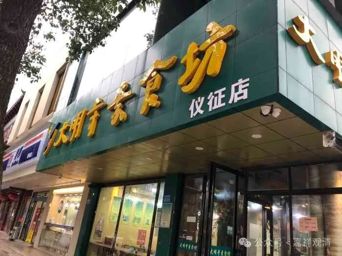
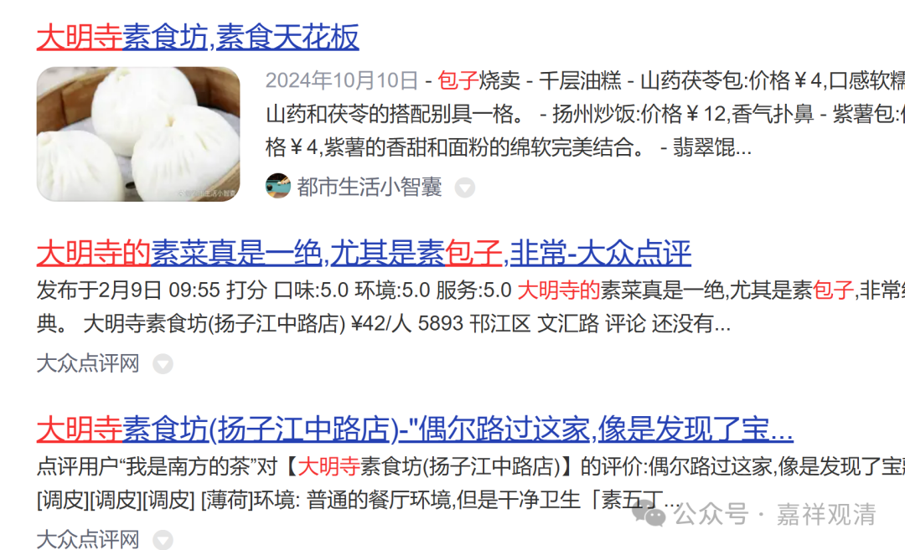
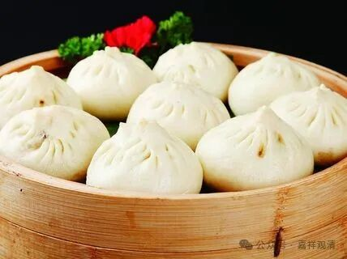
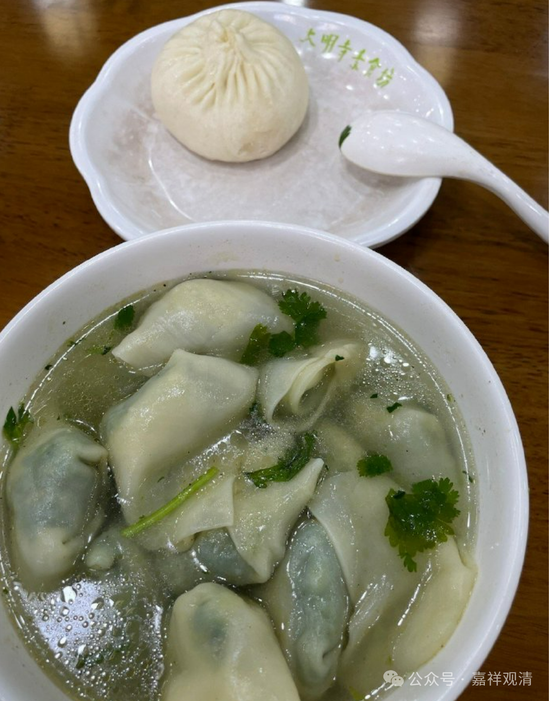
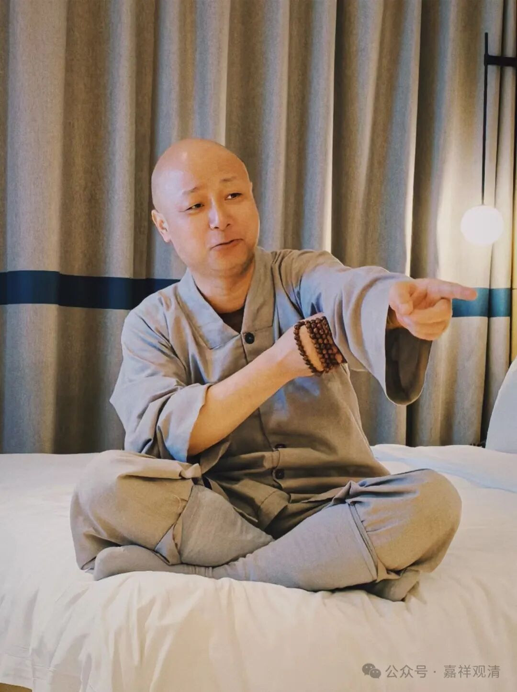

**大明寺的素包子**

很久没去扬州了。

我们普通人的人生，被“疫情”隔断为“疫情前”和“疫情后”……一想到疫情以后都没来过扬州，就知道，最少有五年没来了。

我是真有点想大明寺的包子了。

大明寺的素包子很有名，有一次我硬是晚上从江苏盐城的建湖夜奔到扬州大明寺包子店（大明寺素食坊、扬子江中路店）对面住下，就是为了第二天早上吃几个大明寺的素包子——我们吃素的，也就这么点念想了。（我去扬州市区，基本上就住大明寺素食坊周围，和梁朝伟的《功夫》一样，“一横一竖”。）

那次还正逢扬州的旅游节，旅店酒店爆满，好不容易才找了一家住下。第二天去大明寺，还有素食文化节，正赶上星云法师进寺院，那是第二次见到他本人，两次还都是在扬州。

现在大明寺的包子店（大明寺素食馆）开了很多分店，弟子家门口也开了一个，原先还做素斋，后来包子实在好卖，就只做包子了，还搞了礼盒装，可以直接发速冻快递。这个国庆节庙里来人多，直接订了600个大明寺素包子寄到庙里，解决了几十个人的早饭问题——大家是真有口福啊！

这不，一大早赶去包子店，吃了一碗素馄饨，再来个“马齿笕”包子（豆腐皮包子和素烧麦也很好吃，但没那个肚子了），赞！

回来传了个《金刚经》（这张可以做表情包——“侬组撒！”“马上拉到五千点！”）

再去长江边上放宝瓶——智慧（《金刚经》）和福报（放宝瓶）都有，圆满！

