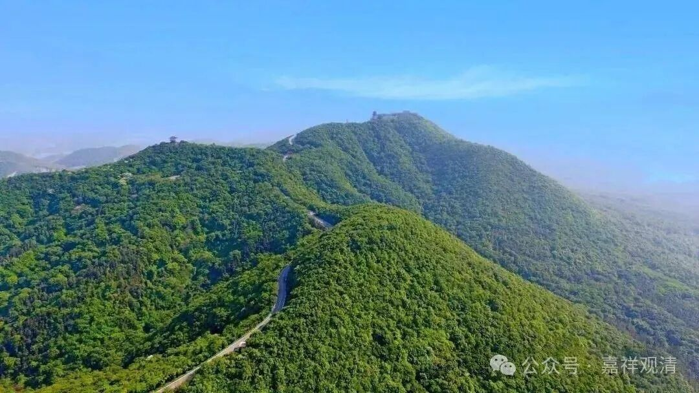
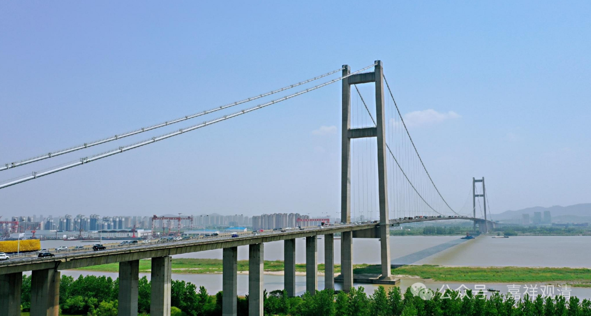
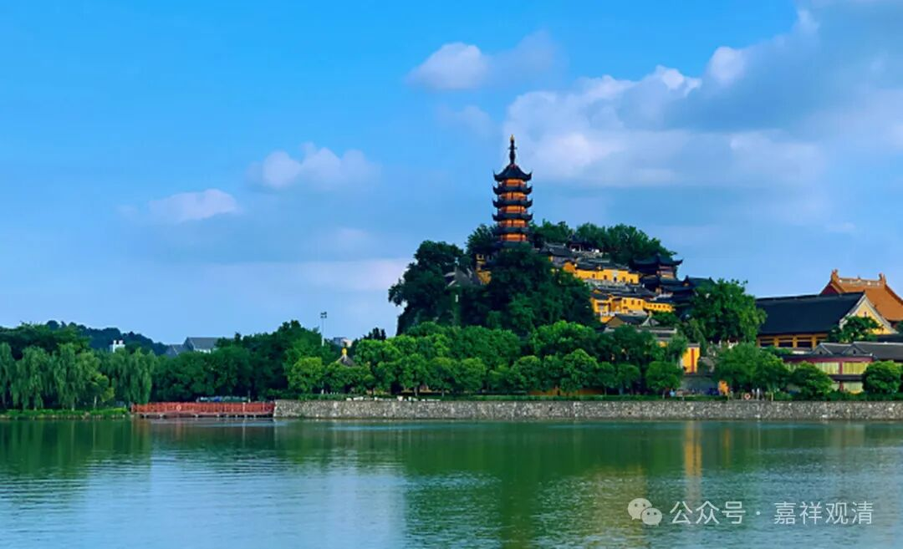
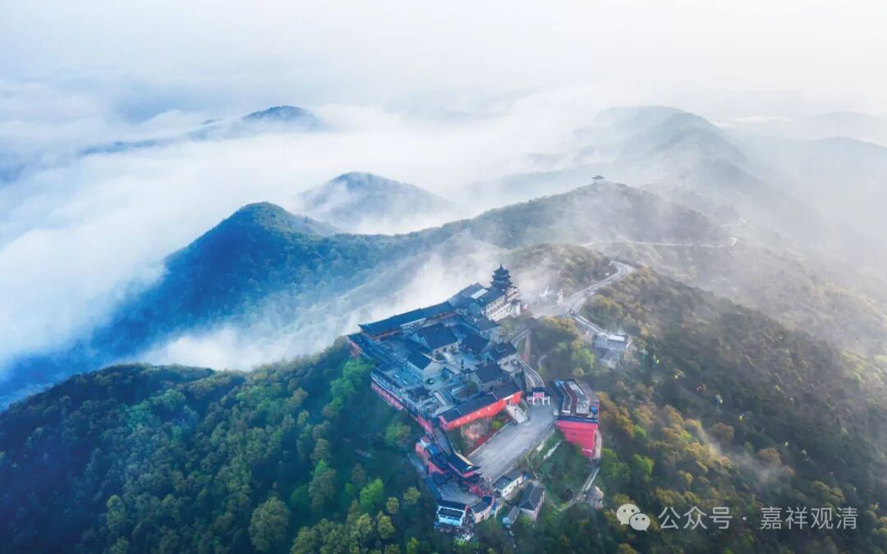
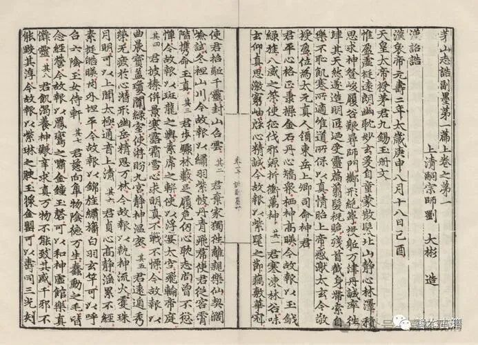

**镇江，先说茅山……**

“京口瓜州一水间”，“瓜州”（今属扬州）的江对面就是镇江（京口）。以前需要“瓜州渡”“西津渡”乘船渡江，后来有汽渡什么“几圩”“几圩”的，可以坐汽车摆渡，现在两地之间有了跨江大桥，“天堑变通途”。

镇江和扬州之间的长江大桥，叫“润扬大桥”——因为叫“镇江大桥”也不好，叫“镇扬大桥”也不好，而镇江以前叫过“润州”，于是叫“润扬大桥”，完美！

以前来镇江，市内的话，都是去金山寺、焦山寺、北固山、甘露寺……镇江境内的话，以前宝华山走的比较多，也去过茅山，去过茅山的新四军纪念馆，在那里放过鞭炮——那里放鞭炮的话，会传来类似军号的声音（因为回声的缘故）。

茅山上有道观，道士对人，比和尚对人要客气多了。那次上山，山下要买票，见我是和尚，问我带没带“戒牒”。那次真的是非常难得地随身带了戒牒，出示给他们看了一下，人家就直接放我们车开上山了。

到了山上，路遇的道长也是很客气地和我打招呼，还很关心地问：“要不要住一天，有戒牒的可以在这里挂单的。”哇，太温暖了！我说：“谢谢！我只是路过，还有事儿要赶回去……”道长仍旧很暖心地说：“没事，想住的话可以住……”

我看到了“传统”！“传统”上、旧社会，佛道教的丛林可以互相挂单三天的。那次见到“事实”了。

后来我在其他几个道观（峄山、昆嵛山、南武当），道长们也都很客气，反倒是很多寺院的出家人非常不好说话……哎……ZZ法师说，“自己人往往更不好说话”，呵呵，也有道理。

道观里买了一本《茅山志》，应该是茅山道士写的，佛教部分一点都没有落着笔。实际茅山上以前有很多寺院，牛头法融就出生在茅山脚下，而三论宗著名的“茅山旻法师”（又称明法师）也是在茅山领众的，他是吉藏大师的师兄弟，当时在三论宗里的实际地位要略高于吉藏大师，是继承兴皇法朗法席的人物，类似三论宗“掌门人”的存在……

