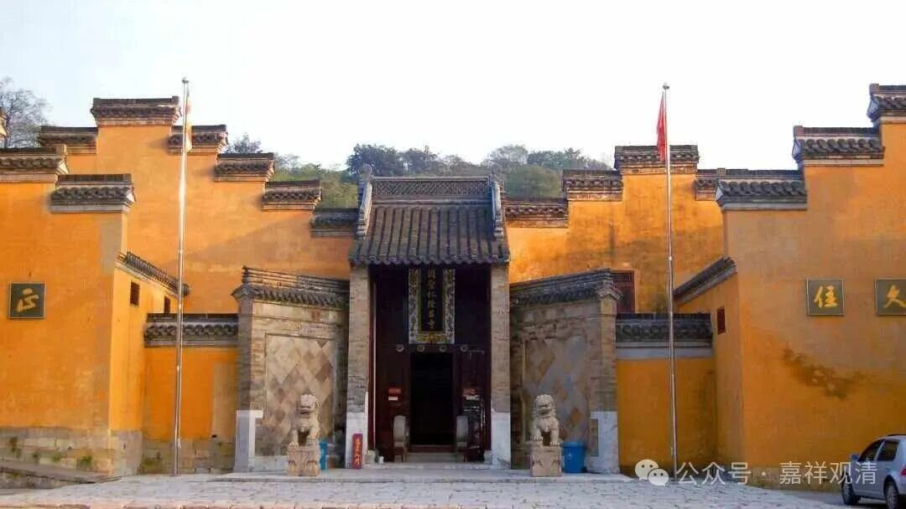
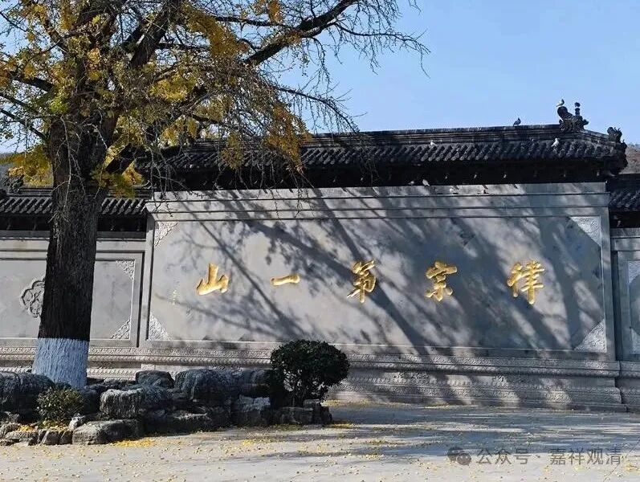
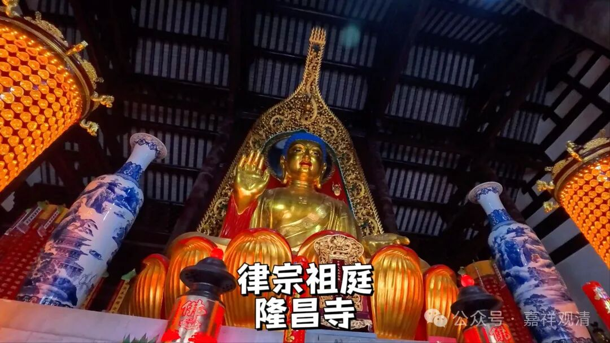
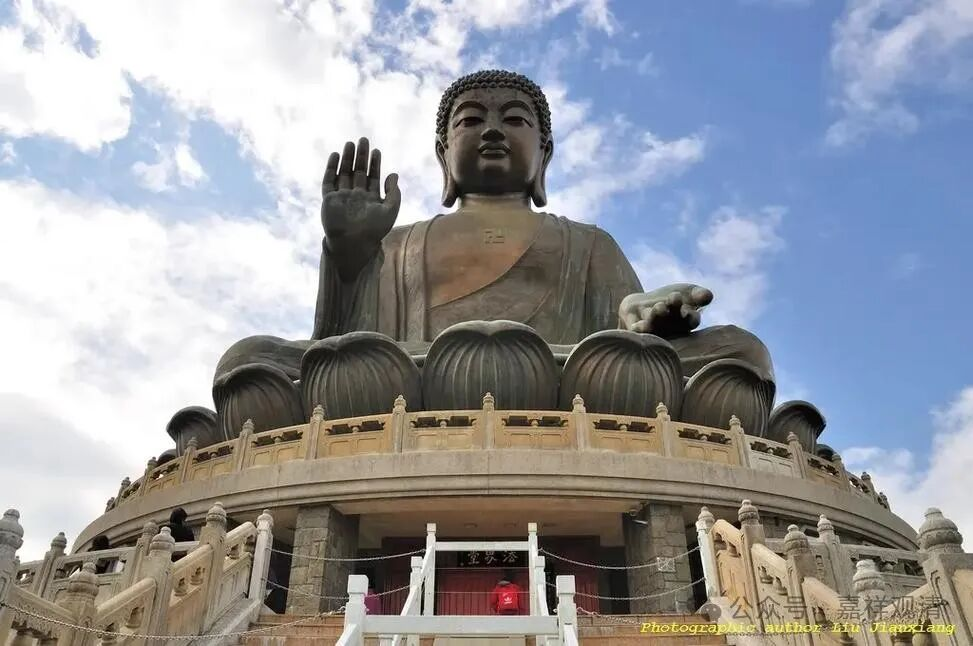
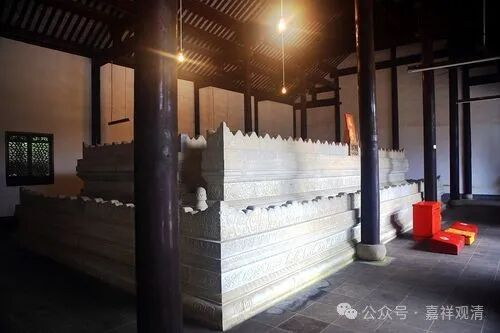

**句容·宝华山隆昌寺**

镇江，以前我最熟的是宝华山隆昌寺。

那个时候，从上海新客站（老北站）做绿皮车到镇江句容站要六个小时零五分钟，还是那种“红眼”车次。到了句容站，做三蹦子一路突突突就上山了，句容站到隆昌寺好象是十几块钱（？也可能几块钱）。

那时候三蹦子正常宰客，我们大致知道价格，浮动个几块钱也正常，但也有香客被宰狠了的。有一次一个司机宰狠了，宝华山的师父知道了，直接叫了几个人出来把司机车胎给扎了……后来那些司机们就都老实了，毕竟要接这里的生意。

我第一次也被“宰”过，因为不认识路——三蹦子司机不是开车直接送我上山，而是把我扔到318国道边上的一条小路口，说上去就是，实际走了有将近一个小时。三蹦子不肯绕远，不然他绕后面的山路上去至少也得十几分钟。十几年前再去隆昌寺，以前的那条小路变成了正路，从国道边上就直接上到隆昌寺正门了。

那时候住在隆昌寺，在藏经楼听禅修课。有一次晚上出门上厕所，回来不经意地一抬头，漫天的星星，就像顺着我抬头的动作撒上去的一样，那真是震撼！当时就想匍匐在地上了……后来一想，作为一个佛弟子我不能这么“自然崇拜”，才压下了这颗“诚虔”的心。

那时候的隆昌寺还很破，没什么大修（其实十几年前上去的时候，寺院仍旧没什么大变，只是门口和山路大变样了，完全认不出来了），一尊释迦佛像原来是香港大屿山的预制的缩小的模型，说是赵朴老见宝华山没有佛像，专门让搬过来的。

大屿山的佛像

寺院里还有一个戒坛，这是珍贵文物了，因此戒坛在文革中没有被毁。周围的僧寮还有一些毛主席语录（十年前仍旧）依稀可见。

宝华山从清初开始就因为传戒（千华派）而有名，最有名的就是见月读体大师（云南人，原是道士）了，他的塔在寺院北偏西的山上，当年我们爬野山找上去过，后来开了路出来。近代佛教高僧如法尊法师、巨赞法师也都是宝华山的子孙。

隆昌寺寺门朝北，传说是为了迎接康熙南来，其实倒未必是这个原因，以前寺院建造跟着山势走，朝哪一边都是有可能的。

