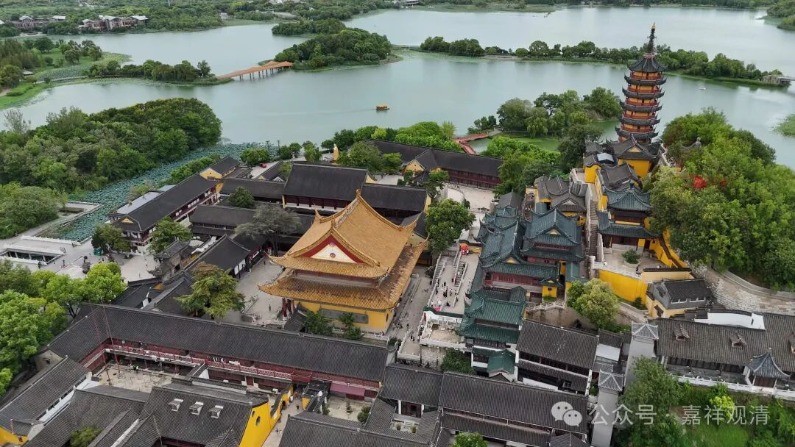
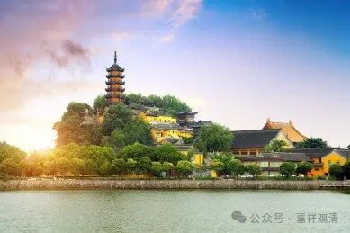

**镇江金山寺（一）**

金山寺最有名的是“白蛇传说”，但是，实际白蛇故事里“金山寺”的最初原型并不是镇江的金山寺，而是在今天上海金山（杭州湾，解放前属浙江）一带的“金山寺”，就像故事里的“断桥”也在杭州西湖。但是因为镇江金山寺也在“水中央”（后来在水边），而且名气更大，于是大家普遍认为“水漫金山寺”就在镇江，而且还出现了“法海洞”、“许仙药铺”之类的景点……呵呵，“凡是群众需要的，就是市场乐于提供的”《===这句话也是民间佛教之所以存在，正统佛教之所以孱弱的社会原因。

佛教圈里，金山寺最早的名僧是佛印了元禅师，他是饶州浮梁人，就是《琵琶行》里“商人重利轻别离，前月浮梁买茶去”里的那个“浮梁”。浮梁以前属于江西饶州鄱阳县，现在和景德镇都“单飞”出去了。佛印禅师的出生地离我们白云寺很近，也就小几十公里的样子吧。佛印了元禅师在镇江金山寺和焦山寺都做过住持，也被算作镇江的名人了。

镇江金山寺的历史地位，在佛教界一直是不算最高的，顶多算州府一级的大寺……但到了清末，金山寺的地位却陡然窜高了，几乎成为天下（禅宗）第一丛林（和扬州高旻寺齐名），清末的几个名刹的江湖排名中，镇江金山寺和扬州高旻寺都必须在名单上，比如：

1、“上有文殊、宝光，下有金山、高旻”：这是说清末（长江上下游的）四大丛林——成都的文殊院、新都宝光寺、镇江金山寺、扬州高旻寺；

2、“金山的腿子高旻的香（，天宁寺的唱腔盖三江）”：这是说在金山寺想挂单，先得能打双盘俩小时；高旻寺则需要被知客“陪”过三支香以后才能挂单；常州天宁寺，则在丛林当中唱腔数第一。还有一个版本，是说“天宁寺的包子盖三江”，说天宁寺打禅七的时候伙食好，包子（好吃）盖三江。那必须的，因为盛宣怀是天宁寺的大施主啊！

3、清末四大丛林：镇江金山寺、扬州高旻寺、常州天宁寺、宁波天童寺。

金山寺在清末的强势崛起，和其“中兴”有关——太平天国事件以后，江南佛教遭受重创，其中以金山寺、高旻寺（此二由扬州盐商助力）、天宁寺（盛宣怀助力）恢复最快，所以也就声名独享了。

