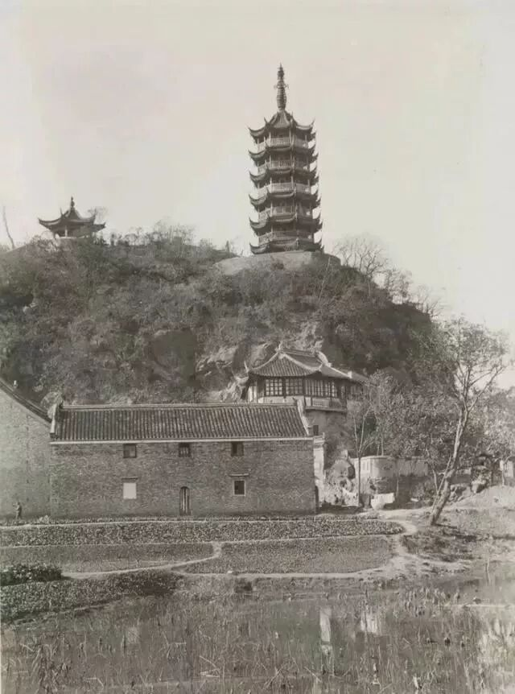
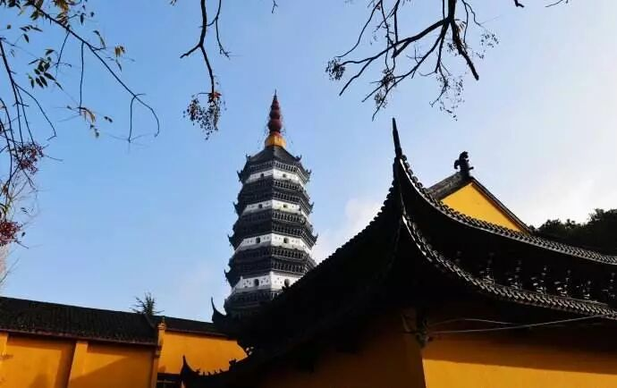
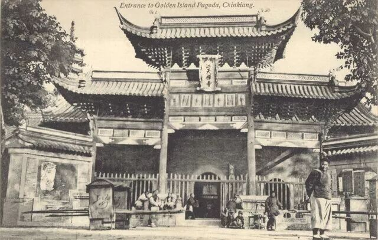
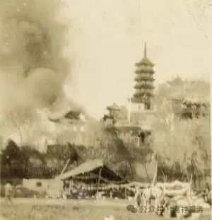
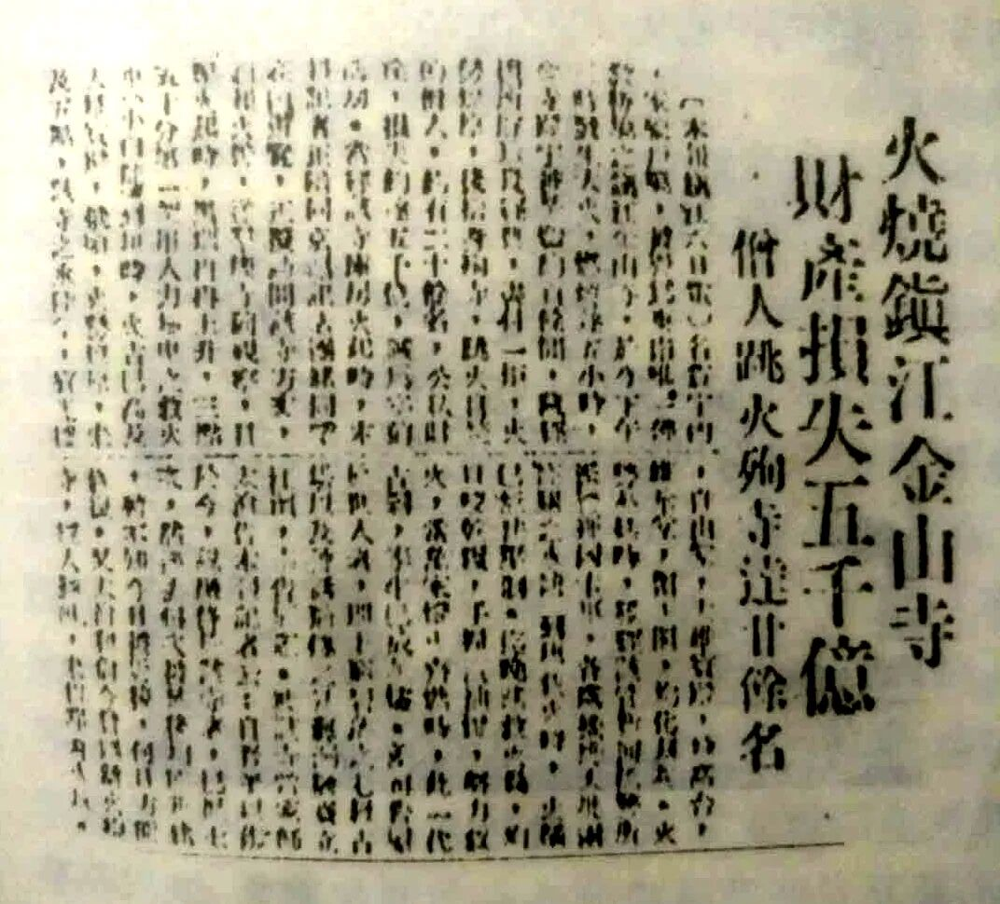

**火烧金山寺**

帝制时代结束，进入民国以后，金山寺发生了两件大事。

第一，“太虚大闹金山寺”。

社会“革命”了，佛教界也要有所行动，（另一种意义上的“落后就要挨打”，）第一丛林的金山寺不得不被大家推出来响应“新社会新秩序”，要成立中华佛教总会。以太虚法师、仁山法师为代表的僧界革命新知识青年向金山寺为代表的老旧势力发出了最强质疑+抢班夺权，最后以新青年僧死一人、伤若干，太虚、仁山跳窗逃走……金山寺有老僧、工人因此入狱……八指头陀敬安赶来出面组织中华佛教总会而结束。（八指头陀为总会成立一事赴北平，被辱后圆寂于北平……）

金山寺，康熙题名“江天禅寺”

第二，火烧金山寺。

1948年四月，金山寺大火！

唯一留下的火烧金山寺的照片。

这时本来就时局很乱，我刘邓大军挺进大别山，陈谢、陈粟兵团在中原展开，三个月后就是豫东战役、此后是济南战役，年底就是淮海战役了……镇江街面上已经谣言四起，人心惶惶了……

此时有老僧管理不善，整个金山寺几乎都被付之一炬，仅有少量文物、殿堂被保住了。

二十多位老僧无法接受现实，前后赴火而亡，方丈大师则被周围人看住而没能殉寺成功，但终于自责过甚，精神出了问题……僧众、常住“无家可归”、终日惶惶……年轻一辈的，见未来无所希望，便有改赴南洋的，也有的受了老和尚们的“启发”跳水自杀的……金山寺顿时就没落了！

