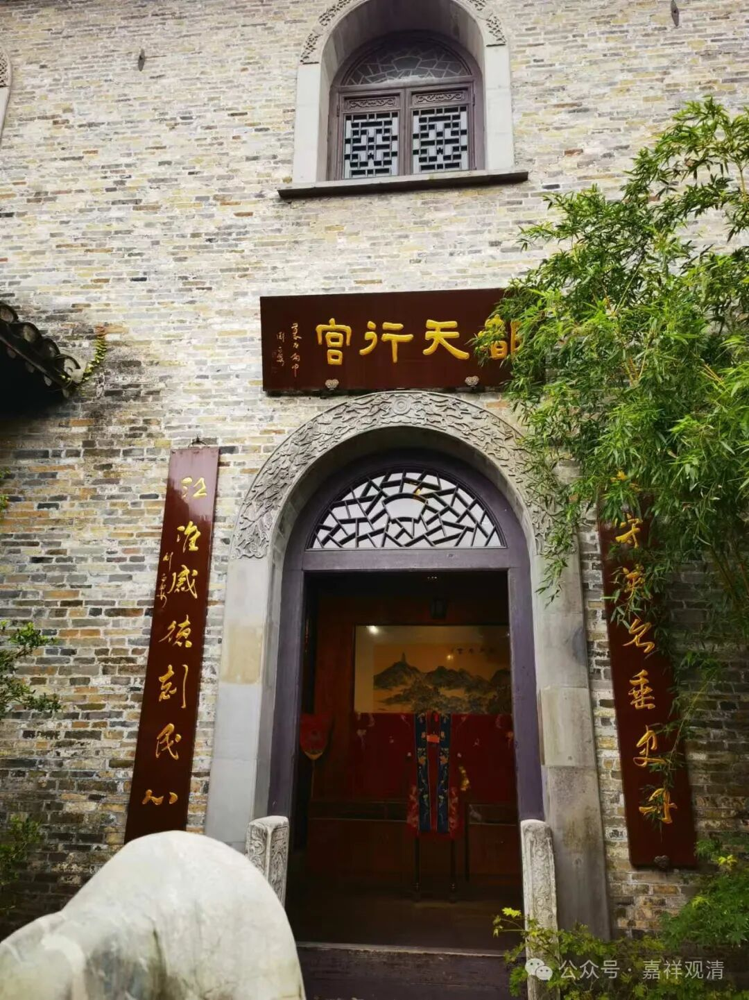
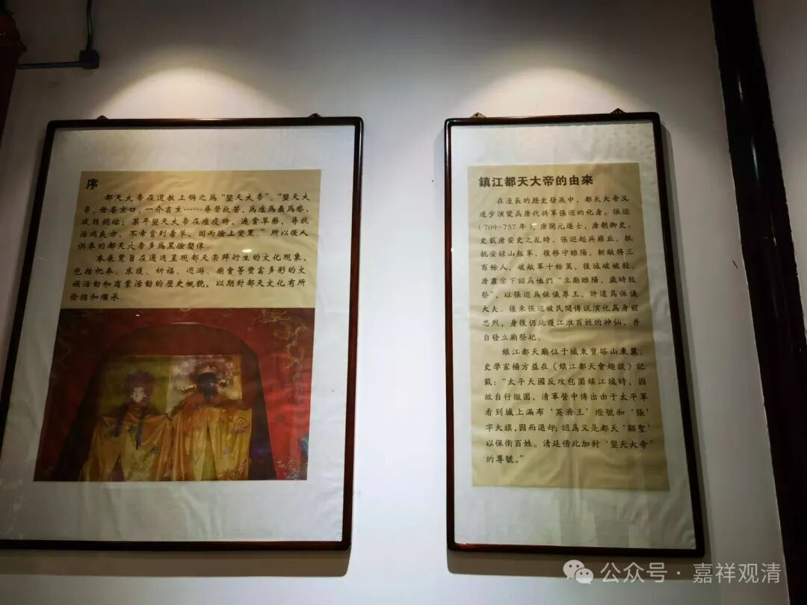
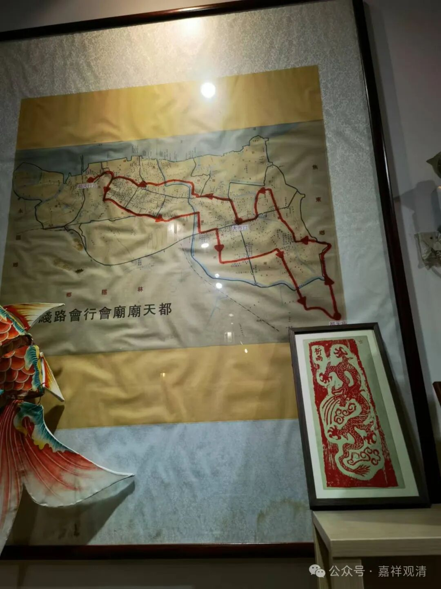
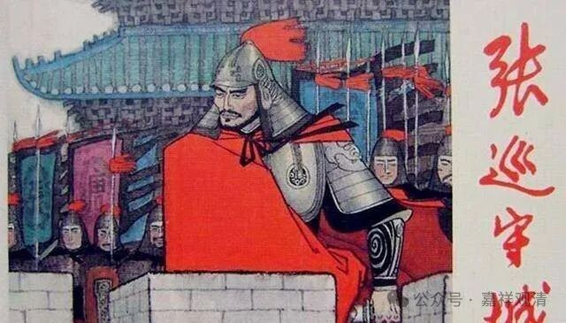
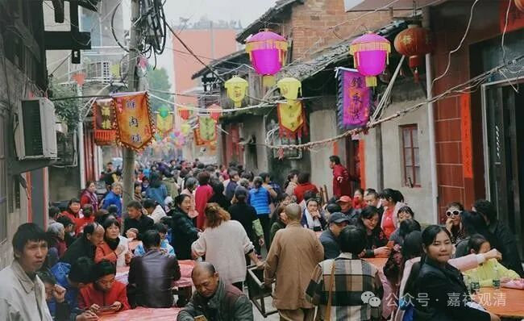
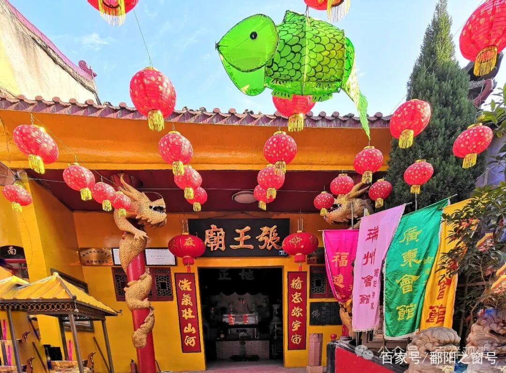
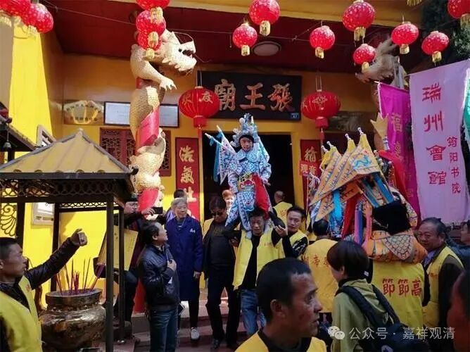

**镇江的都天会**

逛镇江之“西津渡”，看到沿街一个门面叫“都天行宫”，这一看，就是一个“在民间”的“宗教活动场所”啊。“行宫”，明显说这里拜的神是有官方身份的！

走进去一看……呃，卖小商品的。问店员，说：“你们继续进去看……”

再里面一间，小商品之外，墙上布置了一些展板……

哦，原来，这个“都天”是英济王张巡！

唐安史之乱，张巡在睢阳守城，斩将杀敌，硬扛叛军……虽最终兵败被杀，但为唐王朝赢得了喘息的时间。安史之乱后，肃宗下诏各州府为张巡立庙致祭，遂成为国家祭祀的重要神祗！此后因为张巡的保国智勇忠义，历代祭祀不绝，称尊为“靖忠王”“孝王”“英济王”。后来，年岁既久，“礼下诸野”，张巡信仰就进入全国各地的神祗系统中了，江西的鄱阳湖神祗系统中，张巡也是一个重要的“大神”！

鄱阳十一月月底有张王庙庙会（今年有空的话可以去专门去看看），镇江这里四月有“都天会”，性质是完全一样的，都是张王出巡，只是“张王庙会”时间比较短，“都天会”则有前后约一个月的时间。（鄱阳以前是饶州府的府治所在，镇江也是润州府的府治所在。）

鄱阳的张王庙庙会现在恢复了，镇江的“都天会”不知道有没有恢复，下次问问看（以目前“都天行宫”的规模来看，大概是歇菜了，正常，有为法都是无常的！）。

