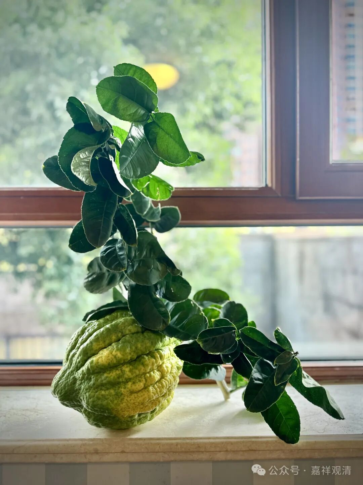

**关于唯识系诸大师的“俗有真空”说**

一般，按传统的说法，中观宗才是持“俗有真空”的“二谛说”，但实际看来，唯识系统中不乏有一些大师级的人物也持“俗有真空”说。

一、大乘光（普光）的《<大乘百法明门论>疏》

光师的《百法疏》中说“所以有體，世諦非無；所以言空，真諦何有？”说胜义空而世俗有，文字已经非常明显了。

二、敦煌昙旷·《<百法明门论>开宗义记》

昙旷法师在其《百法疏》里也说：“三、生圓照，具明真俗，雙顯有空，令得中道，起圓照故”，“具明真俗，雙顯有空”，也是“俗有真空”的意思。

三、欧阳竟无；四、王恩洋

王恩洋先生在其《五十自述》里说，他就“胜义有无”的问题问道于欧阳大师，大师嘱其读清辨《掌珍论》。王先生读后大为叹服，遂就“胜义空”而不动摇。

这么看的话，王生生和欧阳大师都是持“俗有真空说”的。

但以上四位都自许为唯识师，可见唯识师系统有持“俗有真空”者。

但同样的“胜义空而世俗有”，明显唯识师和中观师的观点并不相同，试做如下整理：

部分唯识师：世俗有（自性有），胜义空（二取空，等）

自续师：世俗有（自性有），胜义空（谛实空）

应成师：世俗有（唯名言有），胜义空（自性空）

也就是说，唯识师的“胜义空”，并不应是中观师的“胜义无自性”，唯识的（胜义）“空”，是“三无性”、是“二取空”、是“唯识无境”（这个“空”在唯识的形而上学的建立上稍显薄弱。）

追究起来的话，唯识师取“俗有真空说”，大致有两个原因：一方面是长期受到来自中观的压力和暗示，另一方面也是理论上有难以迈过的一关——圣根本定时缘法性真如（空性），到底是以什么方式认识的？

