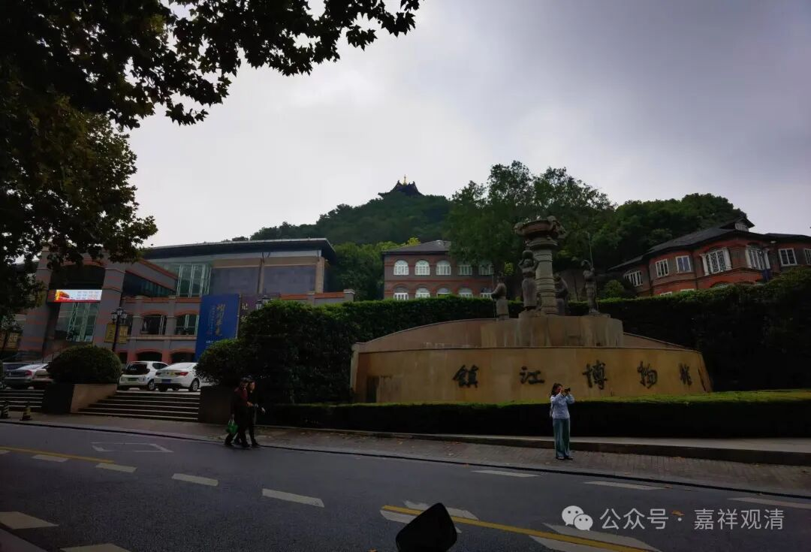

**甘露记忆
**

** 长干寺、禅众寺、甘露寺，和李德裕**

镇江西津渡口的东南角，有镇江博物馆。对于我们这种经常冒充文化人的，这是必须要去走一遍的地方。

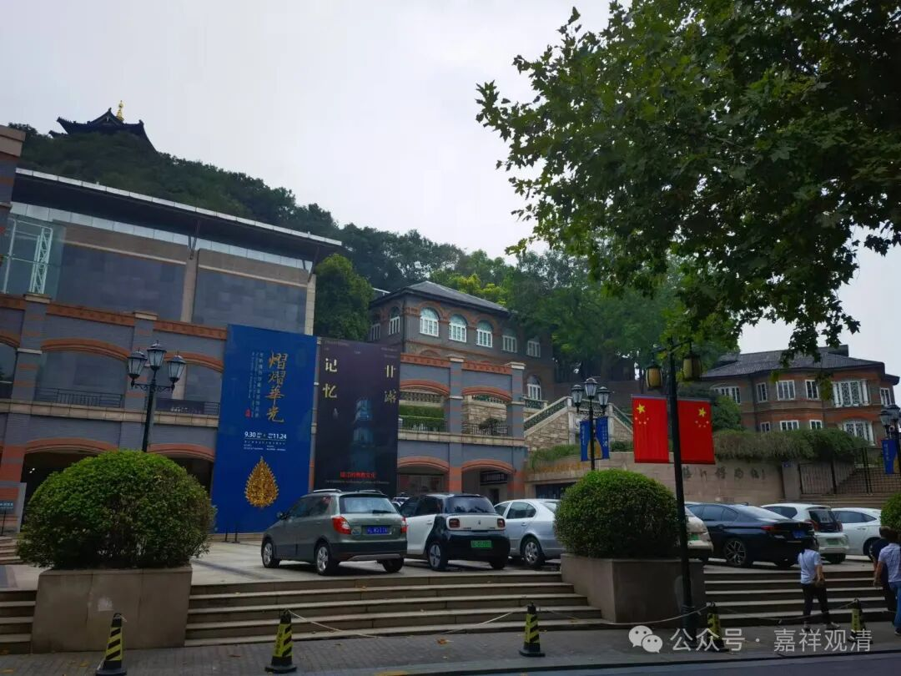

镇江博物馆有一个付费的展览，叫“甘露记忆”，差点错过。本来在看展的时候就觉得博物馆佛教文物太少，果然在边上专门有一个佛教主题的展览。

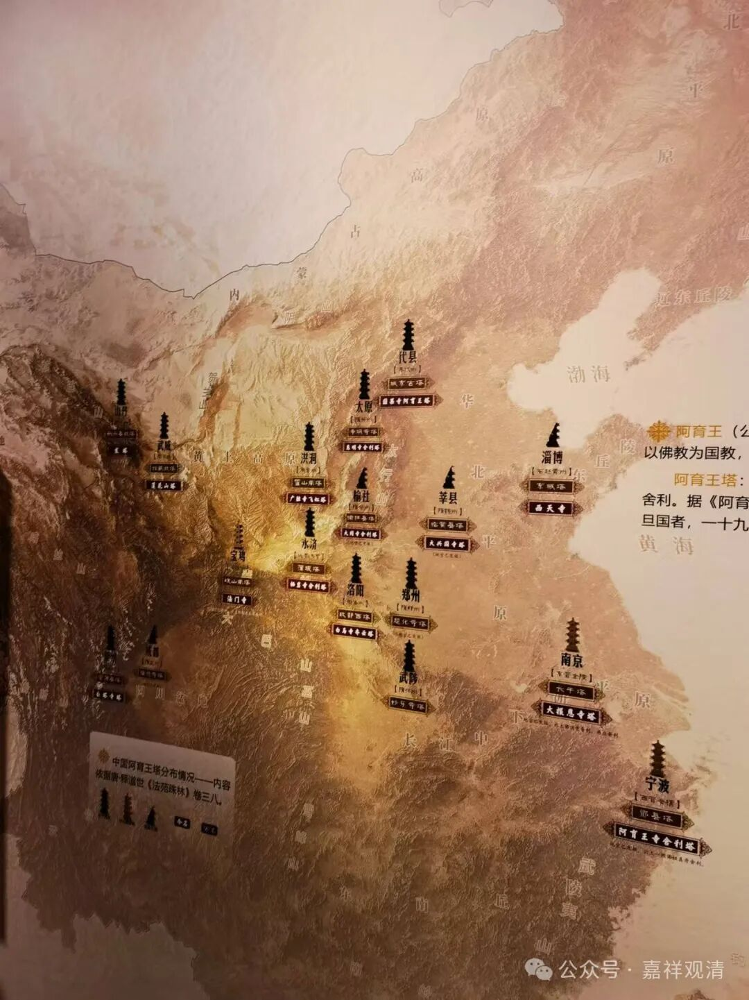

“甘露记忆”，“甘露”就是指的甘露寺，就是“刘备招亲”那个甘露寺。实际甘露寺始建于唐，由名相李德裕创建，三国时有信史记载的孙权建的寺院是南京的“建初寺”，那时候刘备早就在成都称帝了……

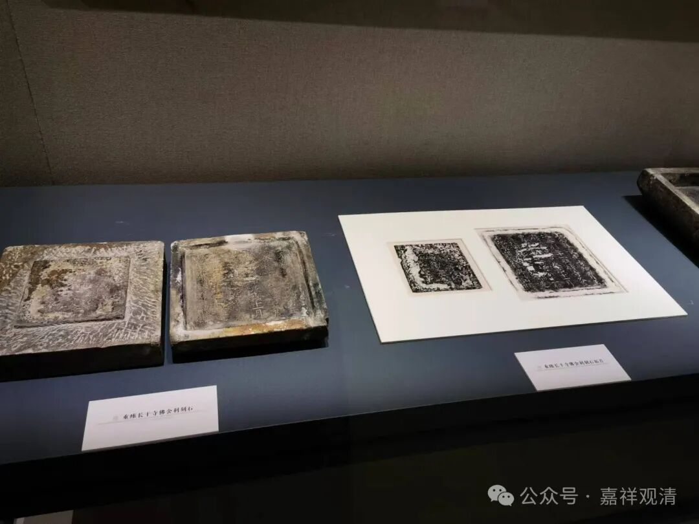

时刻记载的长干寺舍利

建初寺后来在南北朝的时候叫长干寺（这个记住，一会儿要考），三论师里有一个叫“长干辩”的，就在那里住持。后来长干寺在北宋年间叫天禧寺，这个名字一直沿用到元末明初。明代改名大报恩寺……太平天国年间被毁……最近南京恢复了大报恩寺。

李德裕在镇江（浙西）做观察史的时候，发现了南京长干寺塔的佛舍利，于是取舍利在镇江北固山建甘露寺；

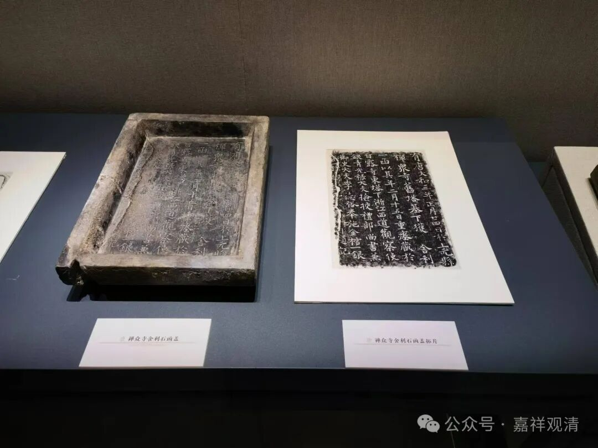

禅众寺舍利函盖

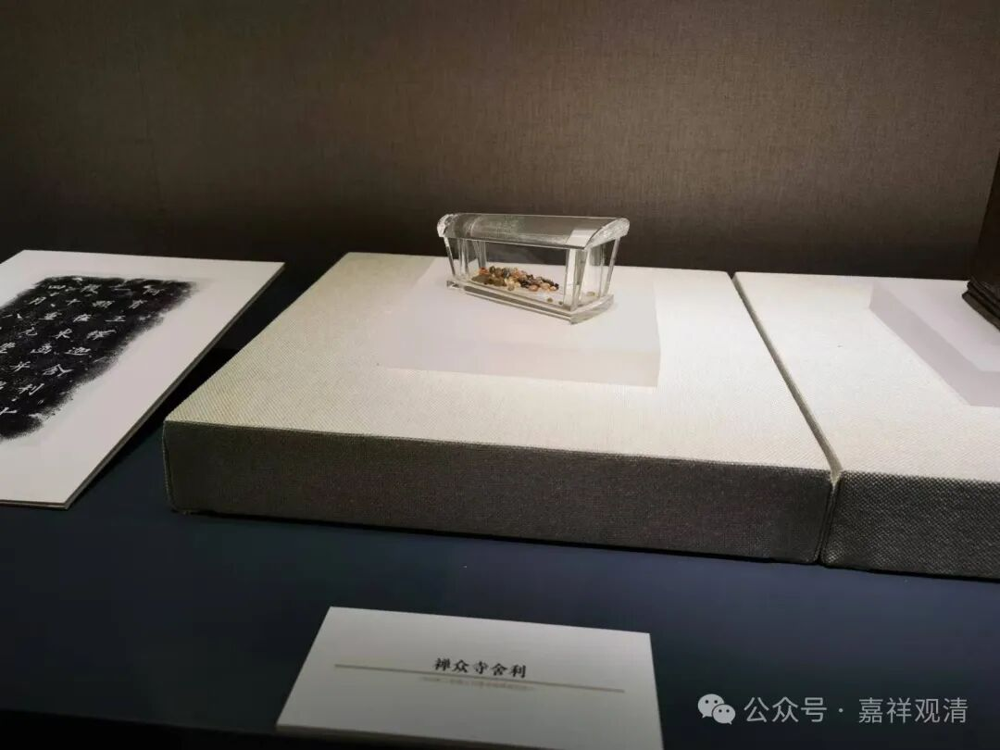

禅众寺舍利

后李德裕又在南京禅众寺（也是南京名寺，南朝至初唐时期也曾有三论宗僧人驻锡）发现有佛舍利，于是一并转入甘露寺地宫。

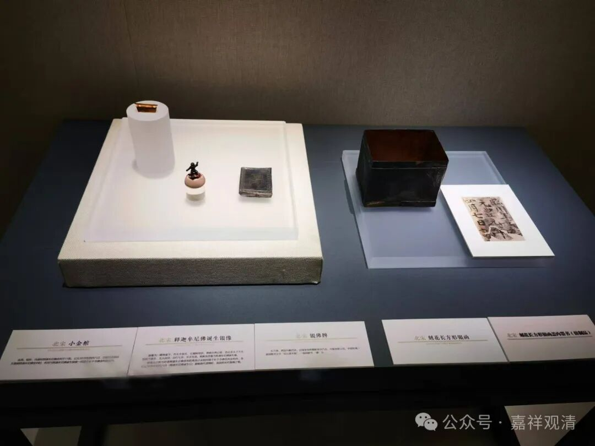

北宋舍利小金棺等

北宋甘露寺住持发现这批舍利，再次重建甘露寺……解放后又再次出土，这次镇江博物馆做了这个专项的展览，于是，我就看到了。

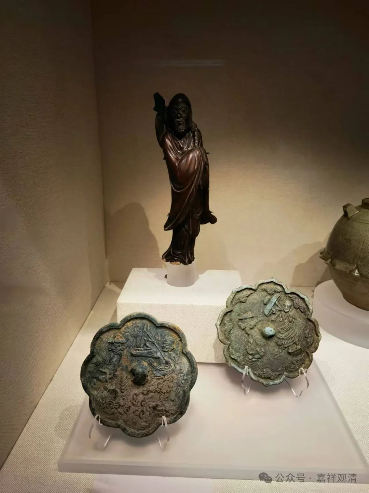

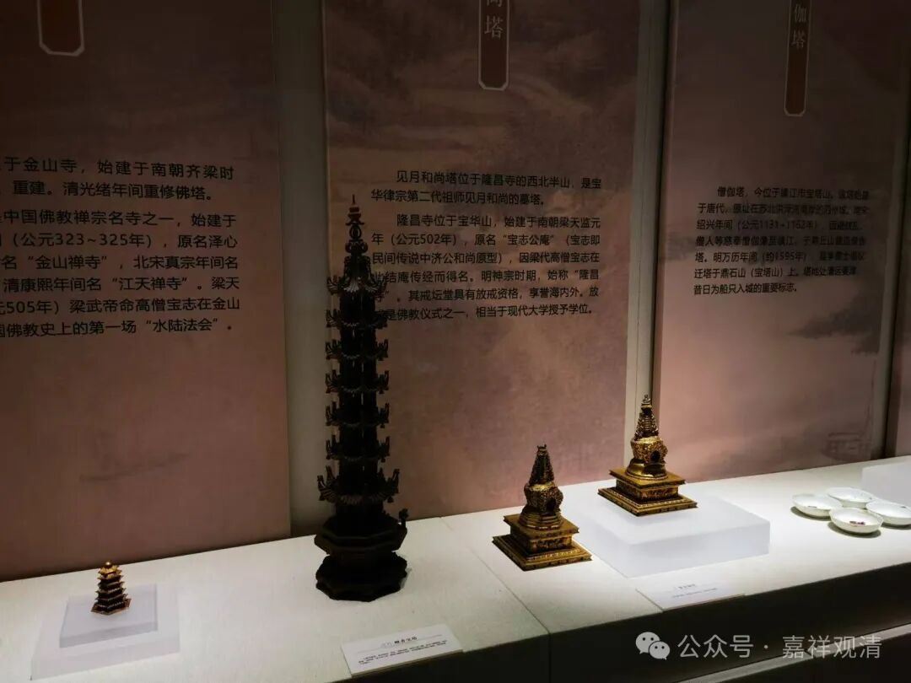

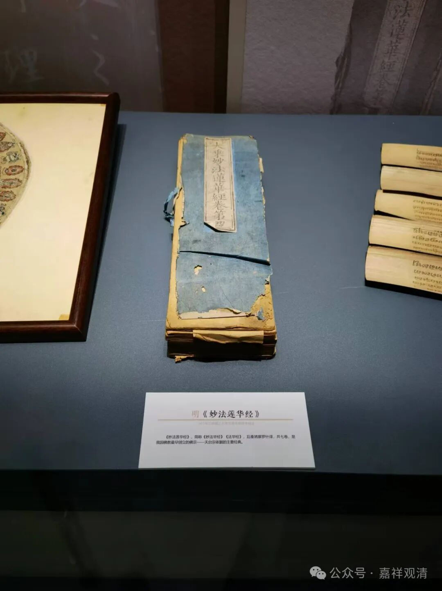

（不过，展览的甘露寺地宫文物仅仅是很小的一部分，加上一些藏经、文献，一共也就一百多件。）

展厅一角有盖图章的，这个现在在各个博物馆都很流行。我拿出一堆餐巾纸，咣咣一通盖……

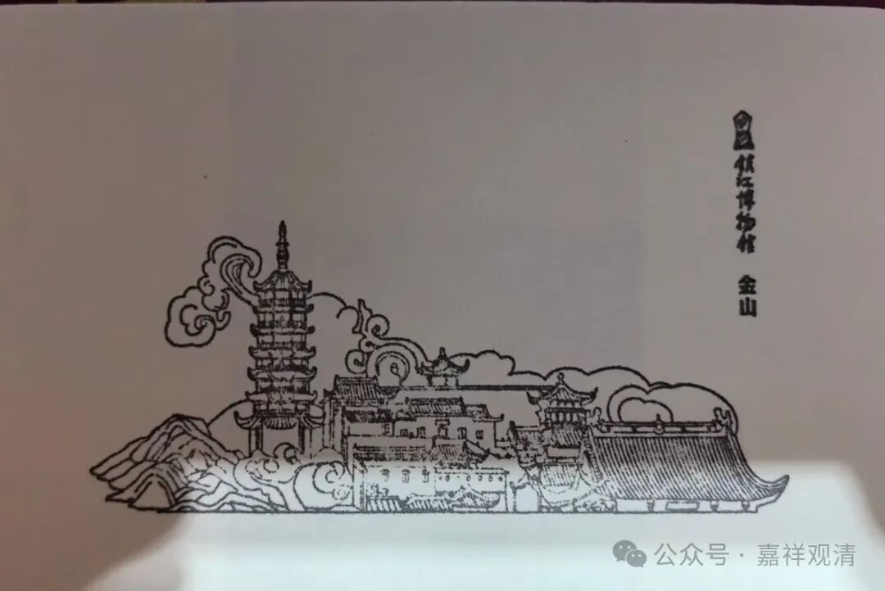

镇江博物馆的章，图案是金山寺。

突然伸过来一只手，送上一堆纸……哈哈，原来是纸被用完了。

送纸的保安大哥小声问：“你们是做这个的（出家人）吗？”

“是。”

“你们怎么进来的？”

“我们也是扫码买票进来的……”

“哦，和尚不免费啊……”

