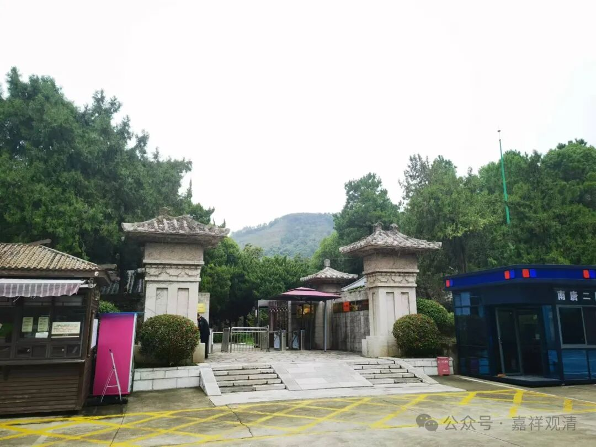

**祖堂山·南唐二陵·祖堂集**

南唐二陵在南京祖堂山，北边就是牛首山。神尼说祖堂山这个名字很熟，对啊，禅宗史书有《祖堂集》，也是这俩字。

祖堂山

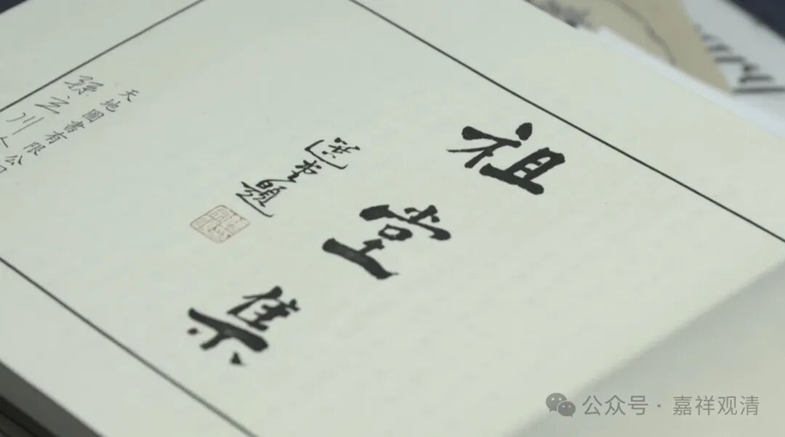

《祖堂集》由南唐禅宗僧人完成，不知道和祖堂山的皇室陵墓有没有关系。

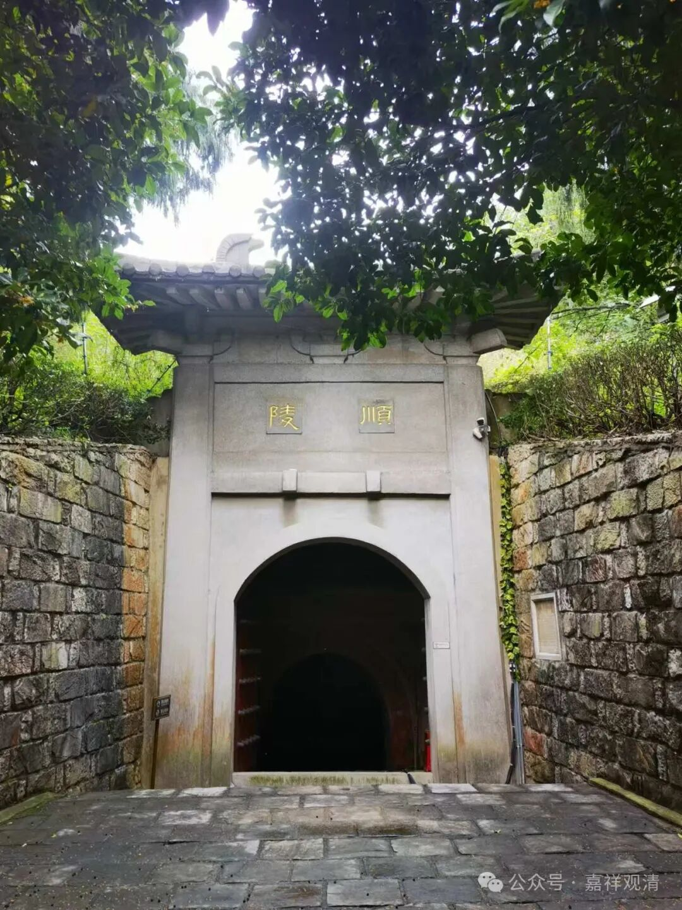

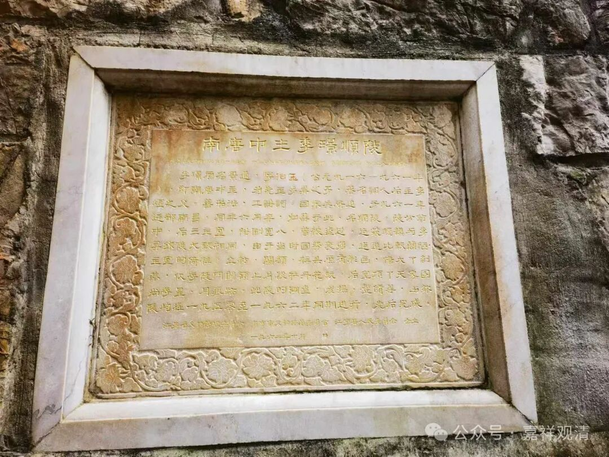

顺陵

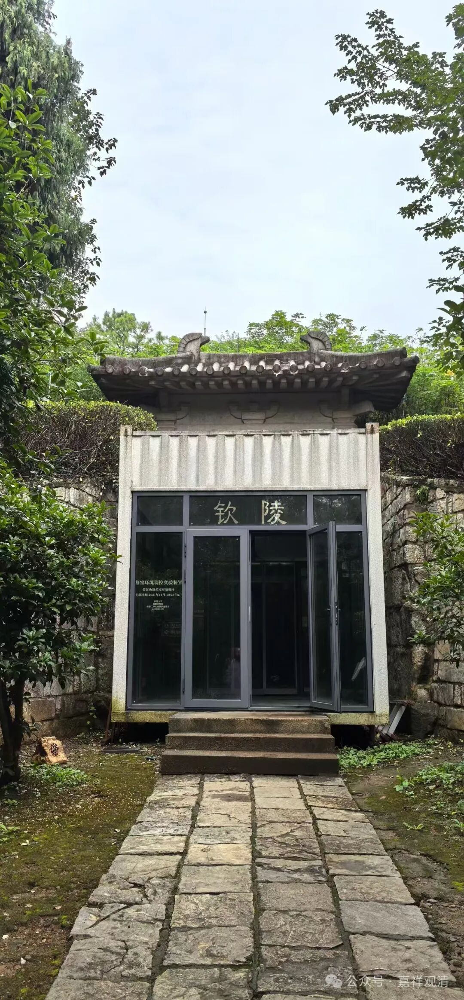

钦陵

南唐二陵是钦陵和顺陵，规模、等级都差不多，分别是南唐初二代主李昪（妻宋氏）、李璟的陵墓。

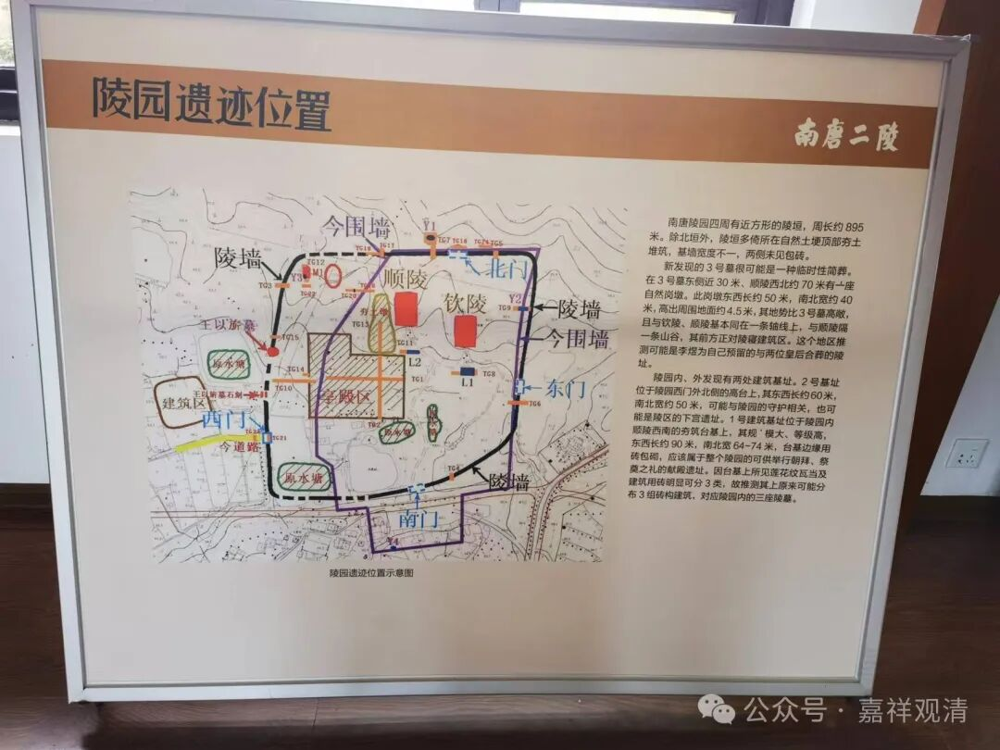

现在又说南唐三陵，因为在二陵的西方有新发现一个墓葬，规格很高，据推测应该是李煜的大周后的临时墓葬，因为在这个墓葬和顺陵之间还有一个小小的山包，看起来就是给李煜预留的，但是……他的身份已经不够了。

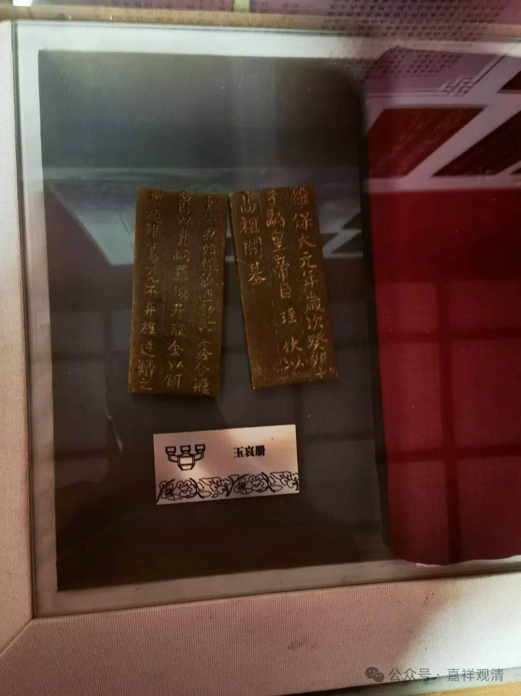

玉哀册

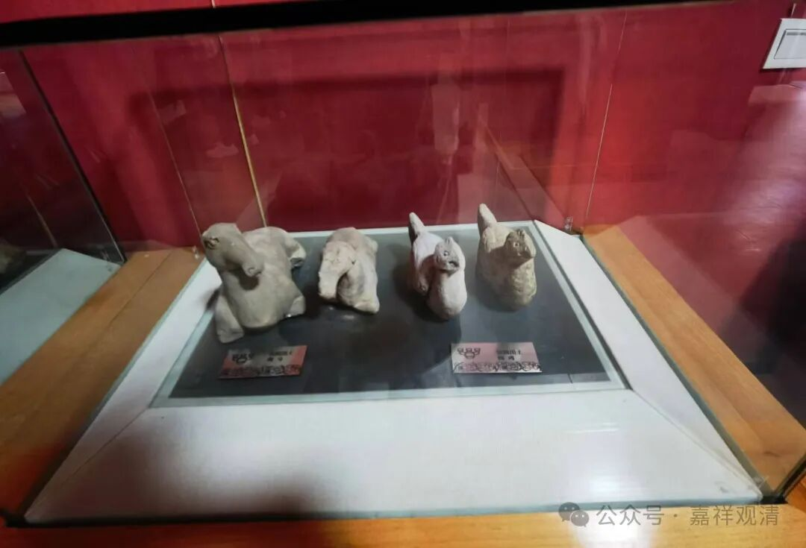

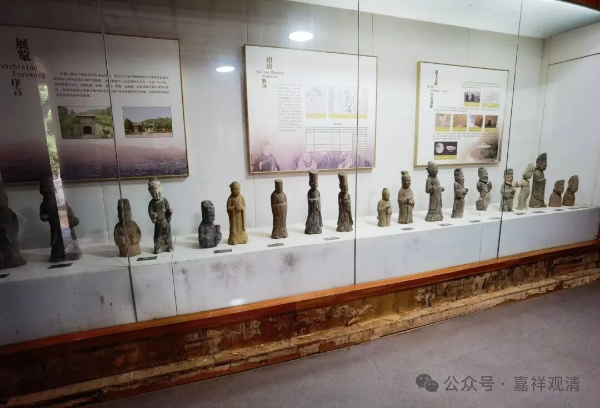

刚解放，南唐二陵就被盗，在夫子庙就出现了一批精美的陶俑，正巧被博物馆工作人员发现……破案后，立刻进行了抢救性发掘，是建国后至今已发掘的江南最大规格的陵墓。

二陵现在“空空如也”，也没什么游人。

有一个展馆，并不大，估计主要出土成果都在南京博物院吧。

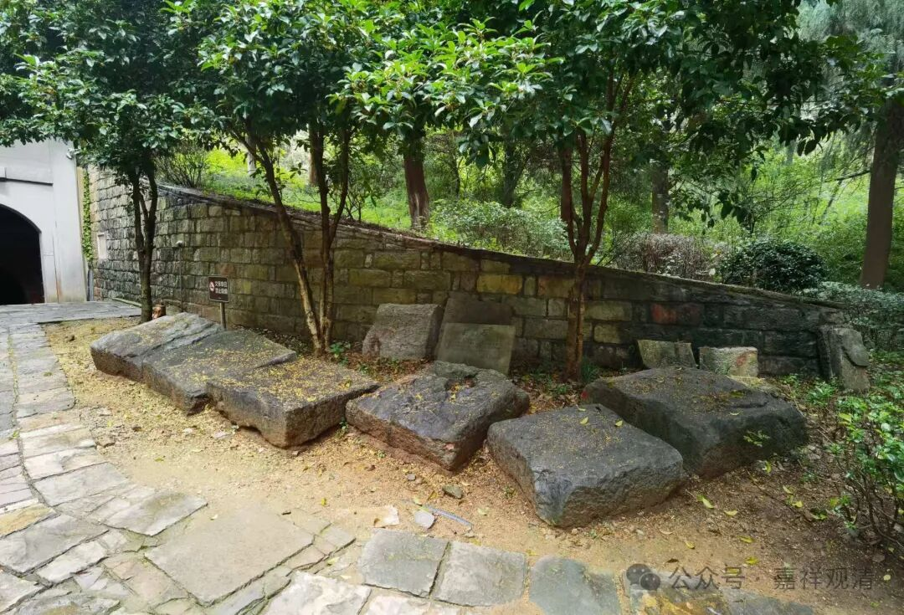

这是甬道里的封门石，今天也在路边晒太阳了

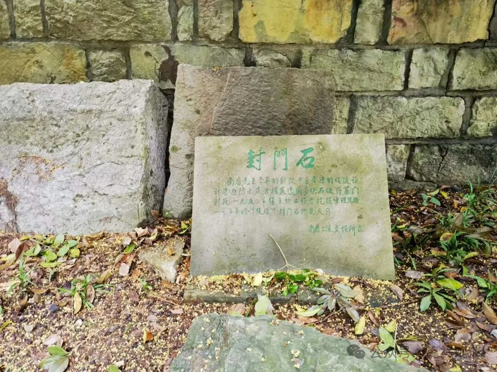

封门石的作用是从墓道里面把门抵住

