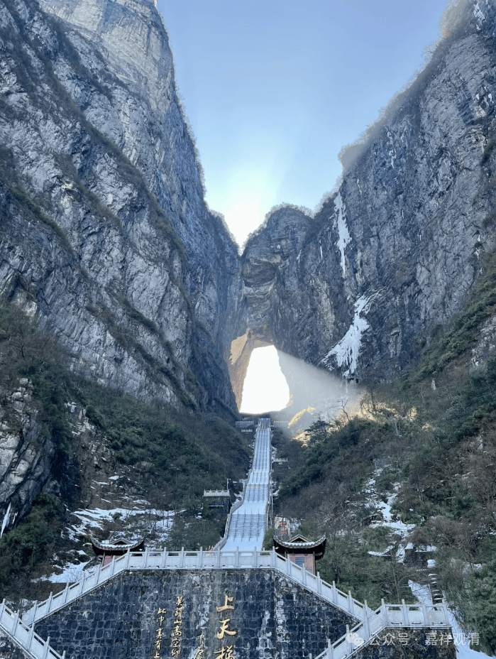

**《宗义略讲》006·052**

“** 又，诸菩萨众以所知障作为（修道）所断的主体，而不以烦恼障作为所断的主体。诸小乘有学众以烦恼障作为（修道）所断的主体，而不以所知障作为所断的主体。**”

这里说的菩萨以所知障作为修道的主体，小乘有学众以烦恼障作为所断的主体，实际是想说，所知障是菩萨众特别的、殊胜的所断。在唯识宗而言，地上菩萨在每一地都要断一品烦恼障和一品所知障的。对声闻人而言，基本只需要断烦恼障，假如非染污无明至少算一份所知障的话，那他们也顺带着断一些，但不是非常刻意地有那个普遍的希求，因为站在他们无余涅槃“灰身泯智”的理论之下，所知障或者非染污无知实际没有太多刻意对治的必要。

这里还有个问题，就是唯识宗大部分是认可无余涅槃下“灰身泯智”这个理论的，也正因为这个原因，中国佛教各个宗派的叛教里，普遍对唯识宗判得比较低，因为觉得它太靠近有部了，所以判他为“大乘始教”“通教”……不过好像对汉地的这些“判教”系统中观的判教也差不多，只是比唯识高半点，都算在“大乘始教”“通教”这里面。（哈哈，没事，我们判他们也不高。哈哈，彼此彼此。）

“** 道之性质：

**唯识宗主张：三乘中的每一乘都有资粮、加行两道，见、修两道以及无学道等五道的建立，而大乘在五道之上更有十地的建立。** ”

三乘各有资粮道、加行道、见道、修道、无学道这五道，一共就是十五道，大乘再在见道以上分十地，大乘的无学道就是佛了。

汉地在此通常还会依《华严经》，自凡夫而圣者，分出五十二位菩萨，即：十信、十住、十行、十回向、十地、等觉、妙觉，最后就是佛地。不过印度佛教似乎只关注了“十地”部分，其余都没有怎么做展开。

《华严经》“十地”部分，最初有单行本，叫《十地经》，龙树大师有《十住毗婆沙论》（“十住”在这里就是“十地”的旧译），可惜只有汉地的不全的版本；世亲论师则有《十地经论》，这两部解释《华严经·十地品》的重要著作都被华严宗的澄观法师参考了，成为《华严疏钞》在《十地品》部分的主要参考资料。大家有兴趣的话可以看看。月称大师的《入中论》也可以看作是在《华严经·十地品》的基础上展开的……

澄观大师的《<华严>疏·钞》原来别行，篇幅极大，明代时被辑在一起，前些年佛陀教育基金会用“圣经纸”（字典纸）印过，质量极好。我这里有几套……

