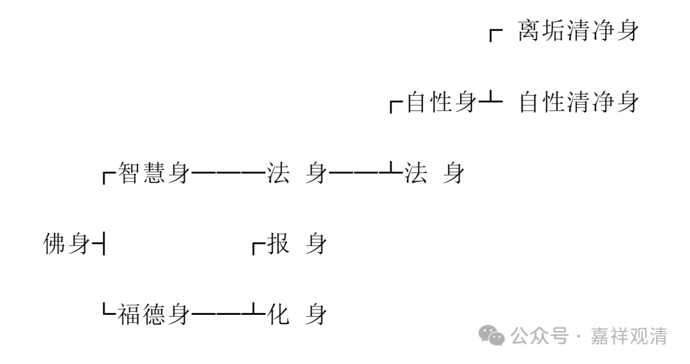

**《宗义略讲》006·060**

“** 佛身有法、报、化三身。法身有：体性身与智法身两种。体性身又包含：法尔清净的体性身与忽尔离垢的体性身两类。**”

唯识说佛有三身，也有说四身，性质没有差别，只是开合不同。三身说就是法身、报身、化身，四身说就是自性身、法身、报身、化身，自性身又包括离垢清净身和自性清净身。

　　　　　　　　　　　　　　　  　┌ 离垢清净身

 　┌自性身┴ 自性清净身

　　┌智慧身───法 身──┴法 身

佛身┤　　　　　┌报 身

　　└福德身──┴化 身

“** 由于唯识宗有上述的主张，所以被称为宣说大乘宗义。”**

唯识宗别依大乘三藏，建立菩萨的五道十地，修习补特迦罗无我和法无我二种无我，断烦恼障、所知障二障，发起菩萨大悲、菩提心，缘无上的佛法，誓愿度无量有情，经历三无数劫，别证无住涅槃……凡此种种都与声闻宗义不同，所以称为大乘的“说宗义者”。

“** 结赞：

**奉行牟尼教法者，所说唯识诸宗义；

** 此文由据善说撰，智者理当欢喜入。**”

最后还有一个结赞：

那些奉行释迦牟尼教法的人，

演说了唯识宗的种种理论，

以上这些文字都是依据他们的这些善说而撰写，

智者们都应当欢喜地领受。

我们今天先到这里吧……

