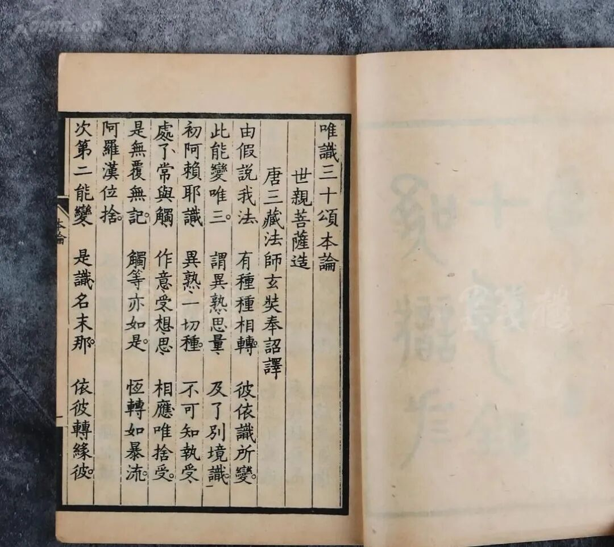
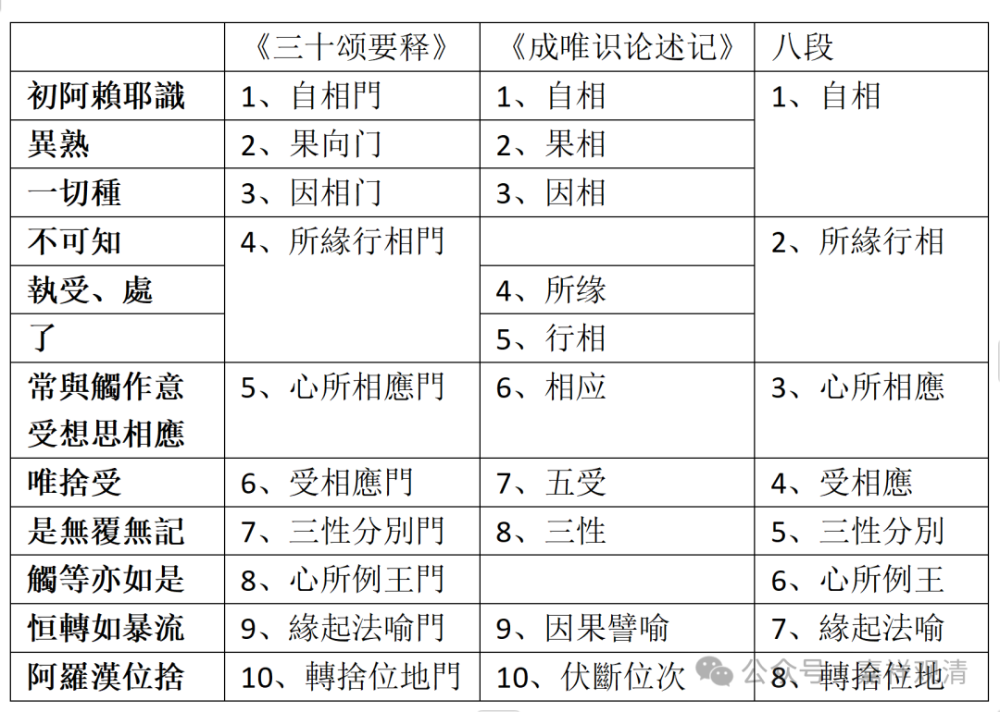

**《唯识三十颂》中“初能变”的“八义十门”**

《唯识三十颂》分别阿赖耶识部分，有两颂半，被分为“八门十义”。《成唯识论述记》以十门分别释初能变，说：

** 本頌以十門解釋：**

** 一、自相：謂“初阿賴耶識”。**

** 二、果相：謂“異熟”。**

** 三、因相：謂“一切種”。**

** 四、所緣：謂“執受處”。**

** 五、行相：謂“了”。“不可知”者，即於所緣、行相之內差別之義，既無別用，故非別門。若別開者，束五受門相應中攝，俱心所故。**

** 六、相應：謂“常與觸作意，受想思相應”。**

** 七、五受：謂“相應唯捨受”。一“相應”言，通二處也。**

** 八、三性：謂“是無覆無記”。**

** 九、因果譬喻：謂“恒轉如暴流”。**

** 十、伏斷位次：謂“阿羅漢位捨”。**

** “觸等亦如是”者，俱時心所例同於王，非是分別第八識也。**

《述记》此处之“十门分别说”与敦煌本《唯识三十论要释》“十门分别”不同，而且很明显是针对《要释》提出的。敦煌本《要释》作者是昙旷（另有文字已经解释了），据传出自（西明）圆测门下，《述记》（批评“心所例王门”不当乃）以圆测为对手，这是可能的。（《述记》删“心所例王门”，又要合乎“十门分别”，所以再析“所缘”“行相”为二）

《述记》又合十门为八义——“自相”“果相”“因相”合为一，“所缘”“行相”再合为一，余五照旧，再出“心所例王门”，而成“八义”。从“八义”看起来，明显是和《要释》的对应更简单、更合拍。

《唯识三十论要释》的文字太多，就不引了，下面出一个对照表，方便大家阅读——

八段十义

《三十颂要释》

《成唯识论述记》

八段

** 初阿賴耶識**

1、自相門

1、自相

1、自相

** 異熟**

2、果向门

2、果相

** 一切種**

3、因相门

3、因相

** 不可知**

4、所緣行相門

2、所緣行相

** 執受、處**

4、所缘

** 了**

5、行相

** 常與觸作意

**受想思相應**

5、心所相應門

6、相应

3、心所相應

** 唯捨受**

6、受相應門

7、五受

4、受相應

** 是無覆無記**

7、三性分別門

8、三性

5、三性分別

** 觸等亦如是**

8、心所例王門

6、心所例王

** 恒轉如暴流**

9、緣起法喻門

9、因果譬喻

7、緣起法喻

** 阿羅漢位捨**

10、轉捨位地門

10、伏斷位次

8、轉捨位地

