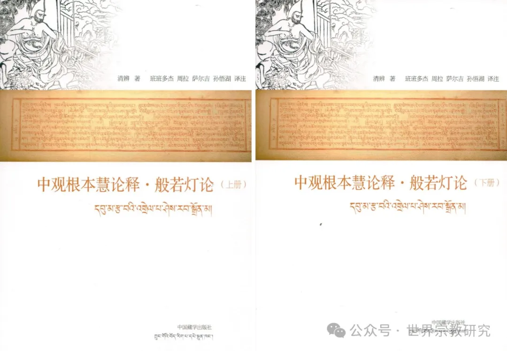
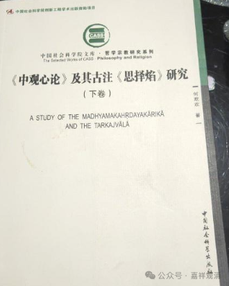

**《宗义略讲》007·006**

“** 不承认自证分，而主张外境以自相而存在”的中观宗，就是经部行中观自续派的定义。例如：清辨论师。**”

不许自证分，而且认为外境在世俗谛上是自性有、自相有的中观师，就是中观自续顺经部行者的定义，比如清辨论师。

清辨论师是自续派的实际开创者，他最初提出了“中观派”的概念，有意识地和唯识宗保持解释上的“距离”，又“痴迷”因明，大量用因明“宗因喻”的格式写作、思维，他还对当时重要的外道（比如胜论派、数论派）观点研究颇深，在《分别炽燃论》等中有体现。当时清辨的弟子极多，据说“常随众”达到两千五百人，是释迦佛常随众数量（千二百五十人）的两倍。

清辨的作品，汉译有《掌珍论》《般若灯论》（即清辨的《中论释》，也叫《般若灯论释》），但汉译的《般若灯论》是一个有删节的本子，由于译者波罗颇迦罗蜜多罗是一位唯识师，所以在翻译的时候把所有清辨破唯识的地方都删掉啦，哈哈。不过最近全本的《般若灯论》（《中观根本慧论释·般若灯论》）已经从藏文转译过来了——

清辨还有《中观心论》和《分别炽然论》，最近也由何欢欢教授翻译了一部分——《<中观心论>及其古注<思择焰>研究》。

目前清辨论师“被认知的”历史地位似乎远不及月称论师，这或许是因为经宗大师抉择后，认为“应成的观点比自续的观点要更究竟”（并被大家普遍接受）有关，但实际清辨的真正的历史地位是不逊于月称、甚至还要高于月称的，月称当年在印度是很“小众”的中观师，而清辨则是一等一的中观大师。

所以有时候历史地位、名气是看有没有人做吹鼓手的，这一点上月称有点像王夫之，在当时代的名气小，但对后世的影响大，主要是被人“发掘”出来了，如果没有宗大师的抉择，月称论师也就湮没无闻了……清辨则相反，当时的名气大，后世的名气小……

