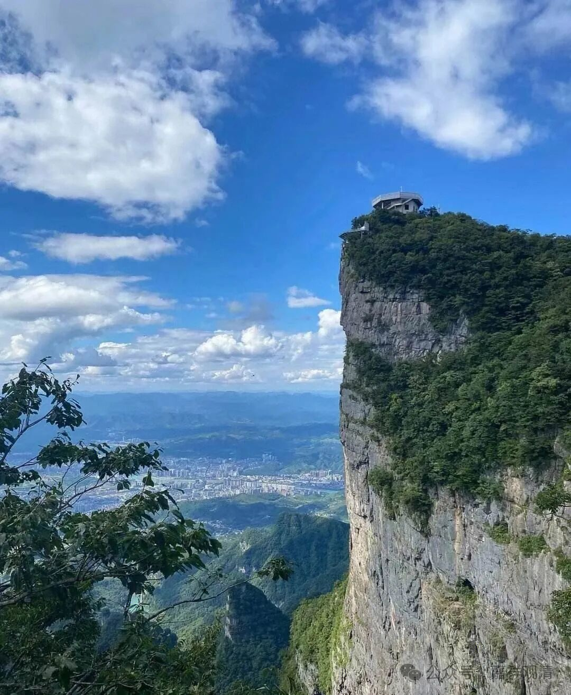

**《宗义略讲》007·019**

“** (2)、道的建立

**经部行自续派主张，二乘皆主修人无我（即没有独立自取的我），大乘主修法无我（胜义空）。** ”

以清辨论师为代表的中观自续顺经部行诸师认为，二乘主修人无我——补特迦罗独立实有空，大乘主修法无我。这里的意思是，不认可（自续顺瑜伽行派的）“独觉需要修法无我”。

“**此派关于道的建立，有下列诸特点：一、主张：定性的声闻与独觉没有法无我的证解。二、不认许：定性的声闻与独觉有通达“能取所取异体空”之智。三、不赞同：认取外境之分别是所知障。** ”

经部性自续派认为：1、回小向大之前的声闻行者，没有对法无我的认识；2、此类行者没有“能取所取异体空”的认识；3、所知障里不包含“承许外境有”。其实这都是相对于瑜伽行派，或者相对于自续顺瑜伽行派而言的。因为：1、承许无外境；2、认可“能取所取（异体）空”；3、独觉要证“能取所取（异体）空”——这都是唯识和自续顺瑜伽行派的观点。对经部行自续派而言，世俗上他们是承许有外境的。

很难在中观自续的“顺经部行”和“顺瑜伽行”这两支中分出高下，双方的观点各有胜出的地方。我个人是比较愿意高看顺经部行这边一眼的，他原创的东西多，但大师数量少……毕竟顺瑜伽行自续里有两支不同的来源，人才“挤挤”，我说的是“挤挤”不是“济济”，哈哈。

