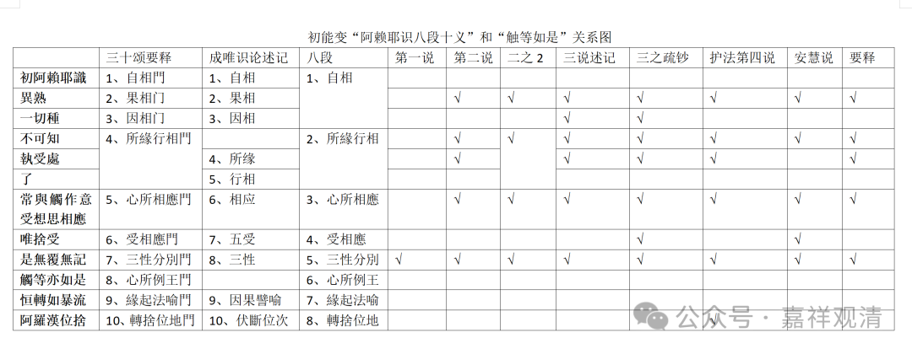

**《唯识三十颂》“触等亦如是”诸说表解**

《唯识三十论》初能变“触等亦如是”一句中，《述记》举四说。

第一说：

“触等亦如是”准同上句“是无覆无记”，即阿赖耶识相应之“触等”五遍行（触、作意、受、想、思）亦是无覆无记。

第二说：

“触等亦如是”所“如是”有五：一、异熟；二、所缘行相俱不可知；三、缘三种境；四、五法相应；五、无覆无记。

若据《述记》前述初能变“八段说”而不据“十义说”，则“如是”有四：一、果相门；二、所缘行相门；三、心所相应门；四、三性分别门。

第三说，即难陀说，谓“触等亦如是”相应有六，即：一、果相门；二、因相门；三、不可知；四、三种所缘；五、心所相应；六、无覆无记。

若据灵泰《疏钞》，则有七门相应，即前述《述记》说加一“受相应”，有道理，因为既然许和“一切种”持种功能相应，则应许“唯舍受”。

第四说，及护法自宗，许由六门相应，即：一、異熟；二、所緣行相俱不可知；三、緣三種境；四、五法相應；五、無覆無記；六：转舍位地。此意“触等亦如是”非但与前诸门相应，亦当与此后诸门有相应者。

第五说：安慧说。安慧《唯识三十颂释》现存，（有五译：吕澄、韩镜清、霍韬晦、韩廷杰、吴汝均。）俱《安慧释》，则有五法相应：一、一向异熟；二、所缘行相不分明；三、触等相应；四、唯舍受；五、无覆无记。

昙旷《三十论要释》之说同于第二，而不同《述记》第四之护法自宗，不知何故。

下面看一下“触等亦如是”诸说对照表。

初能变“阿赖耶识八段十义”和“触等如是”关系图

三十颂要释

成唯识论述记

八段

第一说

第二说

二之2

三说述记

三之疏钞

护法第四说

安慧说

要释

** 初阿賴耶識**

1、自相門

1、自相

1、自相

** 異熟**

2、果相门

2、果相

√

√

√

√

√

√

√

** 一切種**

3、因相门

3、因相

√

√

** 不可知**

4、所緣行相門

2、所緣行相

√

√

√

√

√

√

√

** 執受處**

4、所缘

√

√

√

√

√

** 了**

5、行相

** 常與觸作意受想思相應**

5、心所相應門

6、相应

3、心所相應

√

√

√

√

√

√

√

** 唯捨受**

6、受相應門

7、五受

4、受相應

√

√

** 是無覆無記**

7、三性分別門

8、三性

5、三性分別

√

√

√

√

√

√

√

√

** 觸等亦如是**

8、心所例王門

6、心所例王

** 恒轉如暴流**

9、緣起法喻門

9、因果譬喻

7、緣起法喻

** 阿羅漢位捨**

10、轉捨位地門

10、伏斷位次

8、轉捨位地

√

