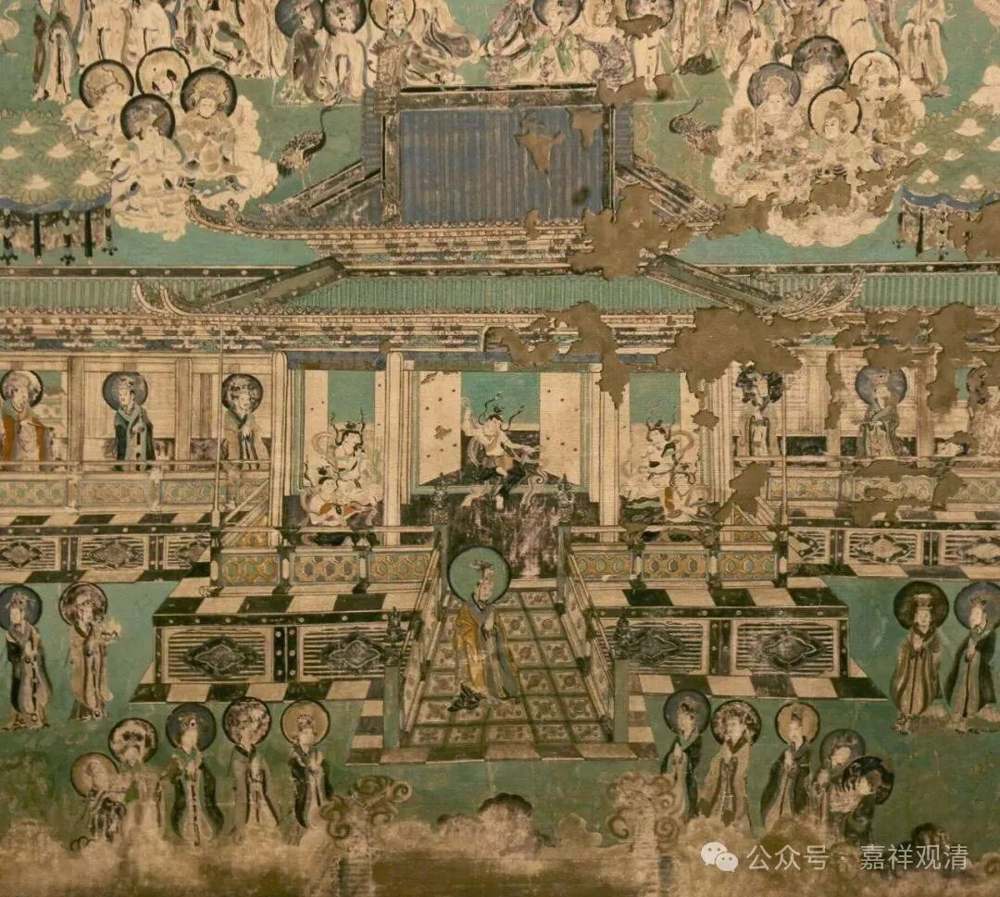
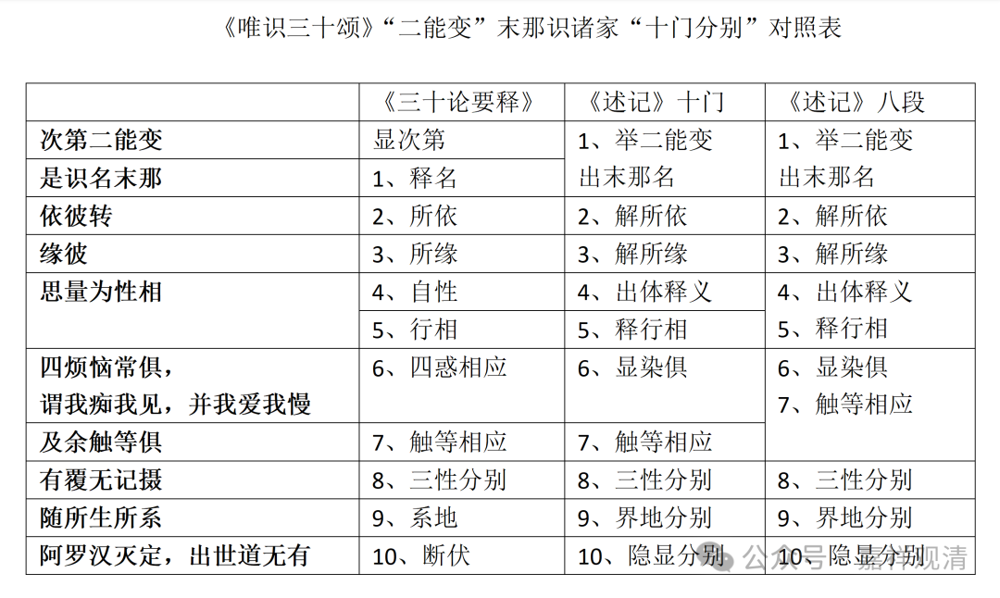

**《成唯识论述记》二能变“十门分别”对照表

《<成唯识论>述记》在述“二能变”三颂时，亦如前“初能变”，作了十门分别：

《<成唯识论>述记》卷四本：

“** 此依三颂，其第七识，十门分别：**

** 初、举第二能变，出末那名；二、解所依；三、解所缘；四、出体释义；五、释行相；六、显染俱；七、触等相应；八、三性分别；九、界地分别；十、隐显分别，即是伏断之位次也。**

** 于下显中，一一广释……**”

《三十论要释》略有不同，昙旷以初句“显次第”，后别标十门，“十门分别”之内容则与《述记》基本无异。

《述记》又合“四五”为一，“六七”亦合说，则总述为八段。

略见附表。

《唯识三十颂》“二能变”末那识诸家“十门分别”对照表

《要释》

《述记》十门

《述记》八段

** 次第二能变**

显次第

1、举二能变

出末那名

1、举二能变

出末那名

** 是识名末那**

1、释名

** 依彼转**

2、所依

2、解所依

2、解所依

** 缘彼**

3、所缘

3、解所缘

3、解所缘

** 思量为性相**

4、自性

4、出体释义

4、出体释义

5、释行相

5、行相

5、释行相

** 四烦恼常俱，

**谓我痴我见，并我爱我慢**

6、四惑相应

6、显染俱

6、显染俱

7、触等相应

** 及余触等俱**

7、触等相应

7、触等相应

** 有覆无记摄**

8、三性分别

8、三性分别

8、三性分别

** 随所生所系**

9、系地

9、界地分别

9、界地分别

** 阿罗汉灭定，出世道无有**

10、断伏

10、隐显分别

10、隐显分别

