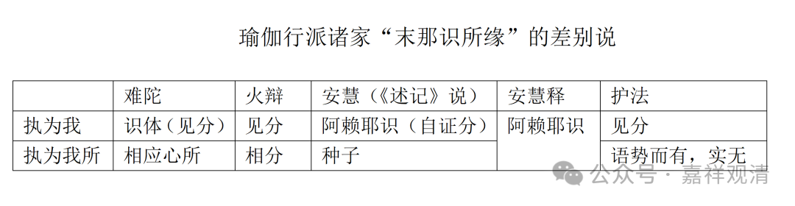

《唯识三十论要释》：

“（彼末那识，）**但缘藏识见分为我，不缘相分、识中种子、及相应法，执为我所，我、我所执不俱起故……** ”

这一段说的是末那识的所缘。末那识以阿赖耶识为所缘，这是唯识诸家的通说，但末那识具体的所缘是什么，则诸说纷纭。以上引用的这一小段就包含了唯识诸家关于“末那识所缘”的诸说。

下面按《唯识三十论要释》的行文顺序，介绍一下这里相关的四家说——

1、护法说：

护法说：末那识只缘阿赖耶识见分为我，并不缘其他的法为我所，因为“我执萨迦耶见”和“我所执萨迦耶见”不能俱起，因为末那识是一味相续的。

护法论师是玄奘大师的“师公”，有相唯识师，持“四分说”，汉传视为唯识正统，《唯识三十颂》十大注释家之一，《成唯识论》主要以他的观点为主解释《唯识三十颂》。

2、火辩说：

火辩论师说末那识缘阿赖耶识见分为我，同时，缘阿赖耶识相分为我所。

火辩也是《唯识三十颂》十大注释家之一。

3、安慧说：

据《成唯识论述记》说，安慧许，末那识缘阿赖耶识为我，同时，缘阿赖耶识所藏的种子为我所。

但是，据现存的安慧《唯识三十颂释》来看，安慧说：“……由与萨迦耶见等相应，而缘阿赖耶识为我及我所故……”，并没有谈及“缘种子为我所”。

安慧论师也是《唯识三十论》十大注释家之一，无相唯识师、一分家，仅承许“自证分实有”。

4、难陀说：

难陀论师说：末那识缘阿赖耶识见分为我，同时，缘与阿赖耶识相应的五遍行心所为我所。

难陀论师也是《唯识三十论》十大注释家之一，二分家，仅承许“相分、见分实有”。

评说：

护法论师不认可其余三说，认为第七末那识只缘阿赖耶识见分，所以才说“不缘相分、识中种子、及相应法，执为我所，”意思是：1、不缘相分执为我所；2、不缘识中种子执为我所；3、不缘相应法执为我所。“不缘”和“执为我所”这一前一后，要管三家学说。

这几家为什么会认为末那识要有“我执萨迦耶见”和“我所执萨迦耶见”呢？因为《瑜伽师地论》和《显扬圣教论》都说了——

《瑜伽师地论》卷六十三：

“**末那名意，于一切时，执我、我所，及我慢等，思量为性。** ”

《显扬圣教论》卷一：

“**意（末那识）者，谓从阿赖耶识种子所生，还缘彼识，我痴、我爱、我我所执、我慢相应，或翻彼相应……** ”

所以（除护法外）各家都要安立末那识相应的“我所执萨迦耶见”的所缘。

只有护法认为，末那识唯独缘阿赖耶识的见分为“我”，并不再缘什么为“我所”，《瑜伽》（包括《显扬》）说“我、我所”，仅仅是1、因为“语势”而有，2、或者说是在说“我之我”（前一个“我”即末那识，后一个“我”即所执的阿赖耶识）。

护法的理由是，末那识“任运、一类，恒相续生”，若它同时缘差别境，则非“任运、一类，恒相续生”了。

但是护法此说有一个不可解释的问题——那“我所执萨迦耶见”是谁的作用？不能是阿赖耶识，它是无覆无记的；不能给第六识，它是有间断的。

所以这几家里，安慧的《三十颂释》的说法是最佳的，泛泛地说“缘阿赖耶识为我及我所”便可。

我们再看一下下边这个表格会更清楚一些——

瑜伽行派诸家“末那识所缘”的差别说

难陀

火辩

安慧（《述记》说）

安慧释

护法

执为我

识体（见分）

见分

阿赖耶识（自证分）

阿赖耶识

见分

执为我所

相应心所

相分

种子

语势而有，实无

