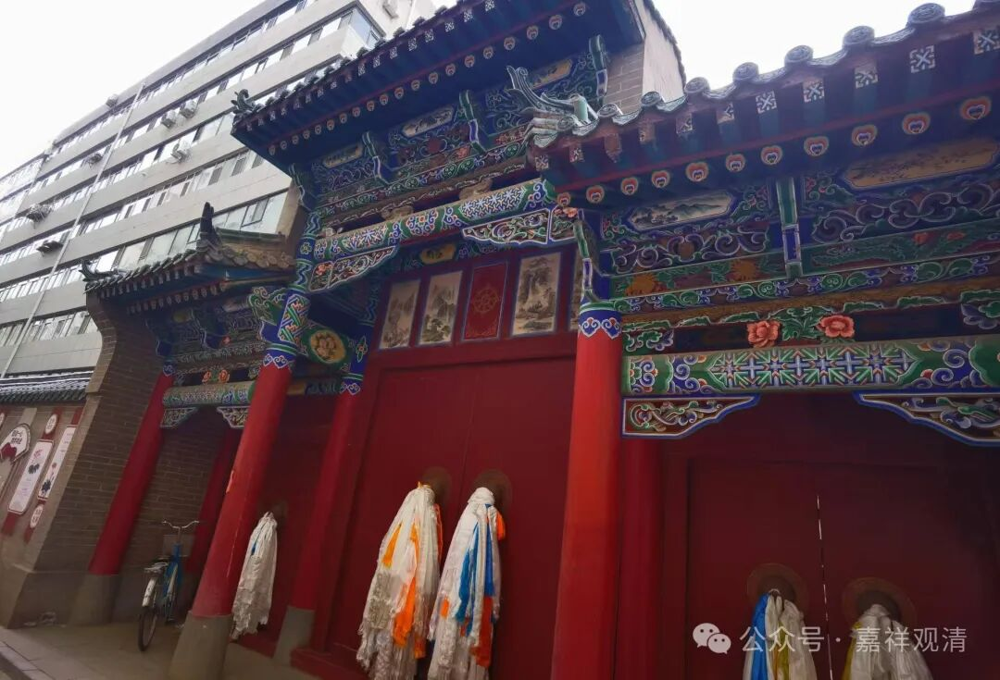
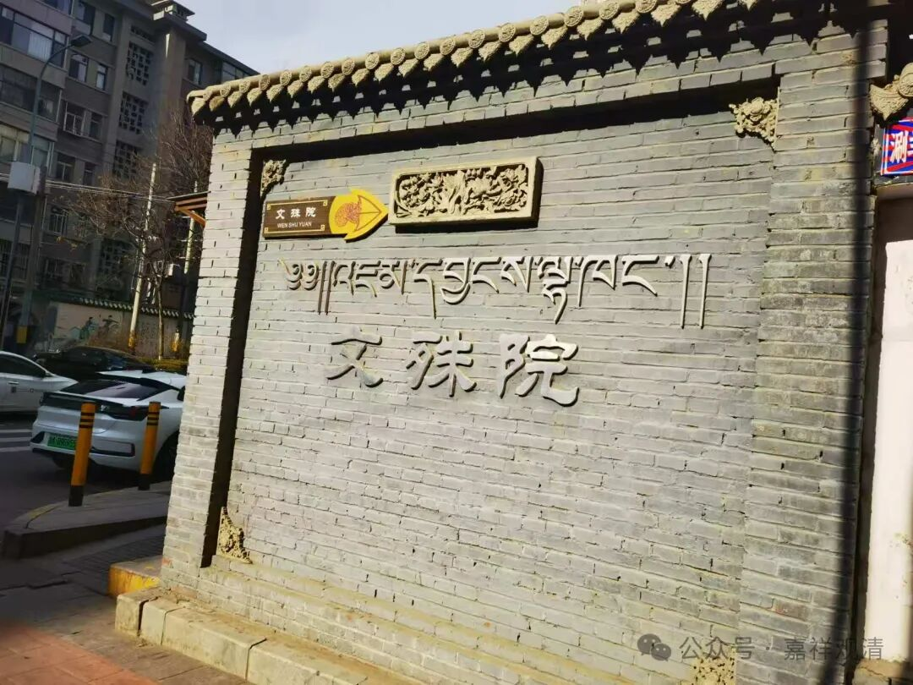
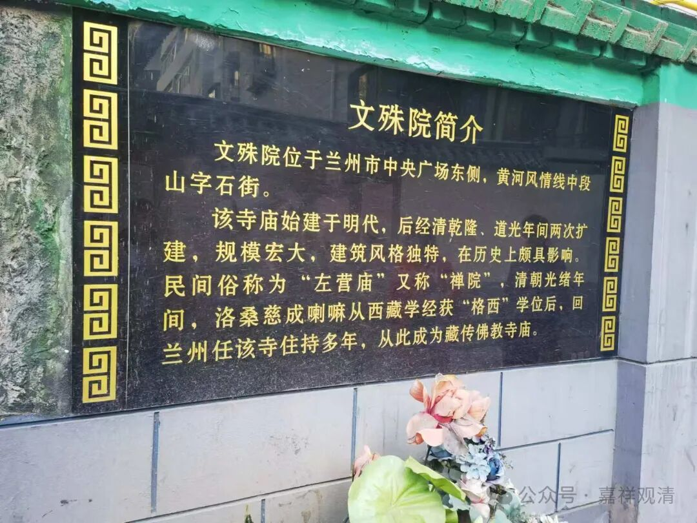
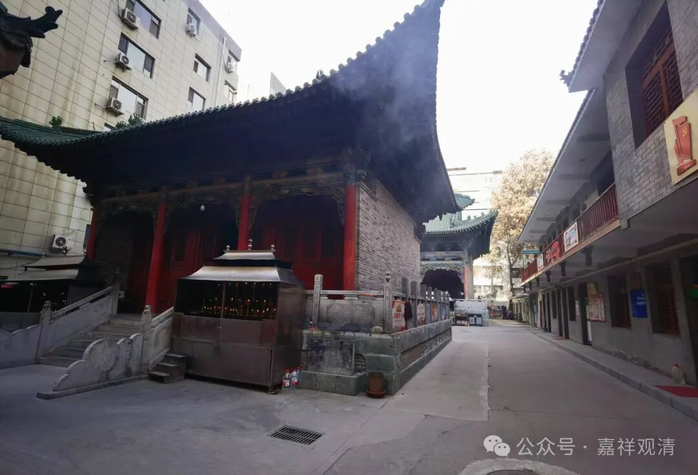
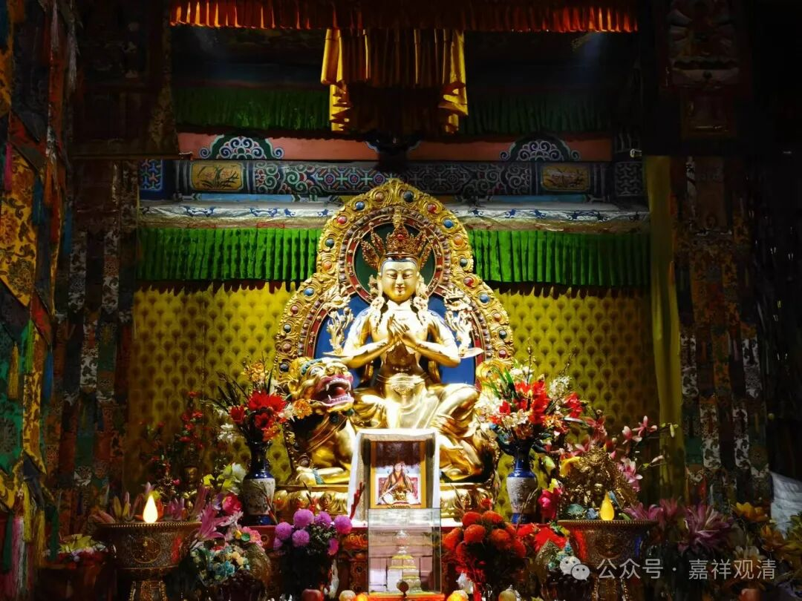
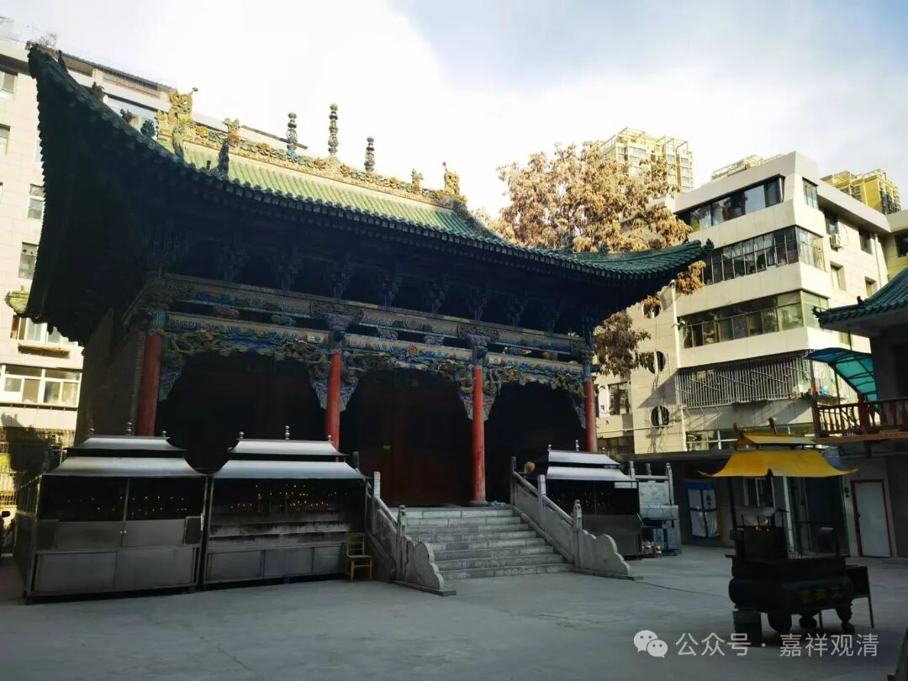
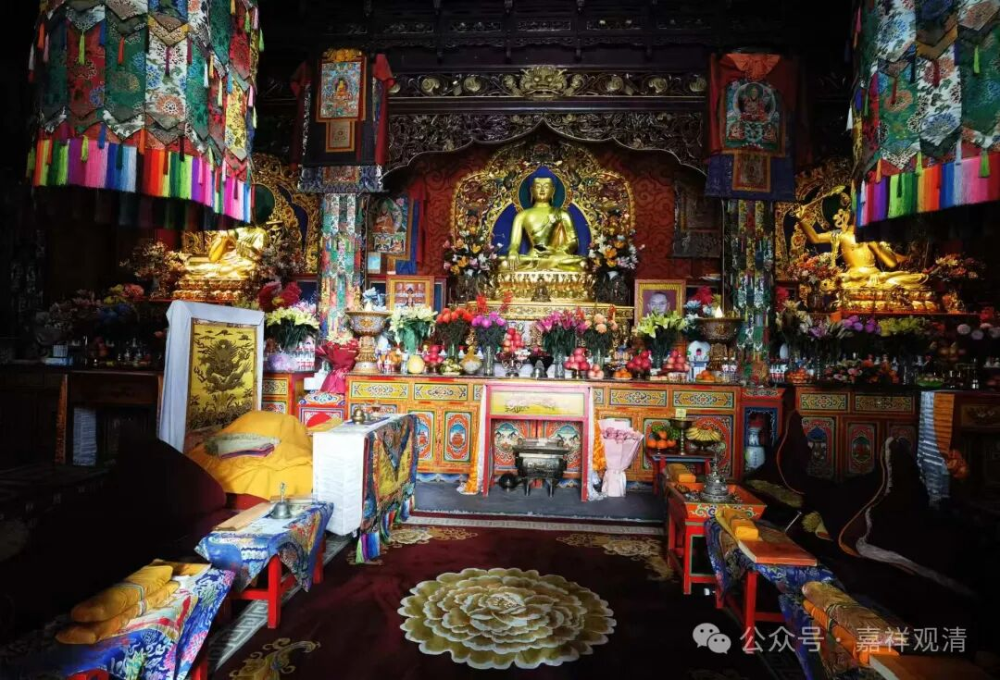

**兰州文殊院

在净觉素斋馆又吃了一顿，就去附近的兰州文殊院走走。

来兰州那么多次，还不知道这里有个“文殊院”，以前都是去五泉山浚源寺或者市内一点的玉佛寺。吃素斋的时候，还在怀念五泉山门口的那个素斋馆。以前来兰州，一下车就直奔那个素斋馆，直接要半斤饺子（有时候能一斤）加个“辣子素鸡丁”……现在说，那个素斋馆已经关门十年了。

兰州文殊院我是第一次来，恢复时间不长，现在好像是拉寺在管理，前几天五供节，拉寺还派了几个人来念经。

据说刚开始附近的人嫌法器声音吵闹，引发了一些不和睦，后来大家考试之前都来烧个香（文殊菩萨“管”智慧），周围学子考试都不错，有考取北京的……大家就慢慢看着“顺眼”多了，和睦起来……哈哈，行走江湖，菩萨“灵”才是最重要的。

文殊院原址在明代就有寺院，清左宗棠重建，所以又被称为“左营庙”，占地很小，目前也就两个殿加一排住宿、办公用的两层楼房子。

前殿供奉的是狮吼文殊

大殿供奉的是释迦牟尼佛。大殿门口有供大家磕长头的板子

据说刚恢复寺院时最早供奉的是前殿的这尊狮吼文殊。

        修改于