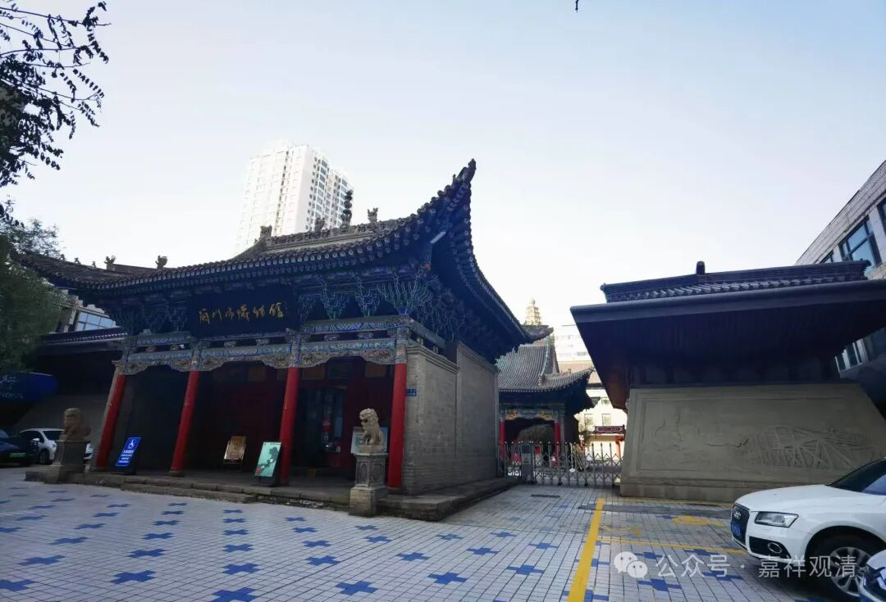

**到处逛逛博物馆**

** 之**

** 兰州博物馆**

今天上午先去了甘肃省博物馆，下午又去了兰州博物馆。

先说兰州博物馆。

兰州博物馆的原址是一个寺院，叫“白衣寺”。

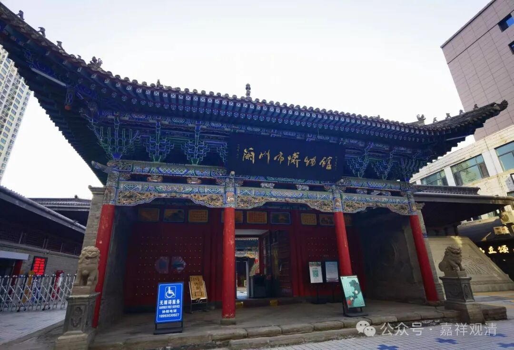

这个是兰州博物馆的大门，清代的时候是“江西会馆”，又叫铁柱宫，供奉许真君。建博物馆时移到现址。

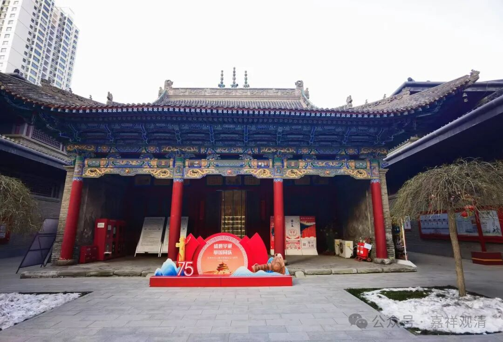

这个殿就是原来的白衣观音殿（兰州前几天下雪，雪还没有化），供奉白衣观音的画像，现在则是兰州市博物馆的文创服务中心。

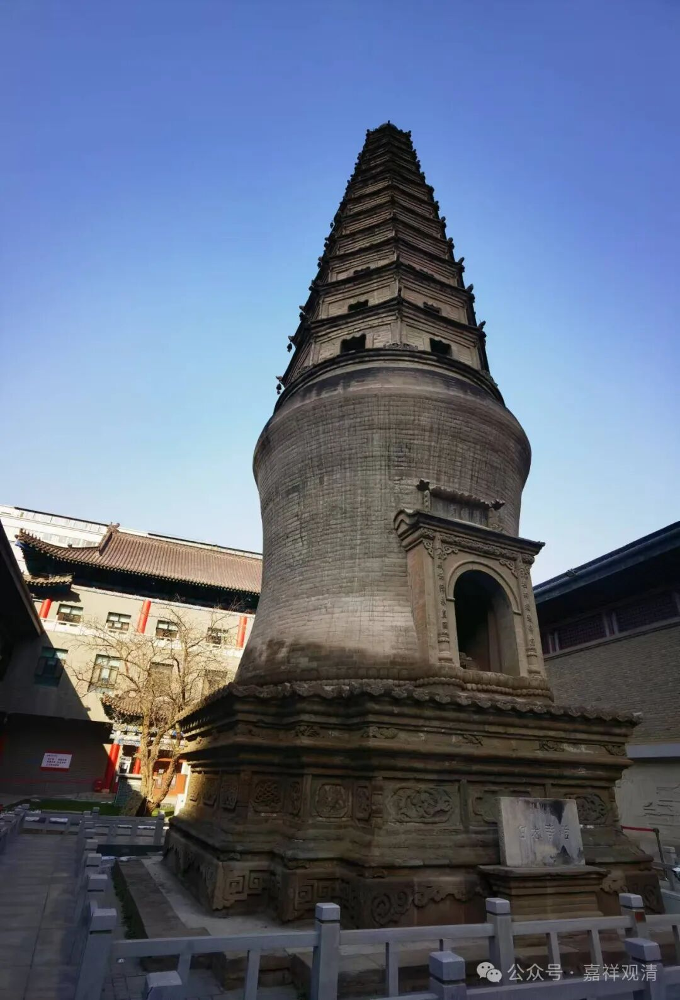

这是院内的白衣寺塔。

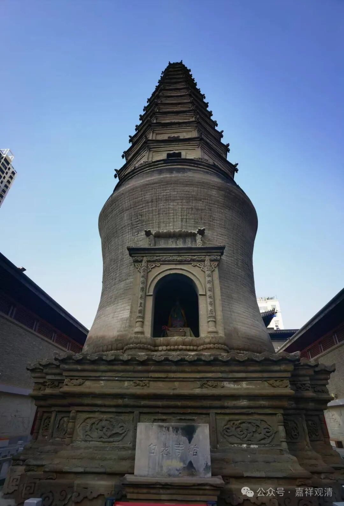

白衣寺塔的中间佛龛里还供着一尊观音，这应该是wg以后安奉上去的。

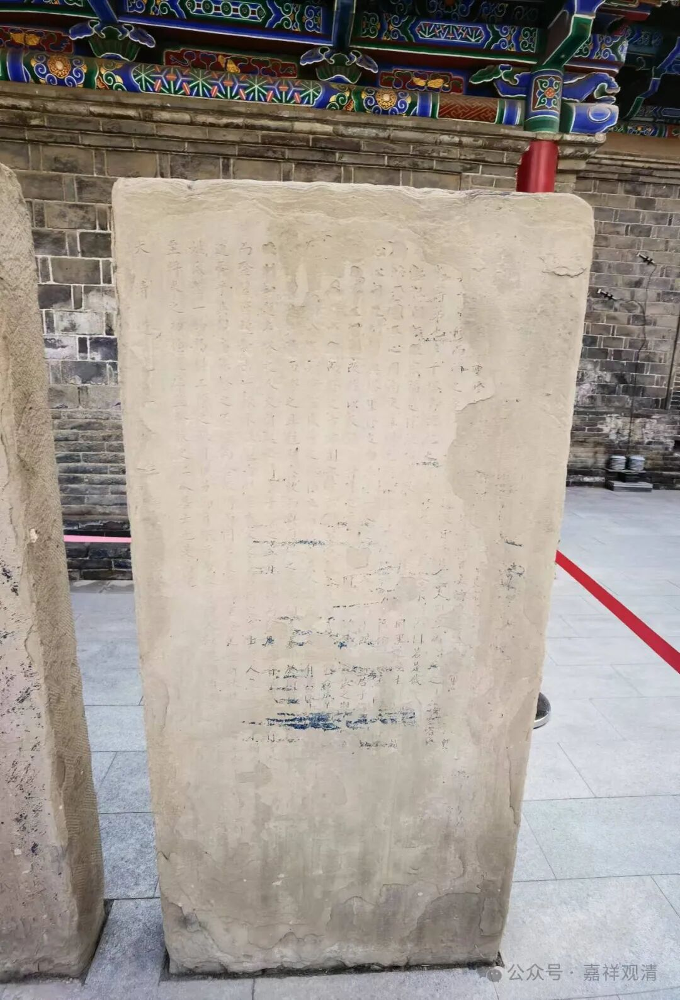

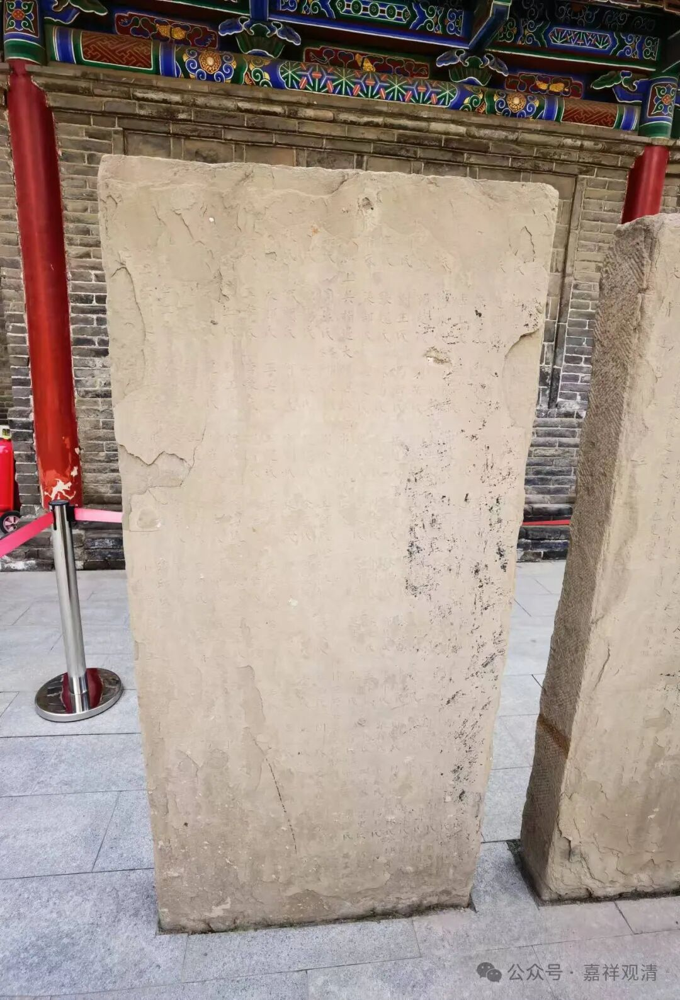

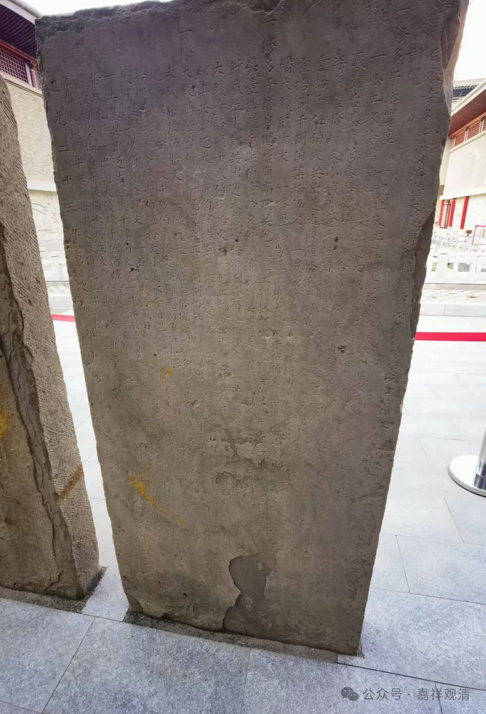

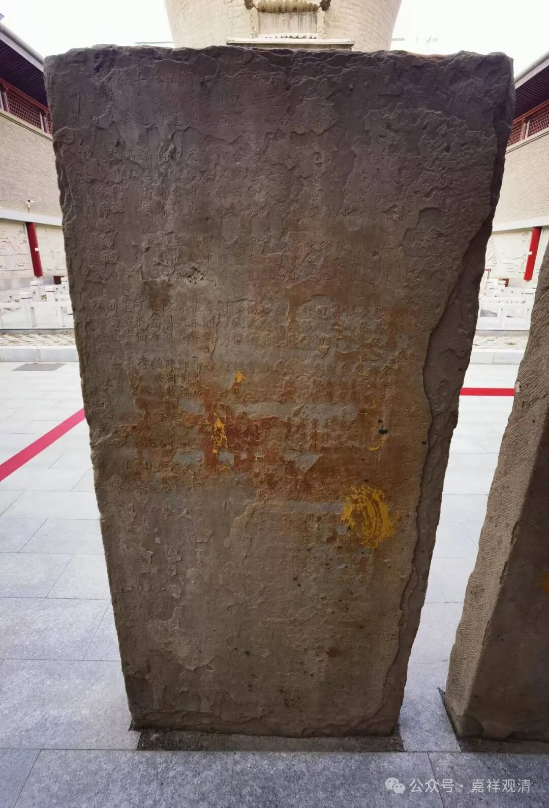

两块古碑，两面有字，可以释读一下。

我的最初反应，“白衣”是指在家人，但据工作人员说因为以前供奉的是白衣观音。工作人员说原来白衣寺是王府的家庙，后来“独立”出来。

白衣观音殿和白衣寺塔都是明代的建筑，至今六百余年了。

“白衣寺塔”又称“多子塔”，应该是民间信众多用来祈祷求子的缘故吧。

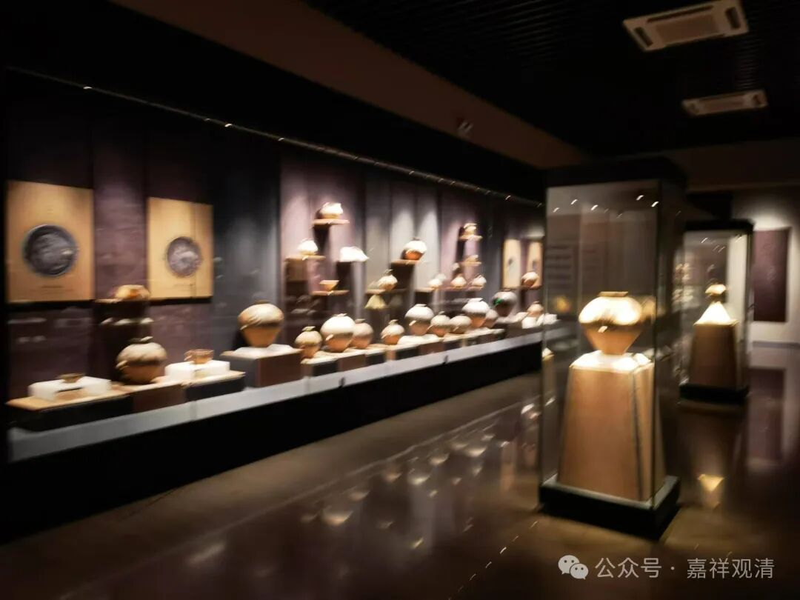

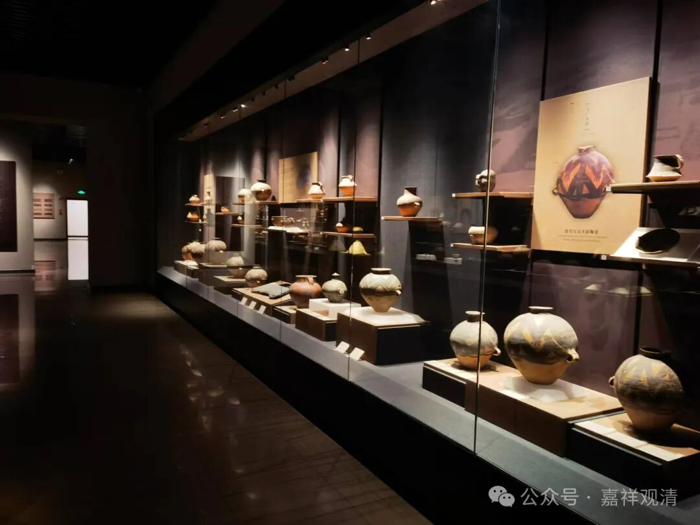

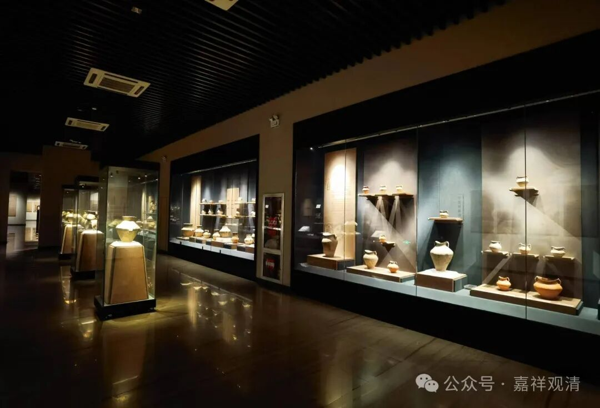

博物馆有几个展览，最大的应该是甘肃的彩陶展。

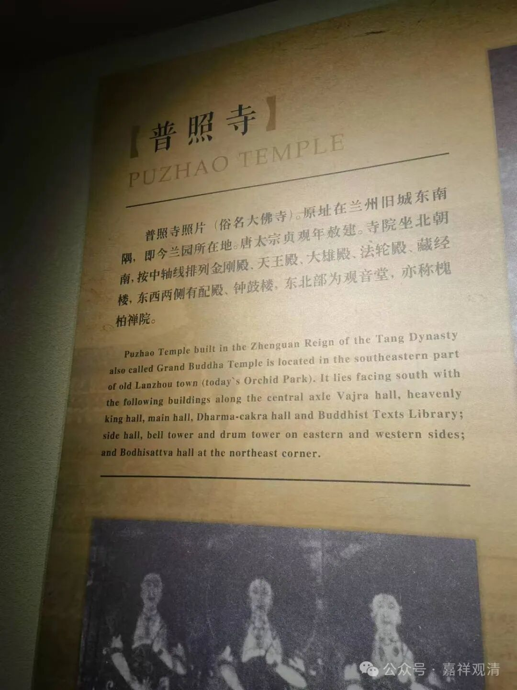

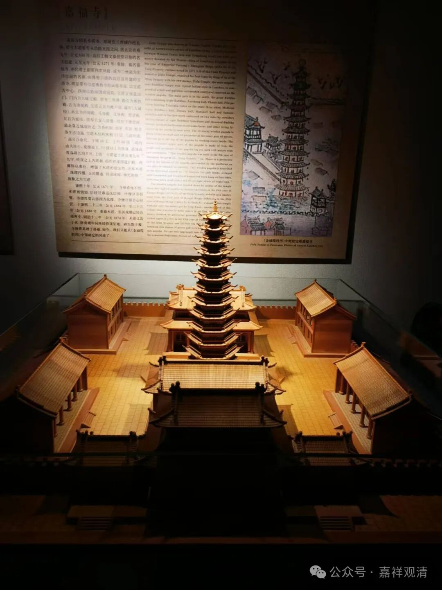

还有一个展，简单介绍了兰州历史上的几个大寺院。

据说兰州博物馆收藏有白衣寺的文物，这次没看到有专门的展览。

