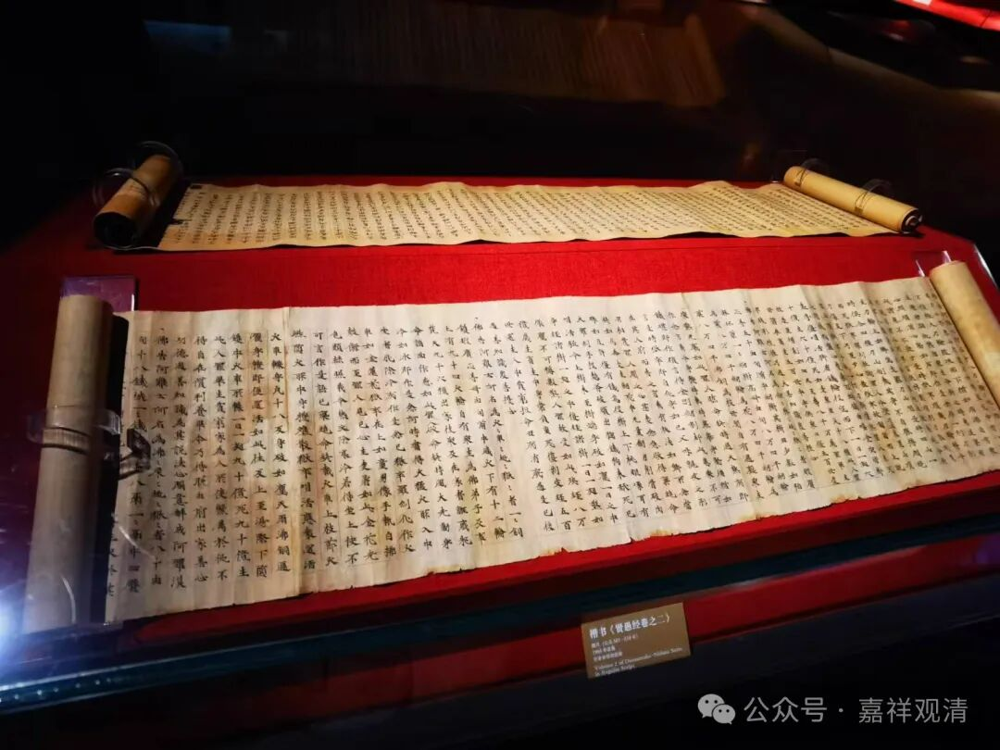

敦煌写经和陇西高僧

甘肃省博物馆的丝绸之路展厅也有一些佛教展品，特别是有一些佛教写经。

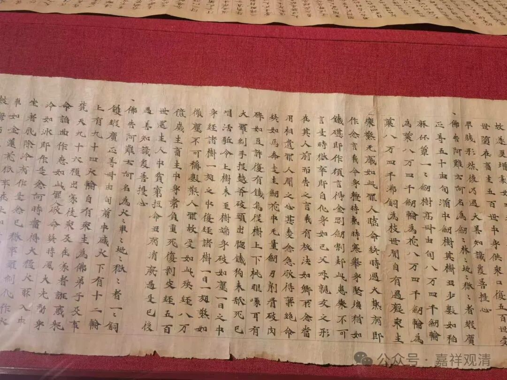

这是敦煌写经《贤愚因缘经》。《贤愚经》是一些印度古代传说故事集的佛教版本。写经文字是有专门的“经生”抄写的，也有专门的格式，我看看这一件，明显的每行十七字，这是固定的写经版式，后来被保留到了刻经里面，刊刻大藏经的标准版式也是每行十七个字。

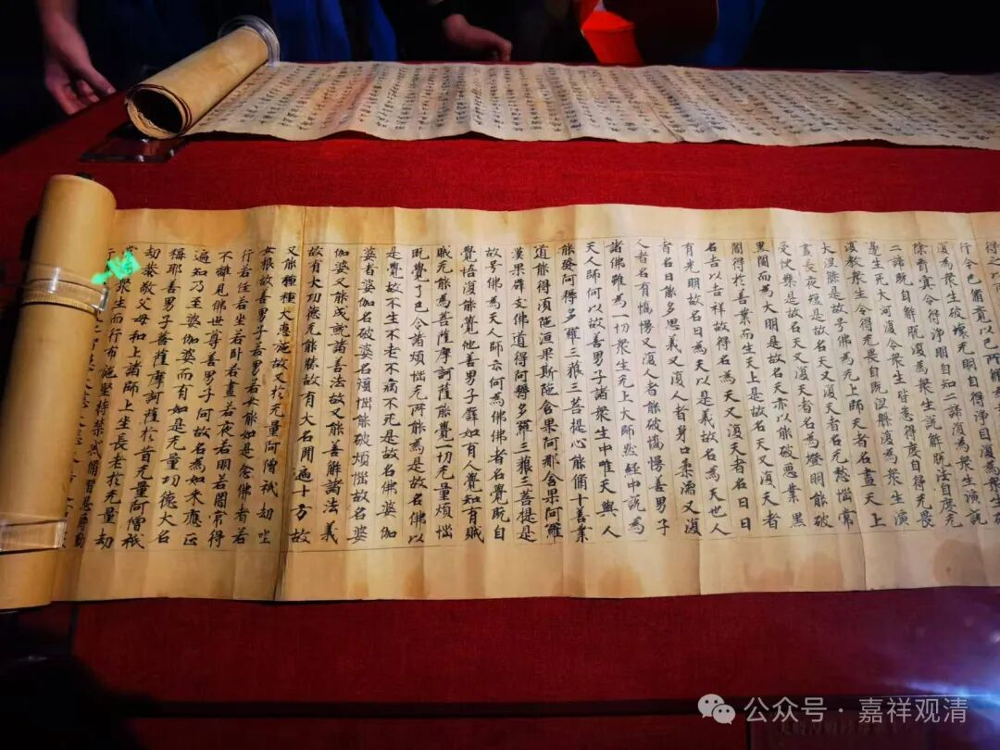

敦煌写经《大般涅槃经》。

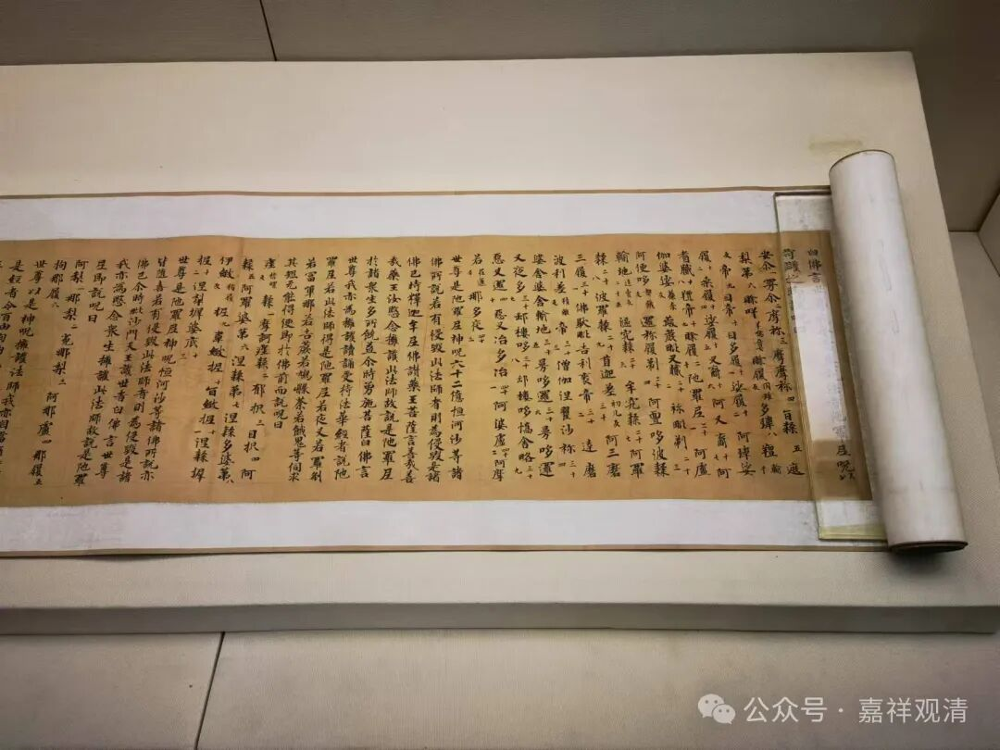

汉文写经。

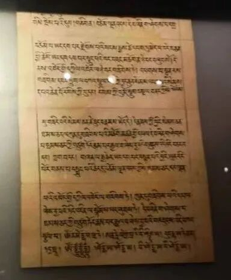

这是一件藏文写经顶髻尊胜。普隆（二合）。

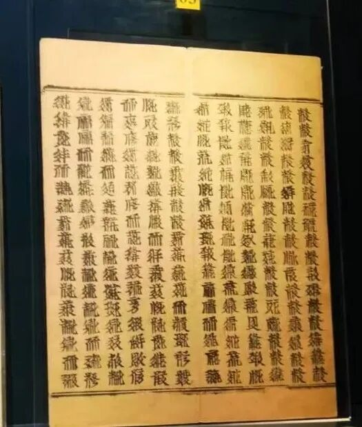

这是一件西夏文的刻经。注：这种版式叫经折装，经常被“内行们”叫错成“梵夾装”。有时候“高僧”叫错就很麻烦，几百年都着跟他叫错，哎……

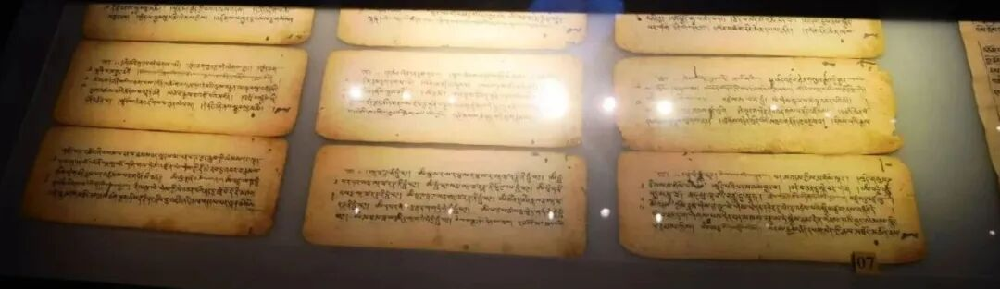

这样的纸张页面，经过装订起来的才叫“梵夾装”。这也是藏文写经。

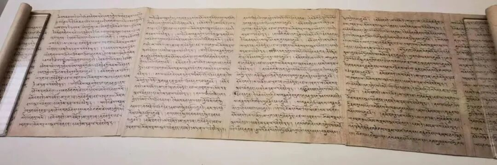

这也是藏文写经，这种可能是前弘期无量寿陀罗尼的写经，纸张式样少见。

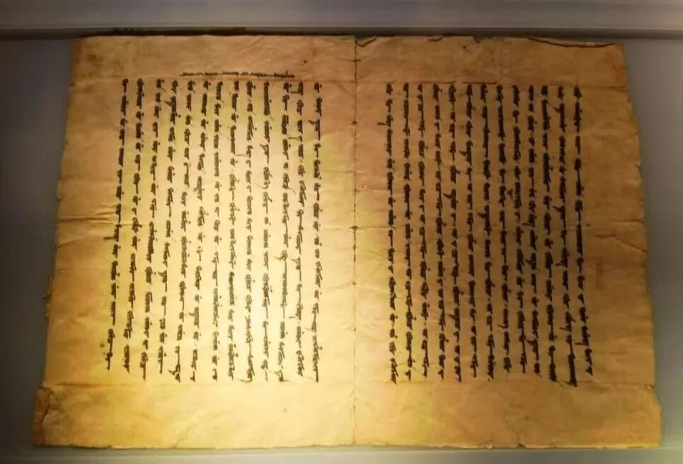

回鹘文写经。

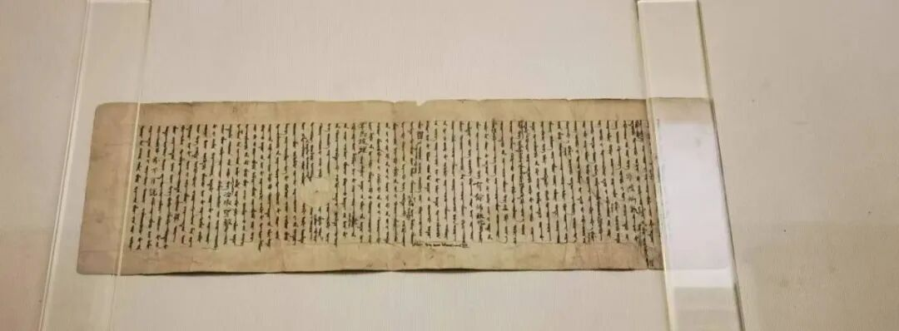

回鹘文写经2，纸张有点小啊。

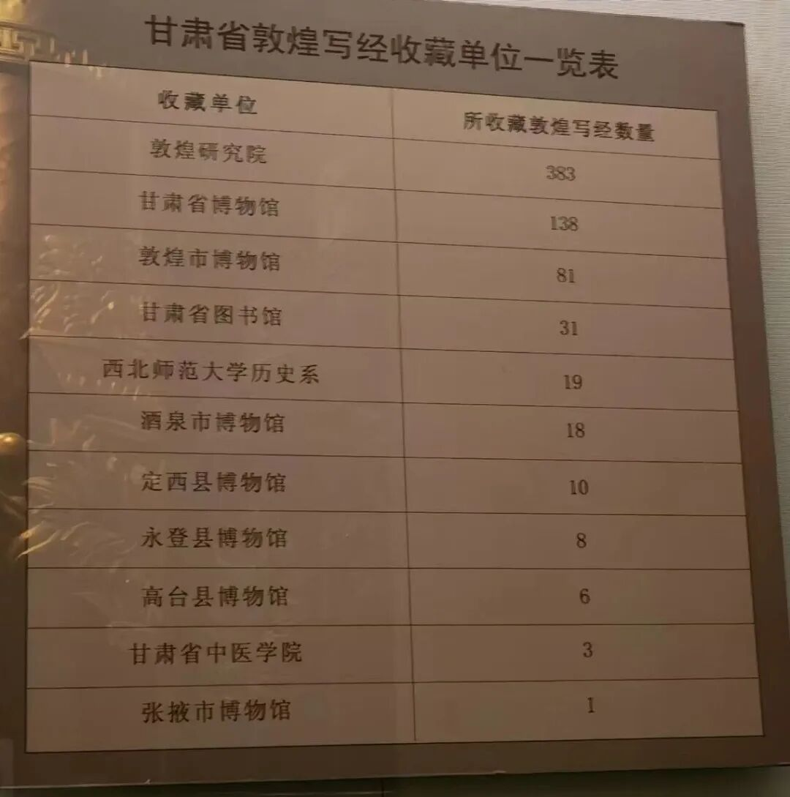

这是一张敦煌写经收藏单位表，仅是甘肃省内国家单位机关的收藏表。

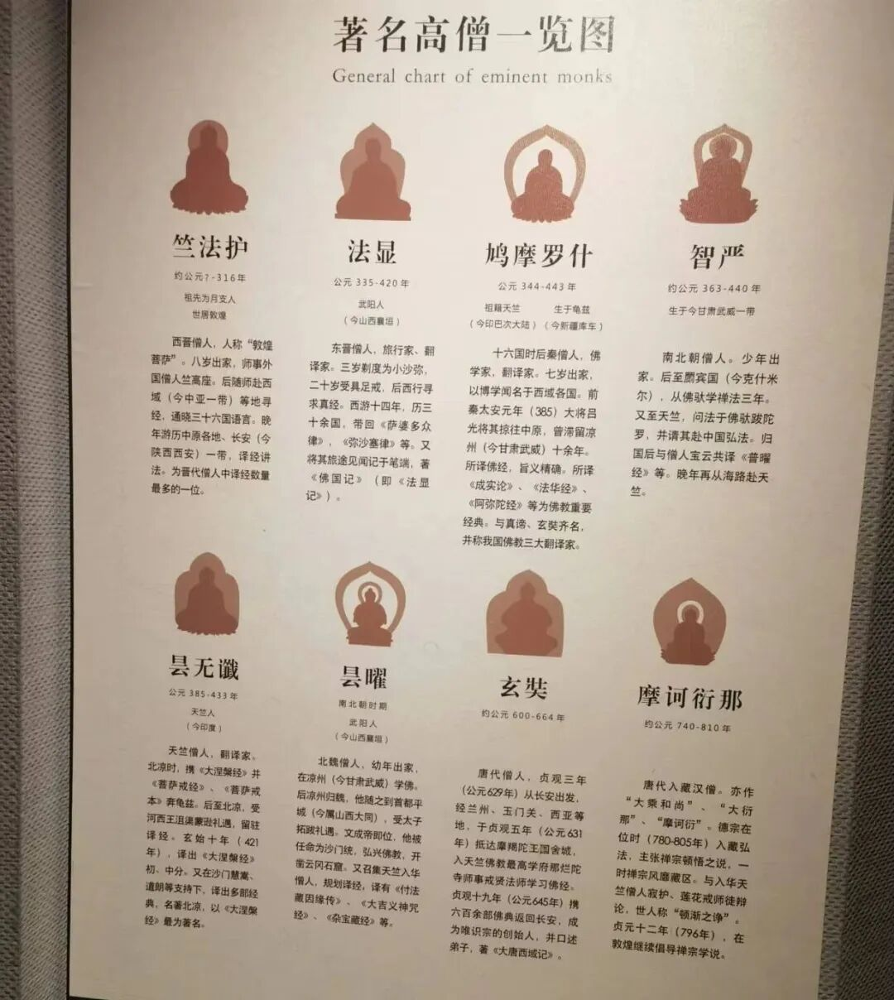

和甘肃有关的著名高僧图。但我更看中这几张表——

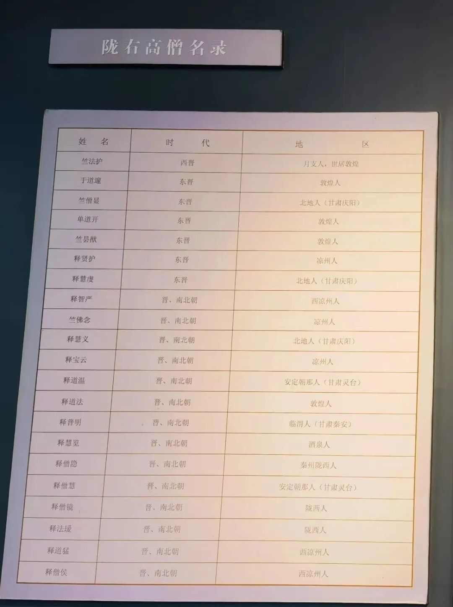

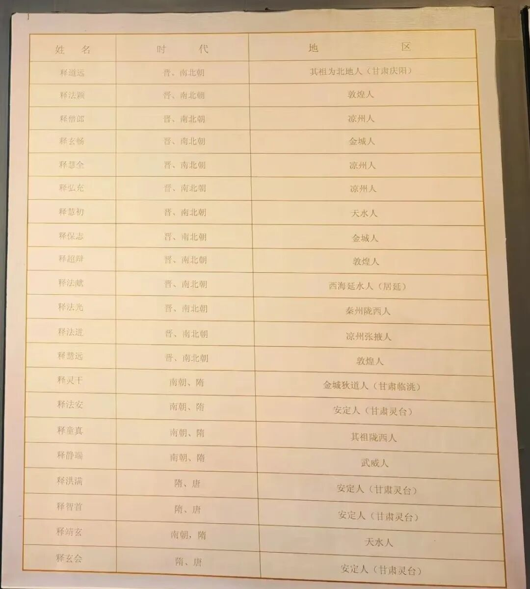

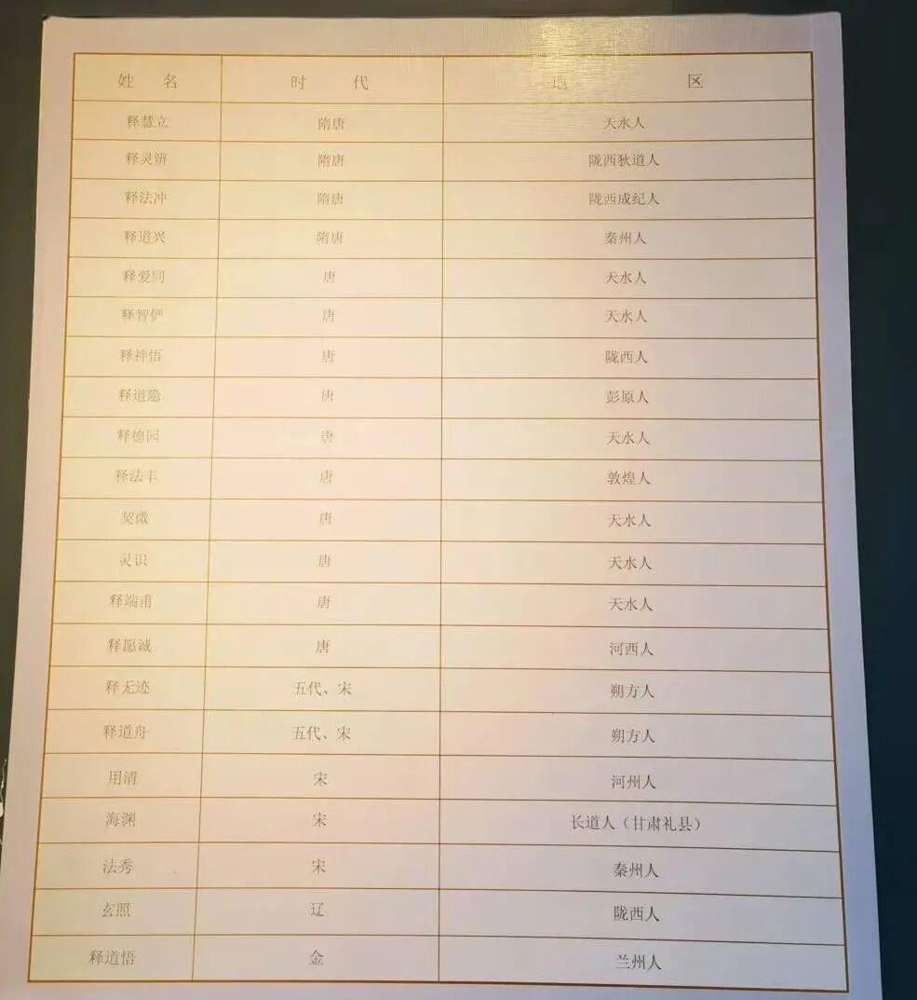

可以考虑复制一张以后肯定有用，比如用来统计来自陇西的三论师。

        修改于