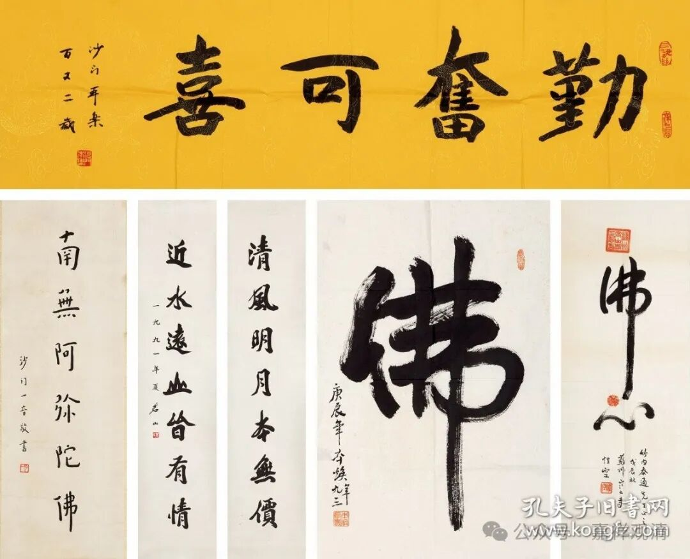

高僧墨宝？

这是一件或者说一组高僧墨宝的拍品，最近在一个拍卖场上拍出了两千元……

几位高僧的作品分别是：

武汉新洲报祖寺本乐老和尚的“勤奋可喜”；

沙门一音（弘一）法师的“南无阿弥陀佛”；

原江苏省佛协会长茗山老和尚的一副对联：“清风明月本无价，近水远山皆有情”；

原深圳弘法寺方丈本焕老和尚的“佛”字；

苏州寒山寺性空法师的“佛心”……

拍出两千元，说明——大家知道，都是假的！

拍卖场上，真的实际有价值拍卖的，近现代的有且只有一个人——弘一法师。弘一法师的书法作品很有市场，而弘一法师的作品肯定不会是两千，也不会是两万……

至于本乐老和尚的字，我作为自己人大概还是看得出来的，这里的字不够老辣，没有老和尚的味道。据内行表述，老和尚的字是硬练出来的，重心偏下，显得很沉稳。而这里的字就太弱了。

（我倒是有想法，征集一下老和尚的字，做一次本乐老和尚的书法展，可以做为我们新楼的“开光”展览。）

最近几年，在好些寺院都看到了冒充的高僧墨宝，看来，“高僧墨宝”太有民间市场了！

我也要加入！

我的叫低僧认字！

