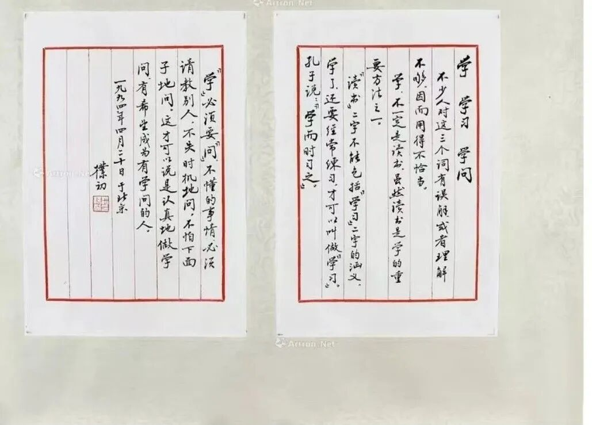
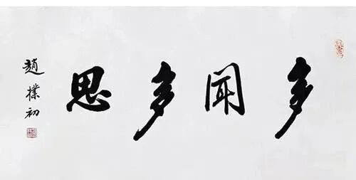

学而时“习”之——复习还是实践？

这是最近在拍卖的一张署名赵朴初的文字。

一眼看上去是像赵朴初老先生的字的，不过据内行说：“赵朴老写字是很潇洒的，小字随意中见精到，从容中见变化（同一类笔划  例如撇或捺，随机挑看变化多、丰富，不会像这幅几乎都一样的方式）”

“学习”这一段，这一段文字还是大致沿用的一般常见的说法，说“习”是“练习”的意思。而清代“颜李学派”的颜元就提出“学而时习之”的“习”应读为“实践”——学了并付诸实践……，颜元因此把自己的书斋名称为“习斋”。说起来，“习”作实践解释，确实要远超“复习”的解释，“练习”这个解释，大概在两者之间的样子。

赵朴老的字，也是佛教圈有名的，可能仅排在弘一法师后面吧。外面他写的字很多，因为当年佛教恢复，各大寺院都找他批示、题字。

我有一副“多闻多思”，是金陵刻经处复制的；还有一个“佛”字，也是署名赵朴初，是一位方丈送我的，但，望之不似真迹啊。

