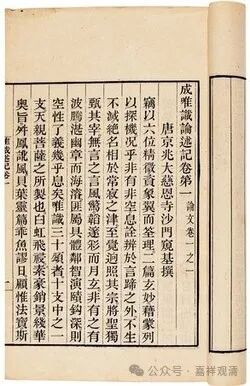
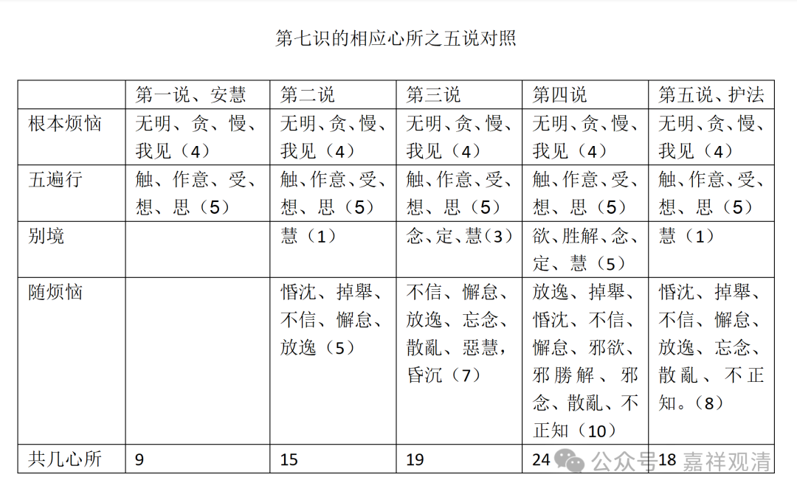

第七识的相应心所

之

五家各说各的

关于第七识的相应心所，唯识至少有五家说法。

1、安慧说：认为第七识相应心所有九，即“我痴、我见、我爱、我慢”加五遍行“触、作意、受、想、思”；

2、第二说，认为第七识相应心所有十五，即，第一说之九种，加别境慧，加《集论》所说随烦恼五——“惛沈、掉舉、不信、懈怠、放逸”；

3、第三说，第七识相应心所有十九，除第一说之九心所外，加别境之念、定、慧，加《瑜伽》五十五之随烦恼七——“不信、懈怠、放逸、忘念、散亂、惡慧，昏沉”；

4、第四说，第七识相应心所有二十四，即，“我痴、我见、我爱、我慢”四，加五遍行、五别境，加《瑜伽》五十八随烦恼十——“放逸、掉舉、惛沈、不信、懈怠、邪欲、邪勝解、邪念、散亂、不正知”；

5、第五说，护法自宗，有十八，即，“我痴、我见、我爱、我慢”四，加五遍行，别境慧，加大随烦恼八。

见下表

第七识的相应心所之五说对照

第一说、安慧

第二说

第三说

第四说

第五说、护法

根本烦恼

无明、贪、慢、我见（4）

无明、贪、慢、我见（4）

无明、贪、慢、我见（4）

无明、贪、慢、我见（4）

无明、贪、慢、我见（4）

五遍行

触、作意、受、想、思（5）

触、作意、受、想、思（5）

触、作意、受、想、思（5）

触、作意、受、想、思（5）

触、作意、受、想、思（5）

别境

慧（1）

念、定、慧（3）

欲、胜解、念、定、慧（5）

慧（1）

随烦恼

惛沈、掉舉、不信、懈怠、放逸（5）

不信、懈怠、放逸、忘念、散亂、惡慧，

昏沉（7）

放逸、掉舉、惛沈、不信、懈怠、邪欲、邪勝解、邪念、散亂、不正知（10）

惛沈、掉舉、不信、懈怠、放逸、忘念、散亂、不正知。（8）

共几心所

9

15

19

24

18

