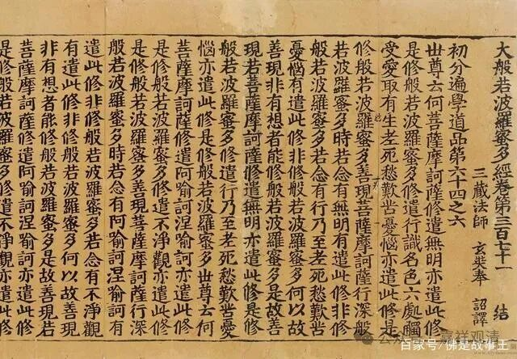

许“末那识九心所相应”的是哪一家？

《成唯识论》在谈末那识有几心所相应的时候，首先提了一家，说是九心所相应——

《成唯识论》卷四：

有義：此意心所唯九，前四及餘觸等五法，即觸、作意、受、想與思，意與遍行定相應故。前說觸等異熟識俱，恐謂同前亦是無覆，顯此異彼，故置“餘”言。“及”是義集前四後五合，與末那恒相應故。

按：

这里的“有义”，按《成唯识论》的套路来说，就是有人这么说，但是护法——玄奘不同意的。如果是其他论师说的，虽然和护法不一样，但是可以接受的，那就用“又”了。《成唯识论》里面大致都这么用。

又，这里“此意”的“意”，指意根——第七识末那识。

这第一家是谁呢？以现有的资料看，基本可以很明确地指向，这么说的人就是安慧，因为现存安慧《唯识三十颂释》的解释和《成唯识论》这里的第一说“一模一样”。

安慧《唯識三十颂释》·韩镜清译：

……言“及”者，謂和集義。言“觸等”者，謂觸、作意、受、想、思。如是五法，是遍行故，與一切識相應。彼等亦隨所生，即與彼處所攝相應，非與異界、異地所攝相應。

復次，言“餘”者，為簡別根本識相應故。謂根本識相應觸等，是無覆無記性。而染汙意相應者，如意，亦是有覆無記性。

这两段，释九心所，释“及”，释“余”，完全一致，所以可以明确，《成唯识论》在这里提到的许末那识九心所相应的，就是安慧论师。

