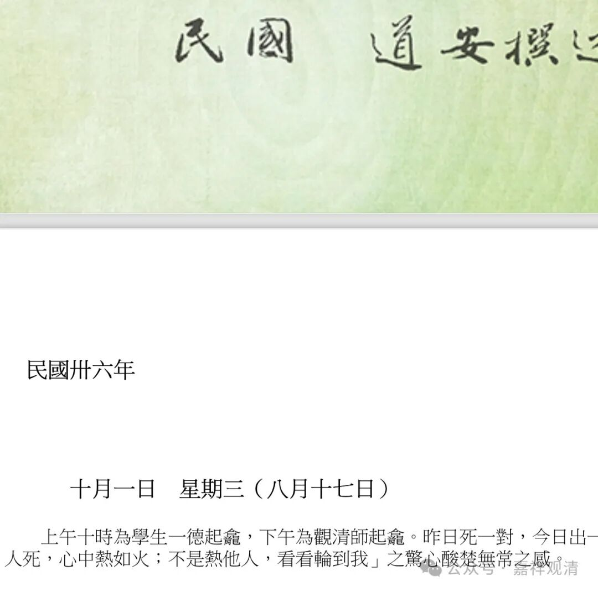

“我心热如火，看看轮到我”

道安法师日记一则

下午，有兄弟发来道安法师日记一则——

“上午十時，為學生一德起龕，下午為觀清師起龕。昨日死一對，今日出一雙，真有點“我見他人死，心中熱如火，不是熱他人，看看輪到我”之驚心酸楚無常之感。”

呵呵，突然就……

道安法师，湖南僧人，解放后去了香港台湾。他有点佛教事业的，好像编过佛教辞典……

这里提到的“观清师”，也是解放后在香港的一位法师。没留下什么大的事业、言说，基本属于一代而亡的那种……

“我見他人死，心中熱如火，不是熱他人，看看輪到我”，是流传的《志公禅师劝世念佛文》里的一段，原文是“我見他人死，我心熱如火，不是熱他人，看看輪到我”。照例，这里的《志公禅师劝世念佛文》也是托名的文字。

我看到这一则，也不免心里一凉——这是绝对的“心里一凉”（不是“心里热似火”），这确实“看看轮到我”啊。

正好最近在念道次第，可以配合“人命无常”这一科来思维哦……

