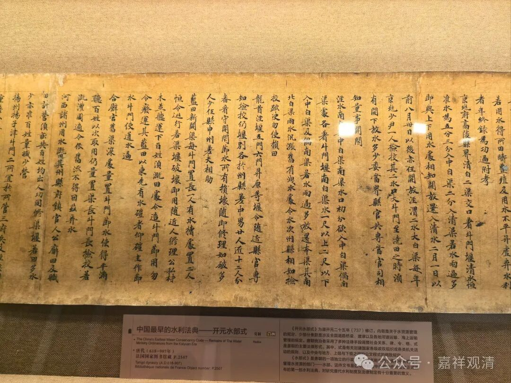
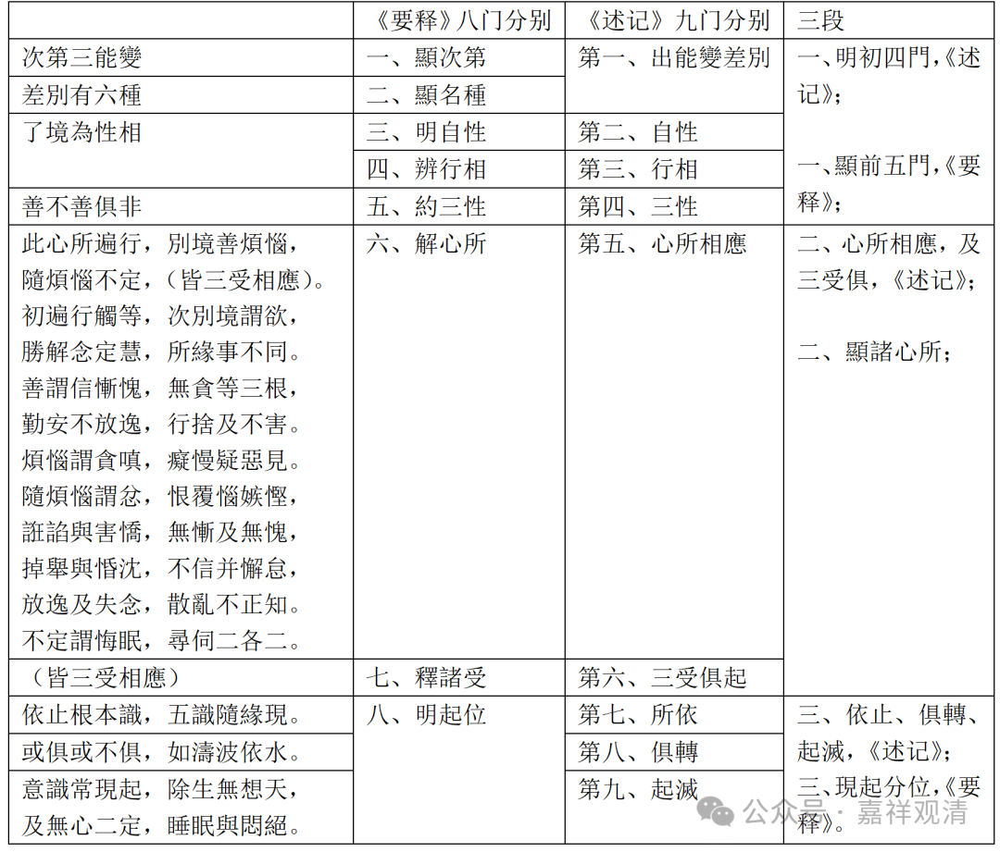

《唯识三十颂》“三能变”之九门分别等

《唯识三十颂》之“三能变”有八颂，《要释》作八门分别，《成唯识论述记》做九门分别，大致差不多，如果强调相应的话，是可以把两说合并，开为十门分别的。

《要释》和《述记》都把八门分别、九门分别收束为三段，这种三段收束，双方完全一致。

其中第二颂末一句“皆三受相应”，释为“三受分别门”，但实际是被夹在“心所相应门”中间的，《要释》和《成唯识论》解释也是一致的。但是，《要释》此处颂文做“**皆三受容俱** ”，与诸本不同。但《要释》的唱行疏释文中仍引作“皆三受相应”，所以也可能是《要释》摘录颂文时出错了。

下面看一下对照表

《唯识三十颂》“三能变”分科对照表

《要释》八门分别

《述记》九门分别

三段

次第三能變

一、顯次第

第一、出能變差別

一、明初四門，《述记》；

一、顯前五門，《要释》；

差別有六種

二、顯名種

了境為性相

三、明自性

第二、自性

四、辨行相

第三、行相

善不善俱非

五、約三性

第四、三性

此心所遍行，別境善煩惱，

隨煩惱不定，（皆三受相應）。

初遍行觸等，次別境謂欲，

勝解念定慧，所緣事不同。

善謂信慚愧，無貪等三根，

勤安不放逸，行捨及不害。

煩惱謂貪嗔，癡慢疑惡見。

隨煩惱謂忿，恨覆惱嫉慳，

誑諂與害憍，無慚及無愧，

掉舉與惛沈，不信并懈怠，

放逸及失念，散亂不正知。

不定謂悔眠，尋伺二各二。

六、解心所

第五、心所相應

二、心所相應，及三受俱，《述记》；

二、顯諸心所；

（皆三受相應）

七、釋諸受

第六、三受俱起

依止根本識，五識隨緣現。

八、明起位

第七、所依

三、依止、俱轉、起滅，《述记》；

三、現起分位，《要释》。

或俱或不俱，如濤波依水。

第八、俱轉

意識常現起，除生無想天，

及無心二定，睡眠與悶絕。

第九、起滅

