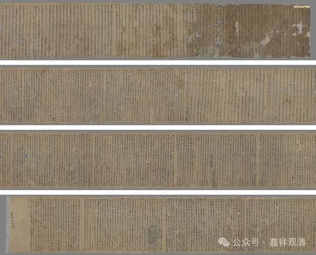

今天我们很多佛学院、很多大师喜欢讲《八识规矩颂》，很多人说《八识规矩颂》是玄奘法师写的嘛，江湖上都说他写的，其实跟玄奘法师应该是没有关系啊，他的弟子们根本就没有任何一个人引用过，而且里面会有一些错误，我当时整理大概有七八个错误啊，比较大一点的问题啊，但是《八识规矩颂》，确实是一个比较好的一个整理的入门读物。

《八识规矩颂》里面的文字最早出现在元代《唯识开蒙》里，到了明代就广泛传开了，成为学唯识的入门教材了。不过明代的一些注解比《八识规矩颂》本身还不靠谱，不值得大家研究、追随……

前面说到，昙旷法师曾经是长安西明寺沙门，他师事道氤，道氤，唐玄宗时人，擅唯识、百法、因明，师承不详。

昙旷法师原先在佛教史上无名，后因为敦煌藏经洞的发现，知道他是敦煌佛教高僧，敦煌文献中，有他的《起信论广释》（二卷）等等。通过这些他的著作、讲记，知道他在朔方撰《金刚经旨赞》（二卷），宝应二年在凉州造《起信论略述》（二卷），后赴敦煌，撰《入道次第开诀》（一卷）、《百法论开宗义记》（四卷），大历九年，又撰《百法明门论开宗义诀》（二卷）、《大乘二十二问本》等，还有这部不分卷的《唯识三十论要释》。

这些敦煌本原件都在英国大英博物馆，部分敦煌文本如《大乘二十二问本》国内也有收藏，这些作品基本上在《大正藏》里都被收录了，也有很多已经出了单行本了。

（上面的图就是《大乘二十二问本》原件的照片。）

那么最近《大乘二十二问本》这个比较火了，因为《大乘二十二问本》是涉及到和这个吐蕃的这个关系。那么吐蕃在差不多昙旷法师这个时候啊，那么就出现了“吐蕃僧诤”，现在有称为叫“拉萨僧诤”啊，就是印度的莲花戒论师（中观自续顺瑜伽行派）和摩诃衍（汉地禅宗），进行了一次辩论，摩诃衍（大乘和尚）是输了，退出了吐蕃教区……

摩诃衍代表的是禅宗，那么禅宗里面，他到底代表南宗还是北宗呢？今天的禅宗都是南宗门下，现在肯定不愿意承认啊，说他是北宗，但是摩诃衍其实南宗、北宗的传承都有，据他自己说跟过北宗的两位大师，但在圭峰宗密大师的《禅源都序》当中把他列在菏泽神会门下。所以他确实南北宗都有师承。

摩诃衍跟敦煌也有点关系，后来他退出吐蕃以后就去了敦煌。摩诃衍在跟莲花戒辩论的时候有还说了一些我们听起来不太……怎么说，不太提气的话，嗯，他说“唉呀，我在经论上不算是很熟啊，我的弟子谁谁谁在这个敦煌啊，你们要是要辩经论的话，他来的话可能会更好一些……”，出现这样的情况。

那么当时呢？这个藏王就问了一些问题，就寄到了这个敦煌，那么就由昙旷法师来回答。这就是《大乘二十二问》，另外，我怀疑《入道次第开诀》是不是也是和这场“僧诤”的外延有关，毕竟莲花戒也写了《修次第》三篇嘛……

我们也发现好像藏地的这些领主们啊，都很喜欢问这样的跟佛教有关的问题，比如说阿底峡尊者也是这样是吧，他的作品《菩提道灯论》也是对阿里王智慧光的一系列的问题，然后给予的一个回答，这后来就成为后来一系列的《道次第》的作品的文献源头。

这些部分我们就不展开了，有兴趣的话我们单独做讲座吧……

