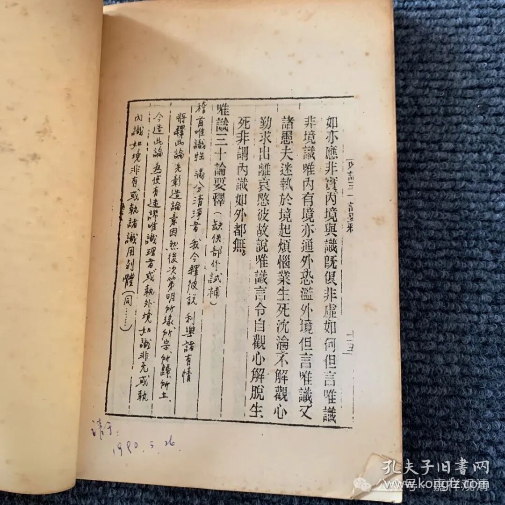

那么，顾老补上的这段呢，在专门研究唯识的人中间倒也不算难。我们看这一件——

这是网上出让的一件《唯识三十论要释》的本子，是金陵刻经处版本的影印本。这里有其他唯识学者同样用《成唯识论》开篇的这段补足《三十论要释》的。

那么，在他们补足的部分应该还有，还有《要释》作为昙旷《唯识三十论》讲义的科判部分还需要补足……

既然我们已经考证了《唯识三十论要释》的作者是昙旷，那我们从昙旷的这个书里面去找找。然后我们发现昙旷的书里面有这些啊，它的科判、分别啊，分别当中有“所缘”，有“所宗”，有“所归”和“所立”。这个很明显就是昙旷的，因为昙旷在他的《百法疏》（即敦煌本《大乘百法明门论开宗义记》）合拍了。

《大乘百法明门论开宗义记》当中是这样的，“**开发论宗，五门分别：一、明所因……** ”这个我们的《唯识三十颂要释》当中没有的，但是接下去后面几个，“二、顯所緣；三、彰所宗；四、辯所歸；五、解所立”这几个在《三十论要释》当中全都出现了。那么，从《唯识三十颂要释》它的前面的这个部分来看，它应该少一个“明所因”。

另外，看起来这个《唯识三十论要释》当中有“**显所缘** ”，和昙旷的《大乘百法明门论开宗义记》的这个“**显所缘** ”也是一样的。我们来看一下，这里也是一样啊，比如说 “**言所緣者，復有二種：初明造論，後顯傳譯”** ，那么昙旷的《大乘百法明门论开宗义记》当中是这样的啊，**“言所緣者，復有二種：一、造论所缘，二、传译所缘”** ，这个是基本上是一致的，所以在“**稽首唯識性** ”前面我们可以把它加进去。

稍微说两句啊，嗯，那么这一段呢，也是敦煌本昙旷的《大乘百法明门论开宗义记》里面的，在CBETA里面也有，里面都被收入在了《大正藏》里面，这个《大乘百法明门论开宗义记》在敦煌本里面有两个本子，所以可以做互相对照，我们这里暂时就不出注了。

那现在我们就可以根据《大乘百法明门论开宗义记》来补足《唯识三十论要释》佚失的开篇的科判部分——

**【開發論宗，五門分別：一、明所因；二、顯所緣；三、彰所宗；四、辯所歸；五、解所立。

** 所因有二：一、所依因；二、所為因。

**所依因者，復有五種：一、依了教，謂依建立阿賴耶識，了教大乘而立論故。二、依圓理，謂依三性，顯說有空，處中理門而作論故。三、依勝境，具依五法，雙據二空，一切甄明而起論故。四、依妙行，以本後智發深慈悲，弘法利生而興論故。五、依大果，要成佛果，具說圓宗，依佛滿智而為論故。

** 所為因者亦有五門：一、入大法，謂以略標廣散義宗，易入大乘離怯懈故。二、起勝解，諸法無我，遠離二邊，令其遍達，離偏見故。三、生圓照，具明真俗，雙顯有空，令得中道，起圓照故。四、令進趣，具說染、淨，所斷、證、修，令正修行無錯謬故。五、令成就，若分、若滿，或化、或真，轉依皆成無缺減故。】

现在补完了《要释》的佚失部分，我们就可以正式开始讲解了……

