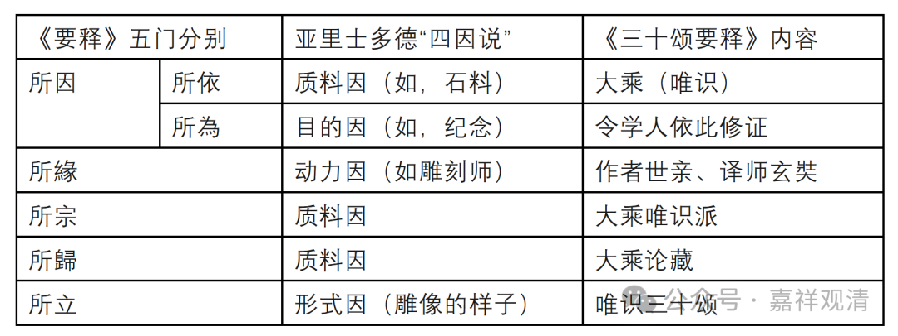

“**開發論宗，五門分別** ：……”

“开发论宗”，就是在最“开”始的时候，“发”起、解释本“论”的宗旨。也就是说“开发论宗”，就是一书的前言、导论的部分，介绍一下作者、历史……提纲携领地，同时把作品的框架也可以说一下。

“開發論宗，五門分別”，我们看这个，比如说你看到注疏、章疏里出现“十门分别”、“六门分别”、“五门分别”……这样，一般来说你看这个就大概知道（如果你想知道的话）是哪个宗派的？或者是谁的作品？因为每个人、或者每个宗派的这个成熟的科判方式，会带有很明显的个人的、宗派的特征……

有时候我们要看到一个比如没有署名的一篇重要的文献，你可以从这个角度去找啊，从它的这个科判的这种方式来看，去判断它大致应该是属于哪个宗派或者哪一个学派的。假如你看一篇章疏，不知道作者，一看全书到处都是“十门分别”的，基本上就可以确定是华严宗的作品了。一个人、一个宗派，到了成熟阶段就会有一些这样的定式，类似一种画押，算是某种标签。

所以，我们就用这个“五门分别”，来判断《唯识三十论要释》的作者是昙旷（当然这只是论据之一），你看，《唯识三十论要释》和《百法明门论开宗义记》的科判就完全是一样的：

“**一、明所因；二、顯所緣；三、彰所宗；四、辯所歸；五、解所立。** ”

“所因”里的“因”就是主要条件，这里说的是来源、目的；“所缘”这里说的是著作者和传译者；“所归”就是所摄、所属，就是属于三乘、三藏里的哪个所摄，“所立”就是所建立的理论，也就是（解释）《唯识三十颂》的正文部分。

“**所因有二：一、所依因；二、所為因。** ”

在“所因”当中又分二，“所依”和“所为”。所依，就是依大乘教（实际指向的是大乘唯识）；所为，就是造论、解释的目的。以亚里士多德的四因说来说，“所依因”就相当于“质料因”，“所为因”就相当于“目的因”。

亚里士多德的四因说是：质料因、形式因、动力因和目的因。假如以四因说来和《要释》上面的科判结合、对照的话大概是这样——

《要释》五门分别

亚里士多德“四因说”

《三十颂要释》内容

所因

所依

质料因（如，石料）

大乘（唯识）

所為

目的因（如，纪念）

令学人依此修证

所緣

动力因（如雕刻师）

作者世亲、译师玄奘

所宗

质料因

大乘唯识派

所歸

质料因

大乘论藏

所立

形式因（雕像的样子）

唯识三十颂

这样能看清楚点不？大概可以这样对照着理解一下。

        修改于