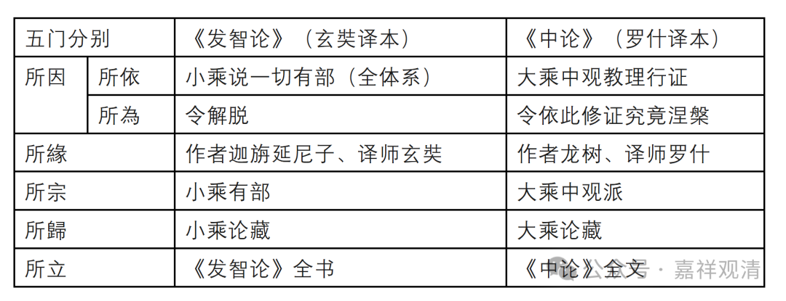

昙旷的这个“五门分别”就是他个人的一个套路，讲什么经都可以用，比如讲《发智论》，那“所依因”就是小乘说一切有部，“所为因”就是令解脱；所缘，就是迦旃延尼子、玄奘；所宗，就是有部；所归，就是小乘论藏；所立，就是《发智论》本身。

换一个，比如讲《中论》的话，那么，“所依因”就是大乘中观的教理行证，“所为因”就是趋无住涅槃；所缘，就是龙树、鸠摩罗什；所宗，就是大乘中观派；所归，就是大乘论藏；所立，就是《中观论》本身。

五门分别

《发智论》（玄奘译本）

《中论》（罗什译本）

所因

所依

小乘说一切有部（全体系）

大乘中观教理行证

所為

令解脱

令依此修证究竟涅槃

所緣

作者迦旃延尼子、译师玄奘

作者龙树、译师罗什

所宗

小乘有部

大乘中观派

所歸

小乘论藏

大乘论藏

所立

《发智论》全书

《中论》全文

所以学会这个套路大家都可以用。大家用顺手了，人家内行、明白人一看你的套路，就知道你的师承。

我们继续看啊，

“**所依因者復有五種：一、依了教，謂依建立阿賴耶識，了教大乘而立論故；二、依圓理，謂依三性，顯說有空，處中理門而作論故；三、依勝境，具依五法，雙據二空，一切甄明而起論故；四、依妙行，以本後智發深慈悲，弘法利生而興論故；五、依大果，要成佛果，具說圓宗，依佛滿智而為論故。** ”

首先，所依因分五，依了教、依圆理、依胜境、依妙行、依大果，也就是唯识派的全部佛教的内容，也就是“教、理、行、果”或者“境、行、果”，《要释》把这两种合并在一起，就是“教、理、境、行、果”了。我们也可以这样理解，前三就是“境”。

唯识的核心内容，内部一向是说：“五法、三自性、八识、二无我”，那么我们看这里“所依因”部分，“依了教”里说了“八识”，“依圆理”里提了“三性”，“依胜境”里讲“五法”和“二无我”，全都齐了。

