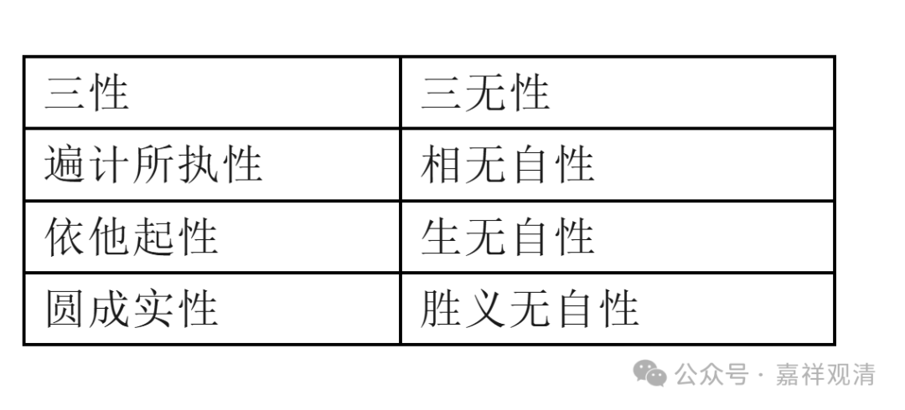
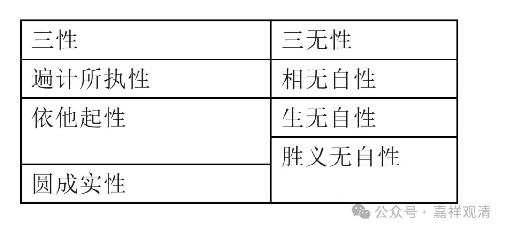

完整地说呢，“三性”和“三无性”要对应。遍计所执是什么呢？“相无性”啊，“依他起性”是什么呢？是“生无自性”，然后加“一分胜义无自性”。“胜义无自性”在唯识里就是空嘛，而“依他起性上没有遍计所执性”是他的空性，但问题是这个）“空性”（“依他起性上没有遍计所执性”不仅在圆成实性上有，在依他起上也有，对吧？——依他起上没有遍计所执性，这也本身是依他起性的性质啊。

“三性三无性”表一

三性

三无性

遍计所执性

相无自性

依他起性

生无自性

圆成实性

胜义无自性

“三性三无性”，表二

三性

三无性

遍计所执性

相无自性

依他起性

生无自性

胜义无自性

圆成实性

所以如果简单的话，“三性三无性”是如“表一”这样分配的，这种分配在唯识里面也有这样说法的，而且更常见，因为比较简单，比如《唯识三十颂》就这么说。如果复杂的呢？就是《解深密经》当中说的，就是上面的表二，说“胜义无自性”要分两个：在依他起性上有一分，在圆成实性上有一分。这个“一分”就是一部分了。也就是说胜义无自性，它在依他起上、圆成实上都是有的。

这个大家先知道一下啊。

其实我们学唯识有个很麻烦的地方，汉传学唯识得很多人在这里面学不下去的原因也就这个，就是唯识宗里面说法实在太多了。《成唯识论》呢，本身就是十个论师的《唯识三十论释》起来的。所以唯识内部观点太多，非常不统一。加上这个唯识核心论典里有弥勒的，有无著、有世亲的，各自的讲解、发挥、重点也不太一样对吧，甚至《瑜伽师地论》里面前后讲的也不完全一样。所以造成了学唯识的人学得多了以后，看到“诸说纷纭”，有点无所适从——这个是学唯识的一个困难之点，是一个困难的地方。这时候就非常需要一个权威的、纲要性的东西出现了……

这类纲要性的东西，藏地出现了，就是略述各部宗义的被称为《宗义书》的这类著作，这样纲要性的出现以后，很多东西至少框架是有了，很多学习的基点就先定下来了，桩脚就有了，在这个基础上再去搭房子、垒砖头……

对汉传唯识的学人而言，唯识自宗的作品翻译太全也是一个“幸福的烦恼”，对一般人而言，造成了不知道从何下手、如何下手、研习次第……的问题。

所以《宗义书》当中的介绍的唯识宗，虽然我们现在也在批评这里、那里“未尽善也”，但是不管怎么样，大家背一背肯定是有好处的，而且很有好处的！你站在他这个框架下重新再去整理、学修，要比没有一个学修的框架要好得多啊。

唯识的书太多了，你跟他讲a主张的话，那一定有b主张和它不一样的。这里也是啊，“三性三无性”有几种说法。那么，“表二”的这种说法是比较标准、源出的，它直接来自《解深密经》《瑜伽师地论》嘛；“表一”这种说法是比较简单的，因为一一对应，比较简洁。

