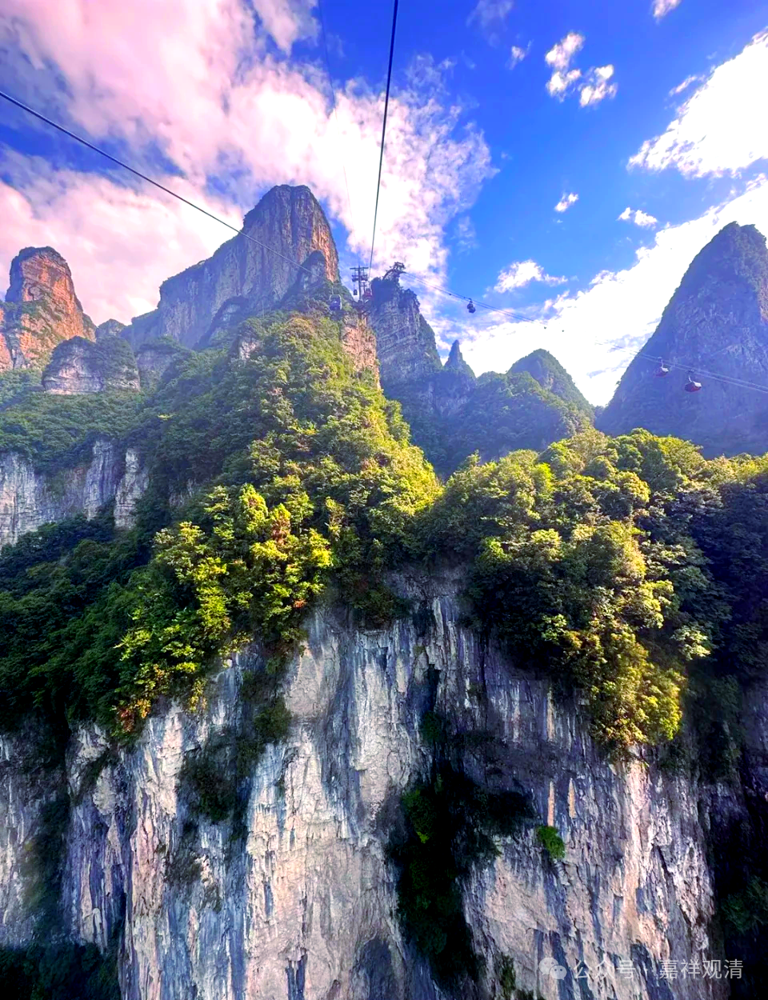

“**處中理門，而作論故** ”，他说我这个就是中道啊，有“空”有“不空”，而且是什么“空”、什么“不空”都已经讲清楚了——三性三无性！“**處中理門，而作論故** ”——我说的就是“中道”！

这个“中道”，几乎是所有佛教的宗派都要去“认领”的一件事情啊，都说“我是中道！我许非断非常，我许非有非无……”，大家都认为自己走的就是“中道”，都来认领“中道”。

早期的阿含时期的中道，实际上它是一种“苦乐中道”啊，到了后来，它就是理论当中的一种中道，就是“常-非常”、“空-有”的这样的一种中道啊，或者是“世俗谛、胜义谛”，是“三性（三无性）”“二谛”这样的中道。

中观讲的“中道”是什么呢？中观的中道是二谛，“世俗有、胜义空”，龙树在《中论》中说：“因缘所生法，我说即是空，亦名为假名，亦是中道义”......我的中道是这个意思啊。

早期的阿含的中道是苦乐中道，既不是世间的享受，也不是像外道的纯吃苦，这个在释迦摩尼佛的这个行为当中就表现出来了——

一开始在世间，他作为王子，不管这个程度怎么样？在当时肯定是相对来说比较享受的，那就是前面19年或者29年，他这个是属于享受型的人生，对吧？就是享受世间的快乐……那么释迦太子出家表现为世间的快乐，并不是真正的快乐。然后遍访外道，修习禅定，这是一种禅乐，最后也放弃了——这也是在暗示，禅乐不是解脱，不能解脱生死！

接下去，所谓的“六年苦行”，对吧？吃一麻一麦。最后吃的都快不行了，这个时候是什么呢？苦，纯吃苦。能不能得到解脱呢？也不行，最后从鹿野苑、从吃苦的地方站起来……这个时候就迈入了一种叫“苦乐中道”。

“苦乐中道”这个是早期的“中道”，大家如果有兴趣的话，可以去看一下基诺里维斯、英若诚演的《小布达》，这个现在不能下载了。那如果在什么地方还是可以看到啊，《小佛陀》他那里面有一段，释迦太子（基诺里维斯）苦行中，听到乐师教育弟子，“琴弦不能太松，也不能太紧”，突然醒悟，起坐，走向了小河……虽然那一段不是完全的佛教史实（实际的故事发生在二十亿耳和佛陀的对话中），但是确实意思在里面是有的啊。

早期的这个中道，它是苦乐中道。那么，佛陀的解脱也是基于这个苦乐中道啊而来的，后期呢这个中道就被理论化。至于到底什么中道，各自表述就好，只要言之成理，持之有故，就行……

总结一下，早期佛教是苦乐中道，中观是用“二谛”来说中道，唯识是用“三性三无性”来说中道，所以《要释》说“**謂依三性，顯說有空，處中理門而作論故。** ”

