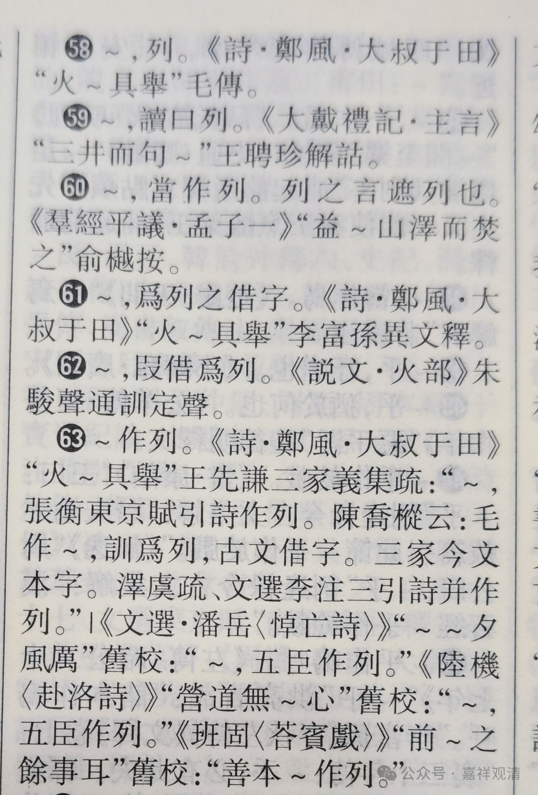

“烈”，还是“列”？讹写，还是假借？

《<唯识三十论>要释》是敦煌本文献，缺失卷首部分，最初于《大正藏》八十五册（No. 2804 ）收录，将底本标作斯·396，实为斯·5537，上山大俊和周叔迦先生都判定作者为敦煌昙旷（不知道两位里面谁更早判定），此昙旷，即《大乘二十二问本》的作者。

《<唯识三十论>要释》中有两处出现“烈”字，但都明确地应该释作“列”——

1、“即初句標，餘二句烈”；

2、“遍行等者，烈六位名”。

有校释认为应该是“列”而写作“烈”，这是讹误的抄写。但先后有两处的“列”都写作“烈”，估计多半不是抄错的。第一反应是不是因为有避讳，但查了一下，似乎“列”字没有避讳的情况。

搬出宝书《故训汇纂》，查“烈”。

原来，“烈”可以直接训作“列”，可以算是一种假借。而早在《诗经》《毛传》时代“烈”就（假借）作“列”了。

那么，《<唯识三十论>要释》两处的“烈”字本身就没错了，不能算是讹误。

