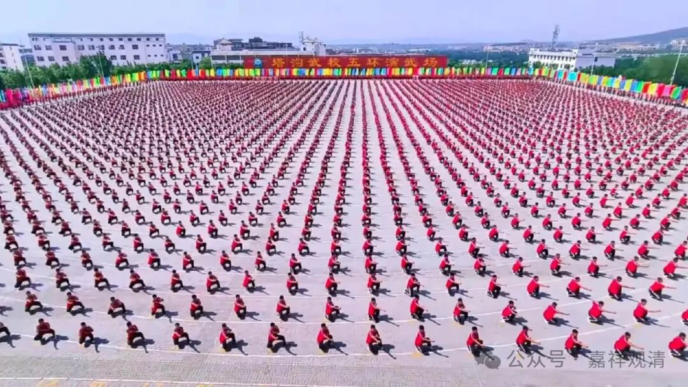

塔沟武校的散打冠军开出租……

打车去车站，照例和滴滴司机聊上了。

看到我一身僧装，司机师傅说起他叔叔，说他叔叔19年学佛，大概遇到骗子了，被骗了（或者说是花了）几十万，去年家里送他叔叔去看了心理医生，现在情况好点了。他也感叹，哎，江湖险恶啊！

司机大哥是河南驻马店的，我说那里有个大佛……大哥说中学时曾经在塔沟武校（少林寺门口）学过四年，拿过散打冠军，后来特招参了军。他说，那时候参军不容易，还得走后门，他因为武校特招进去的。

我说“那你练得比我们好多了，真功夫了。我有一个师兄以前也是山东散手队的，后来在四川某高校做了体育老师，再后来就出家了……”——“散打”，文革刚结束那会儿还叫“散手”。

我说你在部队比武啥的拿过名词吗？他说那倒没有，但他们武校参军的素质比一般的兵要强得多。复原以后分配去的郑州的消防队，他说那时候消防队没独立出来，待遇没现在好，还危险，就辞职了。现在可后悔了，因为现在消防队的待遇比以前好多了。

我说你现在还练武不？他说现在很少练了，所以都两百多斤了（确实，把座位都撑满了）……但有空还是会去练练，上周末就去那谁的场子去打了散打，肌肉都还在，但膘也没少存。

我说今天我回庙里，你呢？——“明天回老家！”

