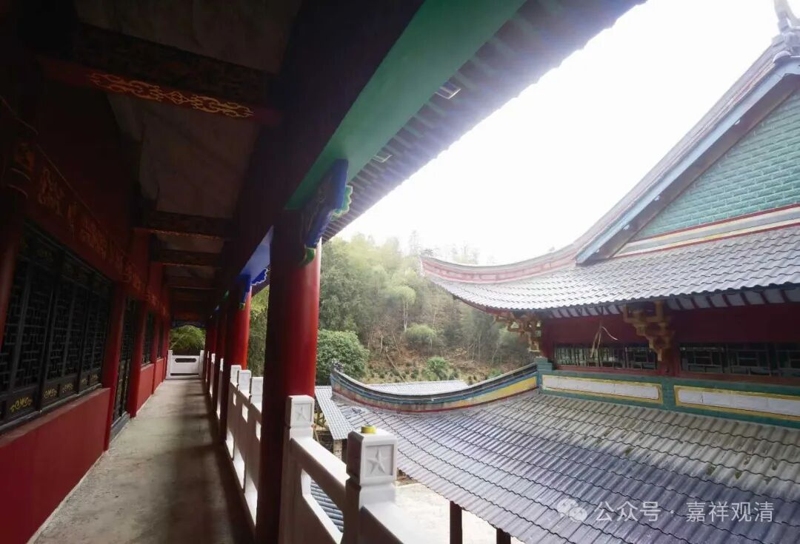

**寻亲不遇

今天我“视察”完寺院“基建”回寮房的时候，迎面走来一对老夫妻，直接盯着我，直冲着我走过来。大概都是七八十岁的样子，男的还有点帕金森，左手一直在抖，边上老妇人搀着他……

我看着他们似乎很有点“目的性”，就停下来问：“你们有什么事情吗？”

老人问：“你们这里有没有一个叫XFF的？”

我说：“没有。”

老人说他们是江西都昌人，XFF是他侄子，十几年前走失了。昨天他梦到嫂子给他托梦，说在莲花山白云寺，所以他就立刻找过来了。他说在网上看过我的照片了，说嘴脸都像，就是鼻子不像……

呃……

我说我是上海人，不是你们要找的人。我问：你们侄子几岁了？

老妇说，78年的，比你大。

我说：我7X年的，比他大。（看样子我确实看着嫩啊。）我们庙里之前有过几个老和尚，没有其他七零后的了。（龙智师肯定也不是嘛。）在后面的都是八零后、九零后了……

我说我能理解你们，但这里确实没有这个你们要找的人。

两位有点失望，“来都来了”，便去大殿拜佛去了……

回房不久，又接到佛协某法师来电话打听XF，我说“已经找到你们了啊？我已经碰到来找的人了……”

