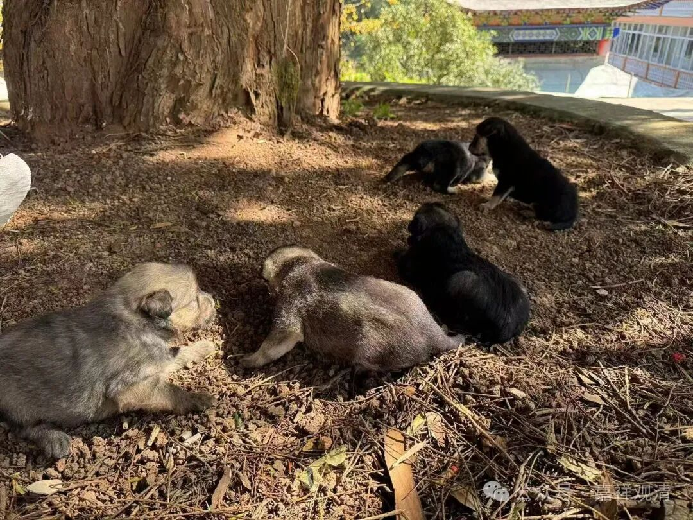
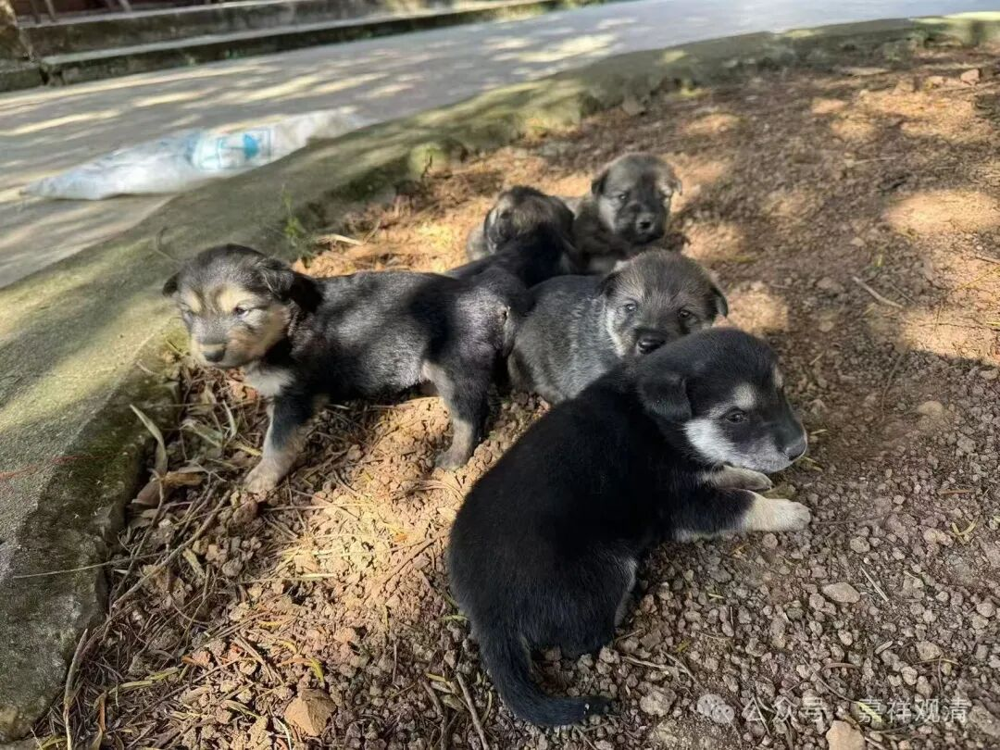
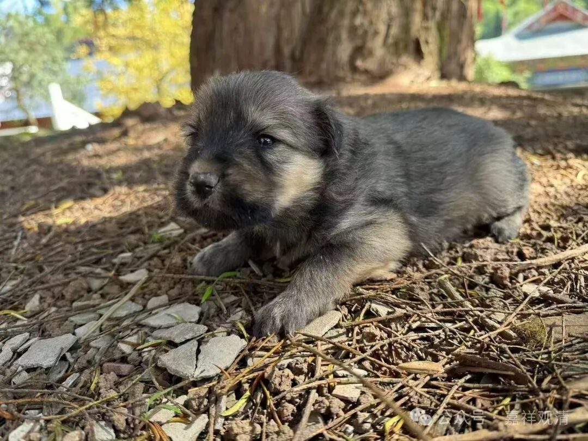

被拐走的“白云寺五绝”

庙里，就剩一只狗了。

乔丹走失以后，庙里就一只“小黑三世”了。去年刚过完年，老周又带来一只狗，这样庙里有了俩狗，小黑，和二黑，都是中华田园犬。

小黑和二黑后来好上了，生了一堆（五只）小狗。

咱庙里实现狗狗自由了！

照例，起名东邪、西毒、南帝、北丐、中神通——“白云寺五绝”！

肉嘟嘟的模样，可爱吧。

可怎么只剩了二黑了呢？

小黑，生病嘎了，传染给了另外一只小狗，也嘎了。

另外四只小狗呢？

龙肃说：“都被人偷走了！”

原来，当地有个风俗，说“狗要拐”的才好，所以就把我们的狗偷走了！你看，还不用“偷”字，用“拐”字！“拐”不就是“偷”嘛！说拐来的狗聪明，看家。

上网一查，发现农村真有这个“传统”，说“猫要买，狗要拐”，真是奇怪。

现在明白了，之前的“乔丹”（纯黑的）也是被人“拐”走了的，拐走的时候，也就半岁。

