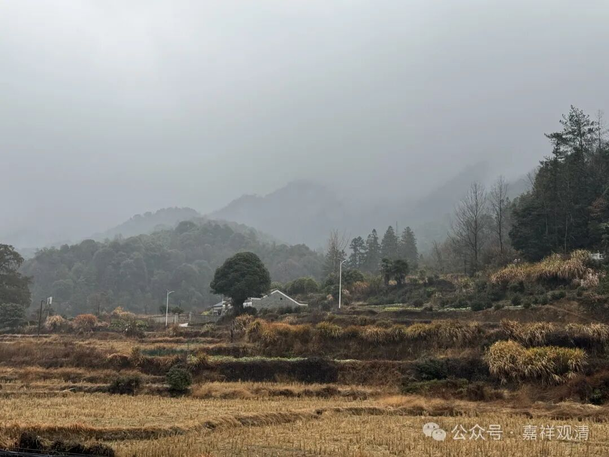

小庙开光

今天中湾的一个小庙重建，来庙里请我们一早过去“点光”，就是“开光”。

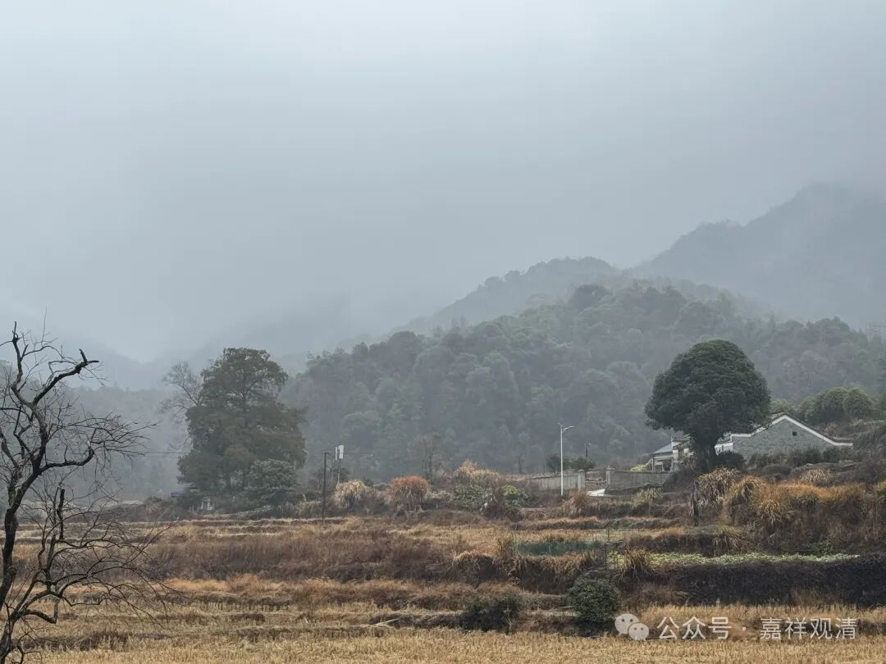

正好我们这儿这两天法师多，大家一起去“走两圈”。

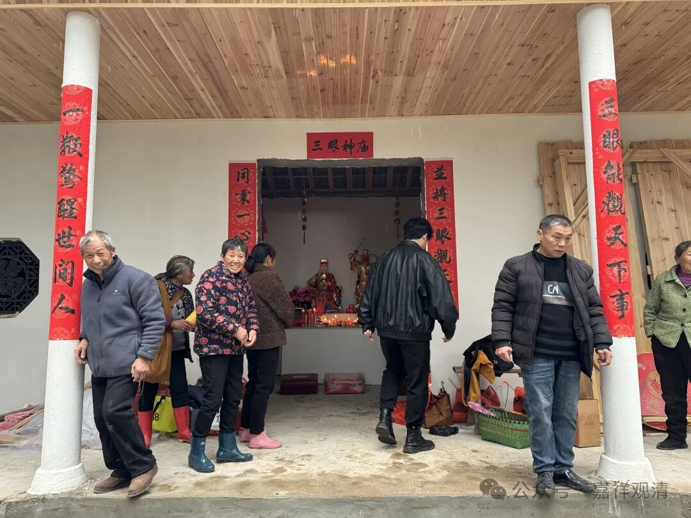

中湾村有300多人口，山里面原先有一个神庙，供的马王爷和王灵官，也有土地神和观音。去年下半年，小庙后面的老树被虫子蛀空了，倒下来把小庙给砸了。村里面一想，这庙过年得有人来啊，必须马上修好！于是集资修路建庙，愣是在今年过年前就把房子建好了。钱也花的不多，七八万的样子。

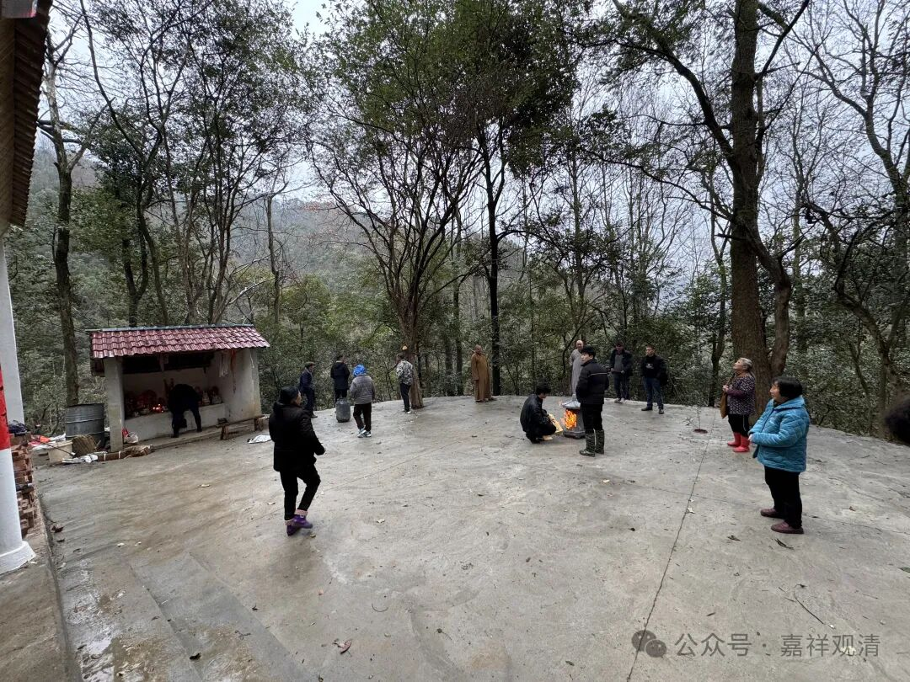

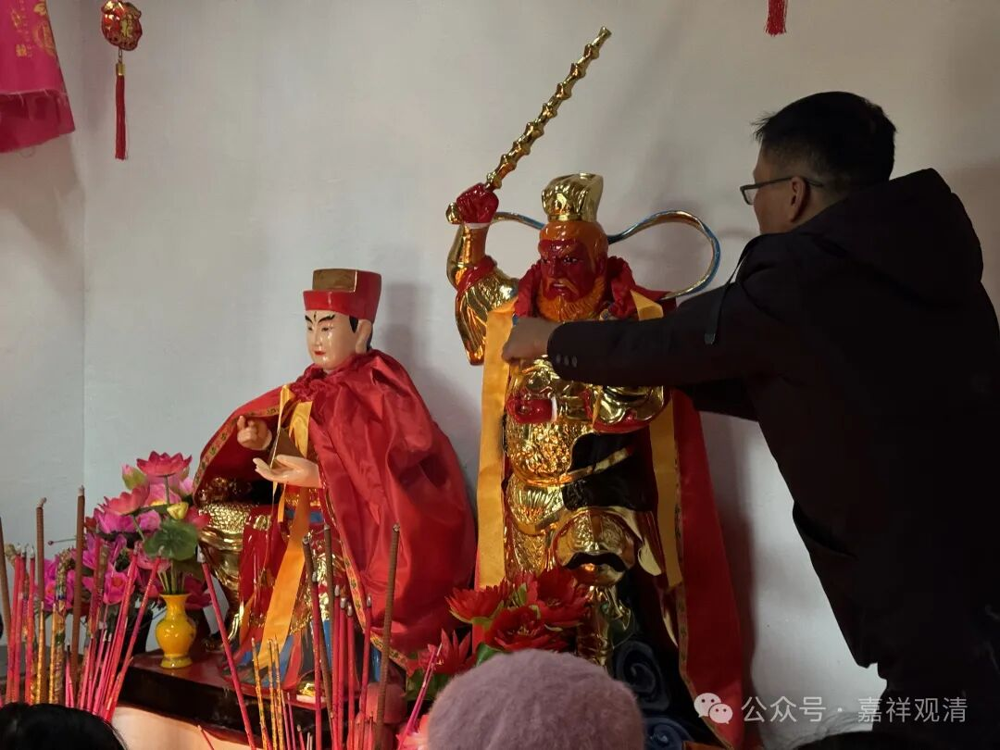

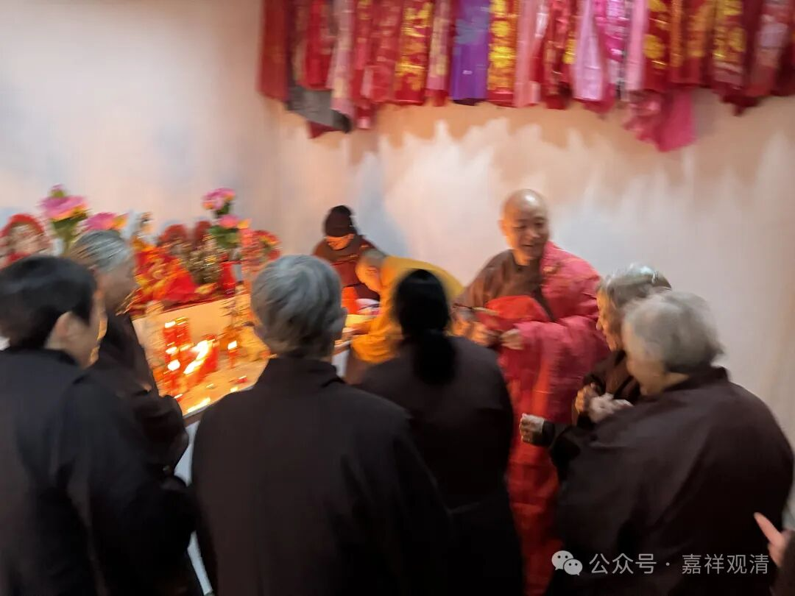

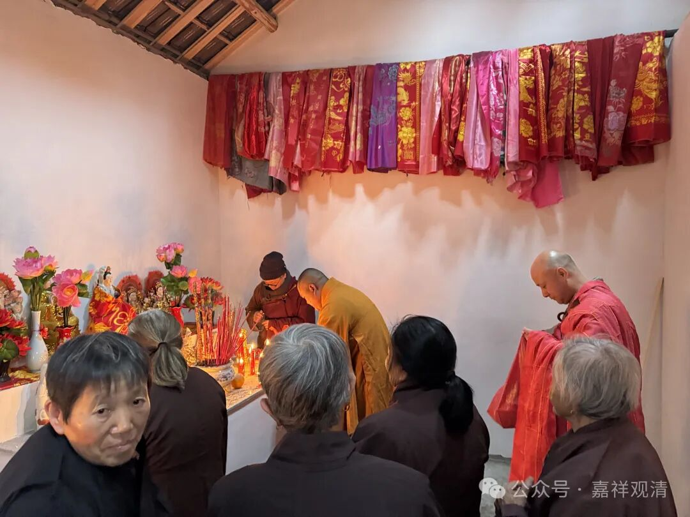

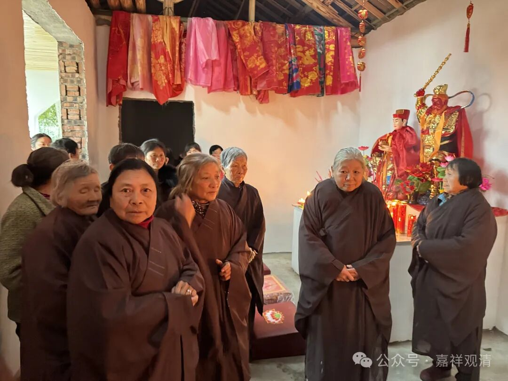

原来的神像也被砸坏了，这次重新补上，没来得及铸铜像（因为工期比较长，交货至少得到三四月份），于是“请”的玻璃钢的神像，由村里的“老板”赞助。不用铜像还有一个原因，因为小庙的神像不大，他们怕被偷……毕竟我们庙今年被偷了三四次居士们也是知道的。

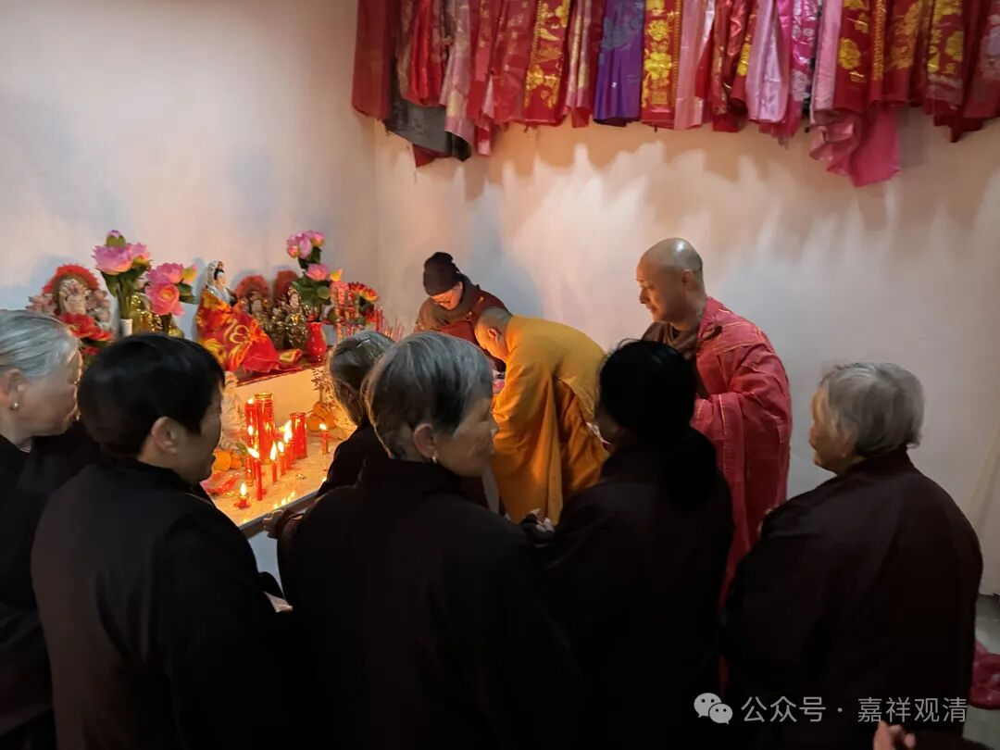

让我们去开光，这必须得去啊，还替庙里送了一尊白衣观音像给他们……这应该属于主动渗透吧，哈哈。毕竟，单纯给神像开光的事情我也做不来啊，把观音给供上，再开个光，就合理多了。

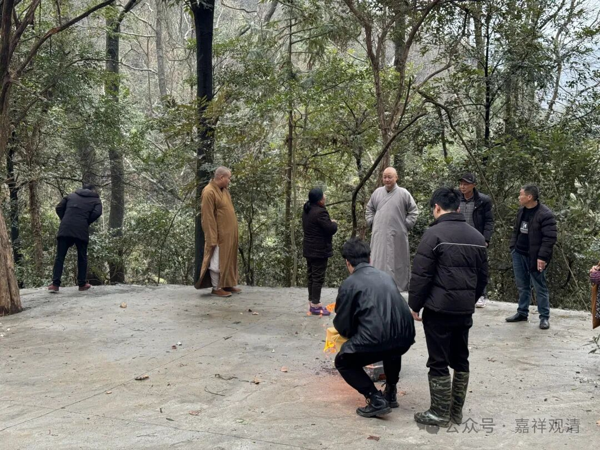

十点半开光，因为下雨，仪式还没做三分之一，人就跑了一多半。也能理解，春节里面他们也还要来拜两次的。

这中午“特供”的素斋是可以啊！

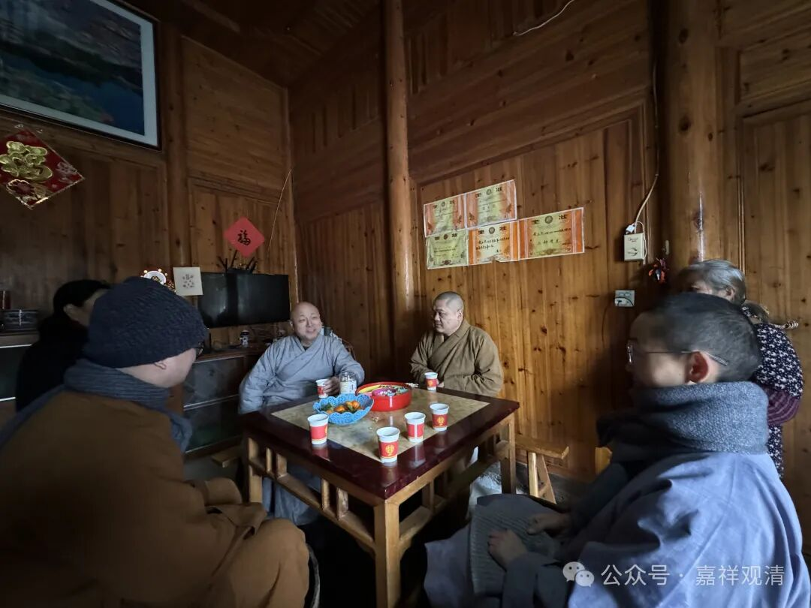

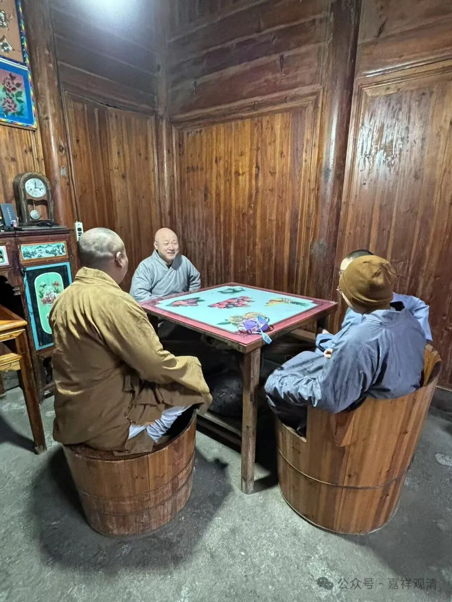

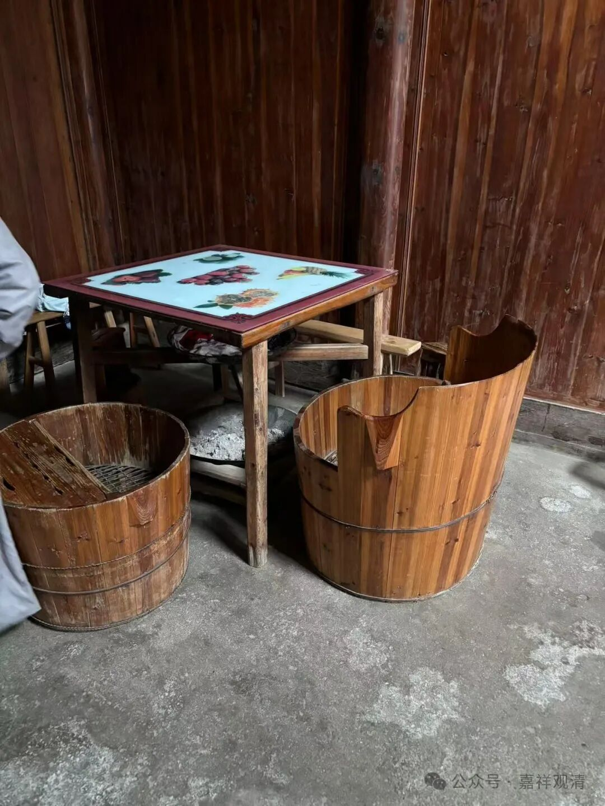

吃完饭去中湾几个居士家“家访”，这木结构、这烘桶，浓浓的山里味道啊……

