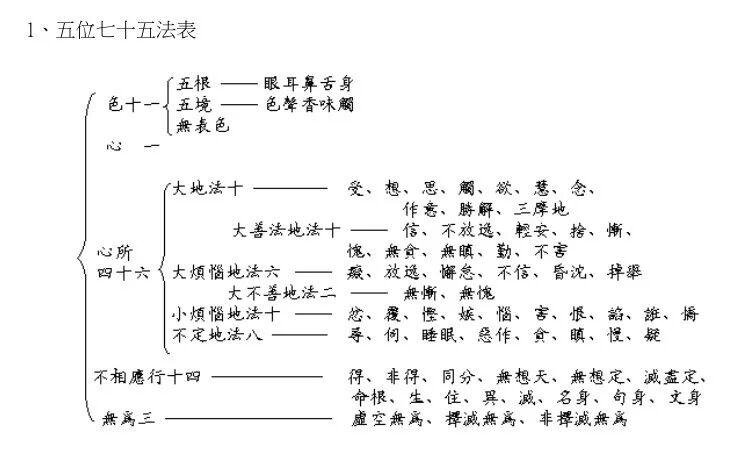

“**或执诸识用别体同”** ，这是说的谁呢？实际上就是一个“一意识师”啊。那么《俱舍论》感觉有这个意思。《俱舍论》我们看这个表，它的“七十五法”当中，它是“一识”啊，只谈一个识呢。

《成唯识论述记》里说这个“用别体同”，是大乘某些人的观点，意思就是某些唯识师的观点，他们认为“诸识用别体同”，其中的实体只有一个，这个称之为“一意识师”。“一意识师”是唯识圈内部的“末宗异义”，据圆测说“一意识师”的“一意识”是指的前六识同体，基大师认为应是八个识同体——应该说两种都可以成立，主要是今天不知道他们（一意识师）具体的观点。

“**或执离心无别心所** ”，这个说的是谁呢？这个明确说的是经部啊，经部师说心和心所是同体的，“心所即心”，心所就是心啊，“离心无别心所”。

这里面，前后四个“或”，按基大师在《成唯识论述记》的说法，分别对应佛教四宗——

“或執外境如識非無”——萨婆多部，即说一切有部；

“或執內識如境非有”——中观派清辩论师等；

“或執諸識用別體同”——唯识内部的一意识师；

“或執離心無別心所”——经部师。

其中，1、4算“迷”，2、3算“谬”。

“或执离心无别心所”这个是经部，

“为遮此等种种种异执”，实际上上面可以用省略号啊，但是用省略号又怕大家以为这里缺字了啊，所以我就没有用啊，为了遮除这些种种的不同的异执啊，不同的执着，不同的错误的认识，

“令於唯識深妙理中得如實解，故造斯論”，为了令他对唯识的这个深妙的道理，甚深微妙的道理得到如其真实的认知，所以造做了这部论——《唯识三十颂》。

