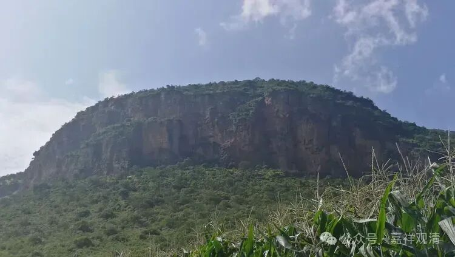
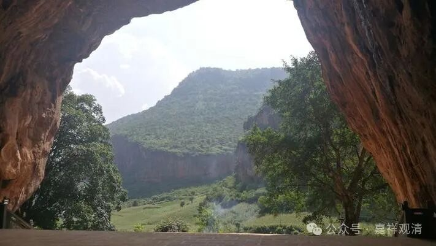

“**佛涅槃后九百年中** ”。

这个佛涅槃后900年中，实际指向的时间是大概在公元的三、四世纪啊。

“**無著菩薩事大慈尊，請說瑜伽、中邊等論** ”。

无著菩萨在慈氏菩萨那里学习了，“大慈尊”就是弥勒，弥勒是梵文音译，意译就是“慈氏”。

无著论师在慈氏菩萨那里学了什么呢？请慈氏菩萨讲《瑜伽师地论》、《辩中边论颂》等……

据汉地的传说（主要是玄奘法师带回来的传说），说《瑜伽师地论》的作者是弥勒，《辩中边论颂》的作者也是弥勒，《辩中边论》的作者是世亲。藏地则传说这个《瑜伽师地论》的作者就是无著，管《瑜伽师地论》叫《无著五论》，（《瑜伽师地论》由独立的五分组成：《本地分》《摄抉择分》《摄释分》《摄异门分》《摄事分》）……

在汉传当中还有一种说法，是真谛译师带来的传说，他说什么呢，真谛译师说《瑜伽师地论》的前面一半就是《本地分》（五十卷），这《本地分》的作者是是弥勒，后面一半，另外四分的作者是无著。吕澄先生啊，也比较倾向于这种说法。观清法师（你看我现在都不称呼“我”了啊，哈哈哈……）也这么认为。

就是我感觉也是前面一半和后面一半的作者，很可能不是同一个人，因为他的很多内容并不一样，同样一个问题，后面50卷里面的一些解释，和后面五十卷不一样。就比如说“遍行”啊，“遍行”这个名词在《瑜伽师地论》前面50卷是没有出现过，在后面50卷才出现过“遍行”，它把有部里的这个“十大地法”解释为“五遍行”和“五不遍行”，一直到了《显扬圣教论》（作者无著）才出现了“遍行”和“别境”的说法……

今天我们已经习惯了用遍行和别境是吧？ 但是遍行和别境的说法，从这里《显扬圣教论》才出现的，《瑜伽师地论》50卷没有讲遍行，后50卷就出现了，《摄抉择分》里就出现了五“遍行”和五“不遍行”，到了《显扬圣教论》就出现了“五遍行”和“五别境”的说法。

那么无著菩萨在慈氏菩萨那里听课，也就是说（哈哈）这个无著菩萨是个秘书，然后慈氏菩萨讲，他记录下来了，就是《瑜伽师地论》和《辩中边论颂》。

那《瑜伽师地论》在哪里讲的呢？有几种说法……

一种说是在天上讲的，无著菩萨去听。这个呢，我们说起来有点问题啊，因为你去天上听讲，你去听完一遍一百卷的《瑜伽师地论》，等你下来以后，大概已经到公元四五千年了，天上一日，地上几百上千年了都……听完一百卷再下来，那时间实在太长了。

于是后来又有一个说法，说不是到天上去听讲的，是什么呢？是请弥勒菩萨下来讲的，在讲堂里，但是大家看不到弥勒菩萨。就是弥勒菩萨坐在那里讲，，无著菩萨在边上听写……这个说法就相对来说比较合适一点了是吧？因为这个时间比较对得上。

那么还有一种说法是什么呢，还有一种传说，说是在云南鹤庆有一个道场，那个地方是一个大的山洞，在这个山洞里面，当地人就说这个地方呢，就是弥勒菩萨当年给无著菩萨讲《瑜伽师地论》的地方。这个地方、这个山洞非常大，塞上万人应该不难……这个山洞离鸡足山大概一两个小时路程。

实际这个洞口是非常大的，光看照片感觉不到

那个TH洞我们这里某个法师非常的喜欢哇，很想接下来，想接了好几次了啊，我要不拦着，ta已经一头扎进去了啊。那个山洞非常大，我们这个地方放进去足足有余啊，这个里面有十层殿啊，而且是完全走不尽啊。这个大溶洞，也是一个新石器时代的一个遗址，现在里面呢，哈哈，只有你不认识的神，没有他不供的神啊，各种神都有，一层殿一层殿的。里面也有金刚萨陀的自然显现的像啊等等……我都去看过啊，某法师不敢进去看了，就我一人爬进去看了。

大家有兴趣的话可以去看一下啊，这个某法师特别喜欢这个地方啊。 我觉得实在是头太大，那个地方如果在山洞外面建庙还可以啊，在里面建……我觉得很难，那个地上很脏啊，地上那个灰有几寸厚啊，然后里面还有这么多神像，我也不敢搬、也不敢砸啊，太多神像了，这个有几百上千……我觉得啊，真的是“只有你不认识的，没有他不拜的”，啥都有。

