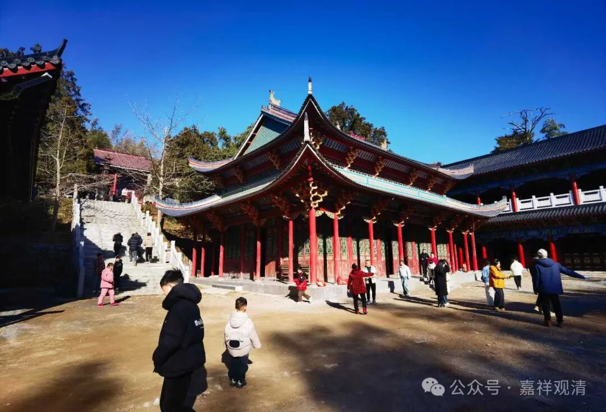

来庙里的年轻人多了

今天大年初一。

白天有点忙。

前几天我们一个出家人群里有人说，现在好像信佛的人多了，或者说来庙里走动的人感觉比以前多了，而且年轻人的比例高，还有人就此做了统计，出了社会调查报告，写了论文。大家普遍感觉好像确实有点这个意思。

今天看起来，果然！感觉就是突然之间年轻人就多起来了，而且“迷信”得也很“专业”，至少比我专业——有个年轻人下山之前要洗手，我给他打开水龙头……边上女生喝住他：“不要洗！庙里沾的香灰就是要带回家去的，怎么可以洗掉！”

呃，我虽然不懂，但我感觉她说的很有道理

…… ……

晚上给大家讲课的时候，我说，我们是一年到头都在讲经啊——因为昨天（大年三十）也在讲，今天也在讲。

去年春节，在庙里给大家传了《中论颂》《入中论颂》《俱舍论颂》《释量论颂》《现观庄严论颂》……今年春节，前几天传了《五蕴论》《唯识三十颂》，快速传讲了《大乘阿毗达磨集论》，这两天开始传讲《菩提道次第广论》。不过由于时间紧、任务重，讲得不多，也比较简单。

明年传点什么呢？考虑《辩了不了义》？……

