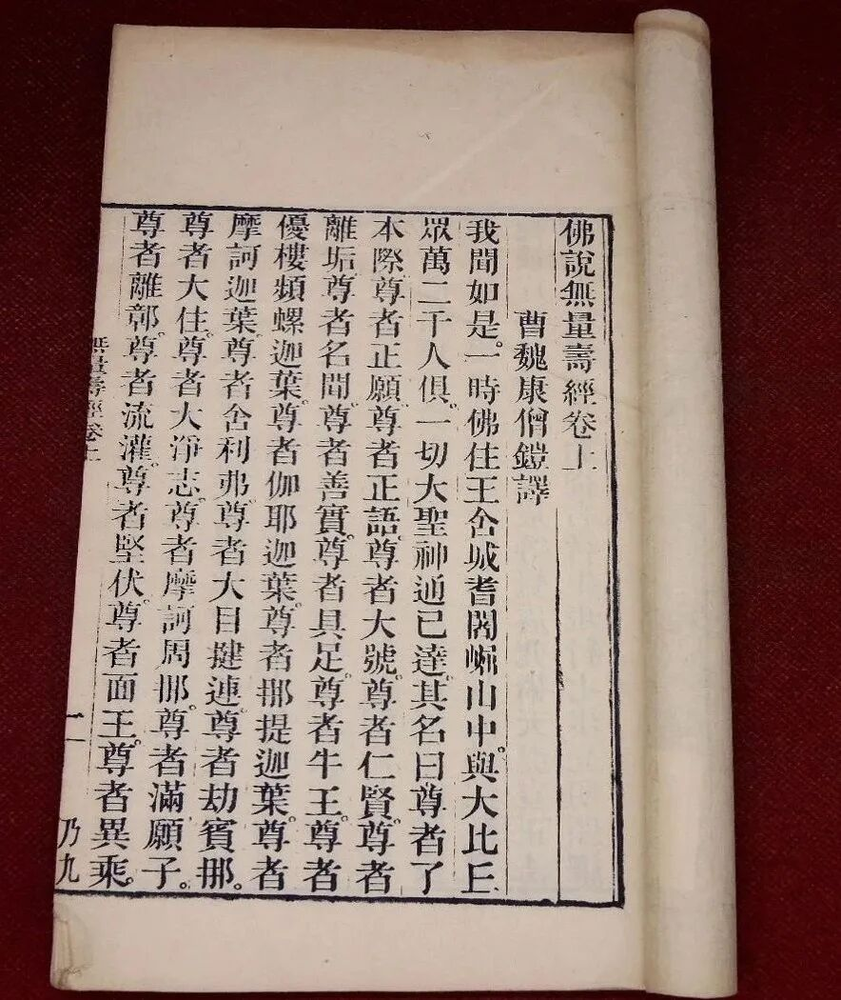
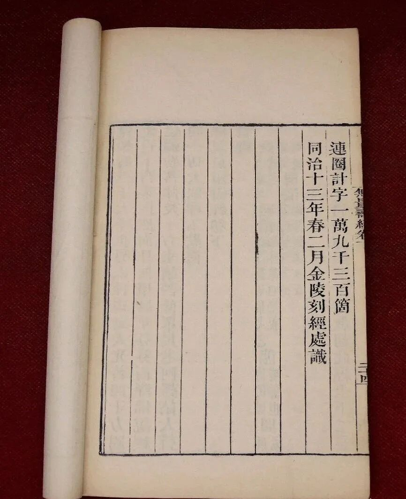
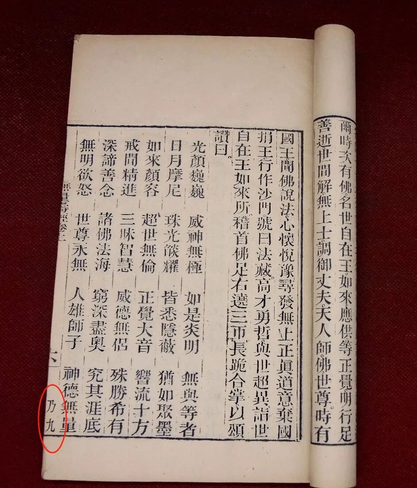
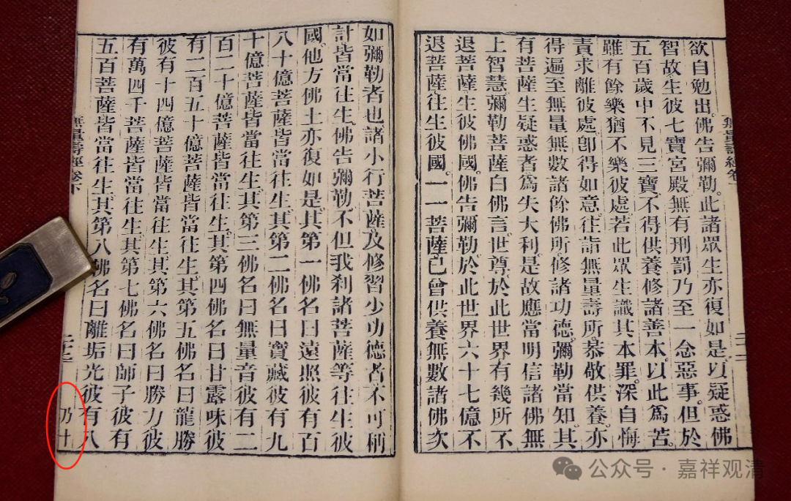

从一部《佛说无量寿经》聊起

这是一本金陵刻经处版的《佛说无量寿经》，两卷。同治十三年（1874）春二月刻板完成。

杨仁山居士之创金陵刻经处，刊刻印刷线装本佛经，最初有刻全藏的打算。他集合江南江北诸佛教刻经处，如江北刻经处、江西刻经处、姑苏刻经处、常熟刻经处、常州天宁寺刻经处等，准备合作完成此事，也就是《百纳藏》的缘起。后来在《百纳藏》进行的过程中发现一些问题，遂有独立完成全藏刻经的打算。

在刊刻全藏过程中，基本参照《乾隆藏》的编排和千字文序号，但易经折装为方册本线装书，这是参考了《嘉兴藏》（又叫《径山藏》）的装订形式。

这一册金陵刻经处版的《佛说无量寿经》就有千字文和序号，《无量寿经》是上下两卷同本，所以千字文的序号就是“乃九”“乃十”。（金陵刻经处刻印的经书，有些有千字文序号，不多；大部分没有；也有的在一卷书里，有的书页有千字文，有的没有。）

金陵刻经处刊印全藏的事情因中日战争而没有完成，后来北京（居士林？刻经处？）收集了各刻经处的经书，完整发行了一版《百纳藏》。

在金陵刻经处（杨仁山）独立刻藏以后，常州天宁寺（冶开清镕）在承宣怀家族的支持下也发起了独立刻藏的活动，但是最后也和和金陵刻经处一样，在完成大部分工作后，被中日战争打断了。现在学界管这个藏经系统叫“《毗陵藏》”，因为常州又叫毗陵。

