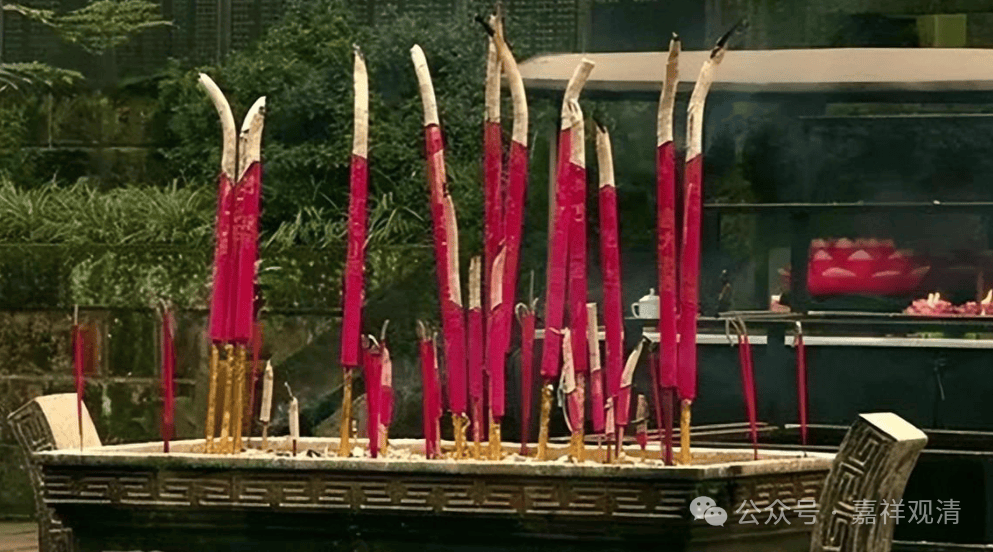
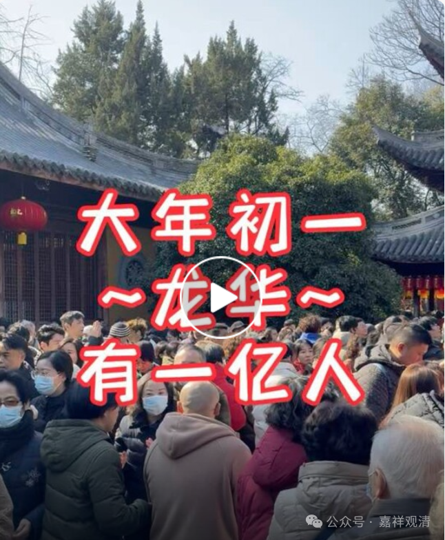
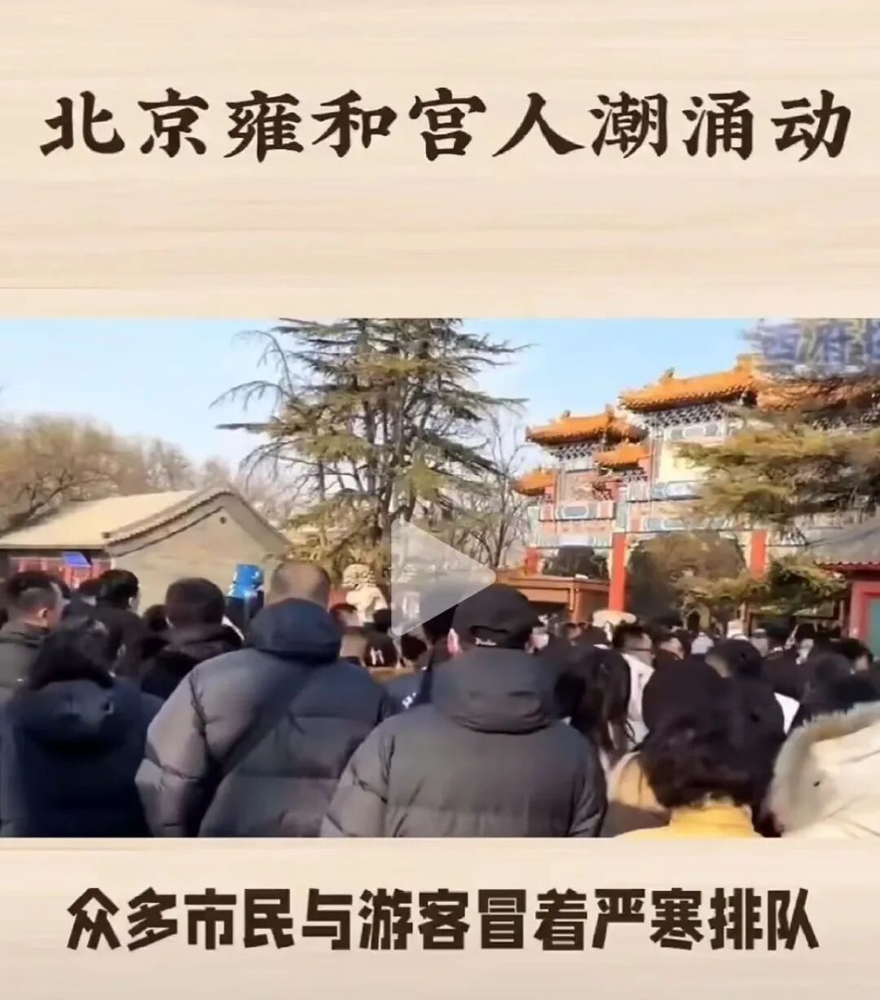
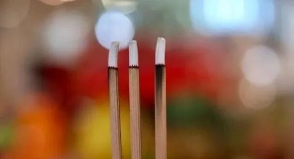
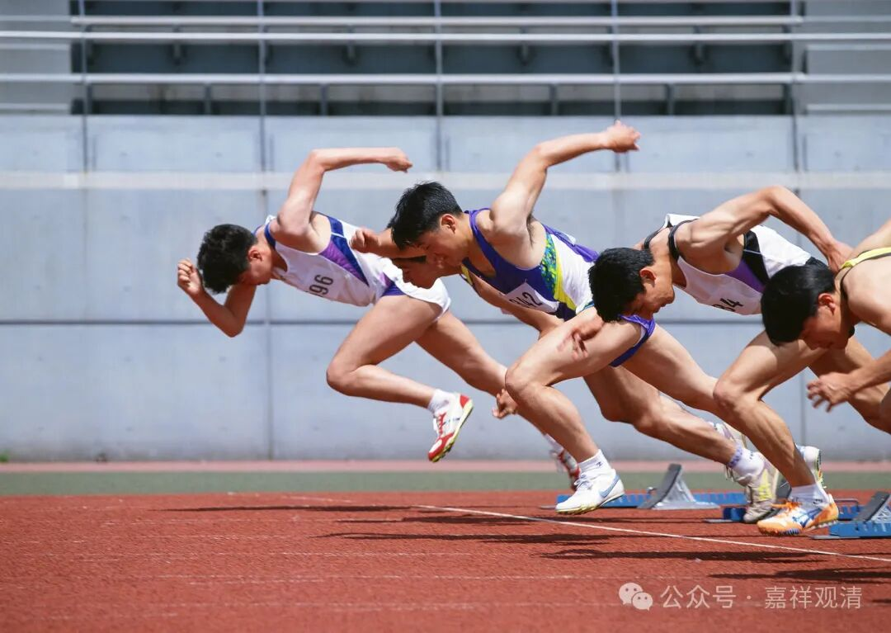

好灵的头香

新年到了，各地大寺院都流出people mountain people sea的照片或者视频……

这是多数人上普陀山必去经过的朱家尖蜈蚣峙码头……这队伍……

上海龙华寺……呃，一亿，应该是夸张了，现在这个点上海应该总共也就两三千万人……据说现在上海地铁都空荡荡的——除了去龙华的。

北京雍和宫……据说人流只能单向流动，你如果错过某个殿就再也进不去了，因为人群流动的方向是——从入口……到出口。

大家都是来烧“头香”的。

假如说，“头香”是指“新年头一支香”，那理论上，“头香”肯定是和尚烧了的；不过假如理解为“新年**我的** 头一支香”，那就可以理解了。

也有延伸理解为——每一天的“第一支香”（开门以后的）。

我有个同学NM，是SH田径队的队医，有个队员是攻短跑的，那一年全运后以后就要退役……来找他拿主意。NM同学告诉他，比赛那天（在北京）去雍和宫烧香……

那天（十几、二十年前了，那时候雍和宫烧香还没现在这么火），他一大早就去雍和宫排队，大概排第一，边上还有俩老太太。

庙门一开，一个老太太缠着他说话，另一个老太太小碎步飞奔……他一开始还没反应过来，突然之间灵光一现——俩老太太是在打配合，要抢着烧头香啊！

他立刻撇下和他聊天的老太太，撒腿就追，“我专业运动员还能输给你们了？！”前面那个老太太也拼了命地加快步频，但，怎么能跟短跑全国前十名比呢？

最后，老六运动员用超越比赛成绩的成绩（哈哈）先一步插上了第一支香……

结果全运会200米第九名。前八名才算好成绩。

但是那一年全运会短跑不能兼项，有一个运动员同时报了一百米和两百米，而他一百米的名次更靠前，于是他放弃了两百米的名次，这样两百米就“空”出了一个名额……

“头香兄弟”最终以并不太美丽的运动成绩获得了全运会第八，后来攥着这个“全运会第八”退役，进了SH某大学做了体育老师……

哈哈，这个“头香”好灵啊！

